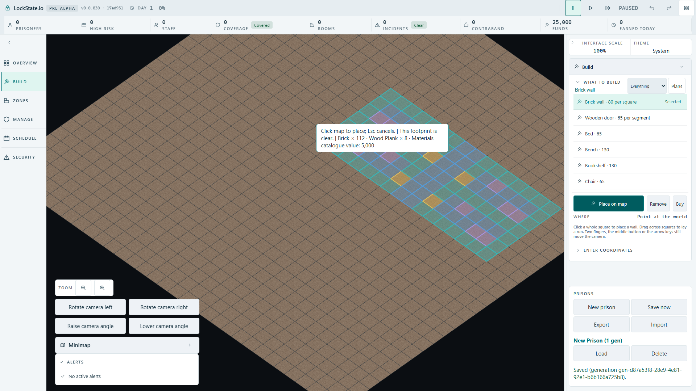
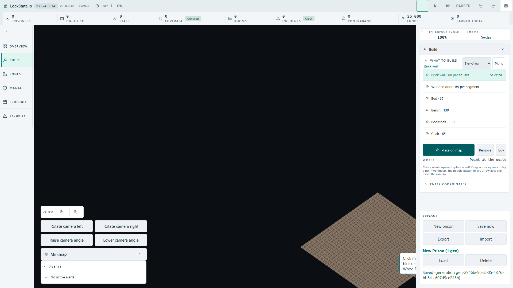
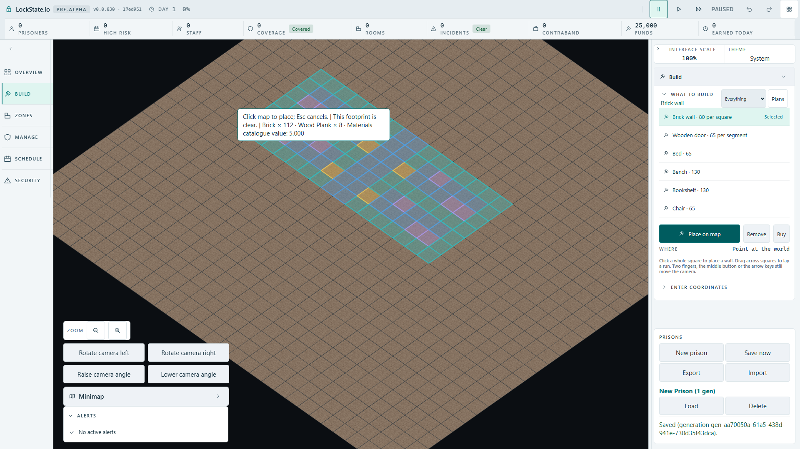
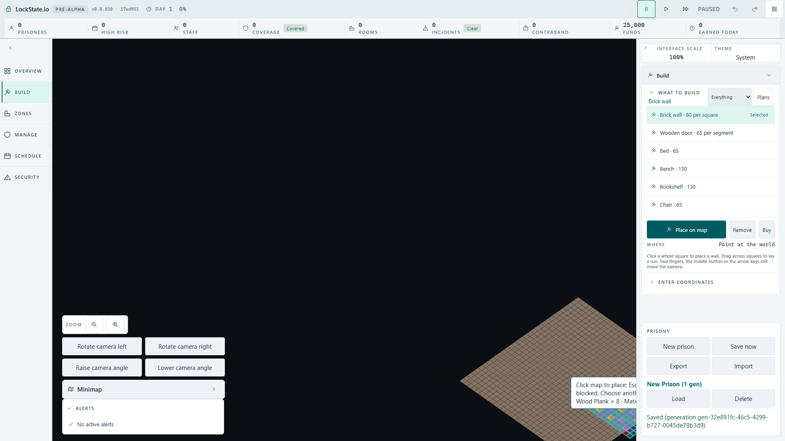
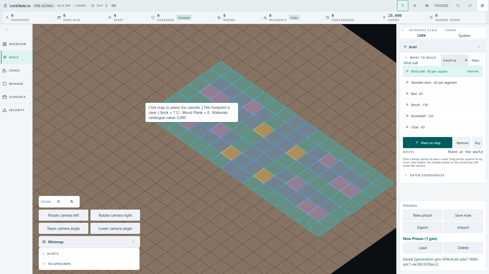
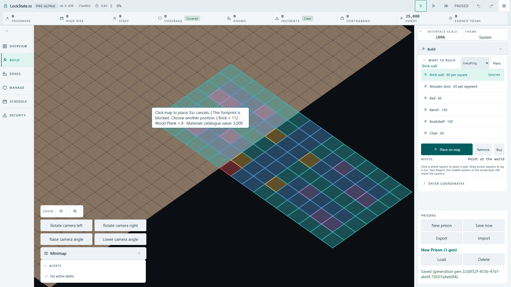

# Full HD large-plan preview: owner review

Review draft only. No production fit policy is selected. The comparison port exists only with `?renderer=oblique&room-preview-fit-draft=1`. Source checkpoint `17ed9518d8`; production artifact build, six cases passed in 35.2 seconds with one browser worker.

All images show the real running game at 1920 x 1080, the same 7 x 16 four-cell row (112 squares), unchanged 64-pixel world tiles and the authoritative quote: Brick x112, Wood Plank x8, materials catalogue value 5,000. Catalogue value is not a prediction of the debit after existing stock is consumed.

The measured safe playfield is x570..1548, y103..1072. It conservatively excludes the top readouts, right inspector and bottom-left controls. The ordinary ghost text still overlays part of the geometry. `fits` means all floor-square bounds lie inside this safe rectangle, not that the tooltip is invisible.

| Rule | Central cursor | Edge cursor | Behaviour |
| --- | --- | --- | --- |
| 1. Keep origin square under cursor; reduce zoom | fits, zoom 0.649 | clipped, zoom 0.200 | Familiar placement anchor; cannot guarantee full visibility near an edge. |
| 2. Centre whole pattern under cursor; reduce zoom | fits, zoom 0.634 | clipped, zoom 0.200 | Changes the cursor hotspot to the pattern centre; still cannot fit near every edge. |
| 3. Fit and pan; freeze the selected origin until physical pointer movement | fits, zoom 0.940 | fits, zoom 0.940 | Guarantees the floor footprint fits, but camera movement separates the pointer from the original anchor. |

These are explicit one-shot review candidates, not complete automatic controllers. The draft freezes the candidate origin at the review cursor and clears that lock on its next movement. Future production behaviour, repeated movement and interaction with rotation require the owner's choice and subsequent implementation. No candidate bypasses worker validation. The edge placement is outside the new prison terrain, so its genuine blocked verdict remains visible; a fitted camera does not make an invalid plan buildable.

## Images

### 1. Origin under cursor

### 2. Whole pattern centre under cursor

### 3. Fit, pan and locked origin

## Evidence

Each adjacent JSON preserves the immutable origin, original dimensions, candidate camera, required zoom, honest `fits` flag and 112 actual DOM polygon bounding boxes. Independent post-run comparison of every bounding box with the safe rectangle confirmed the four fitted cases and both clipped cases. Pure fit tests: 5/5. TypeScript: passed. Browser comparison: 6/6. This does not prove Save/Load or committed placement under an approved policy; those are deliberately still pending.
