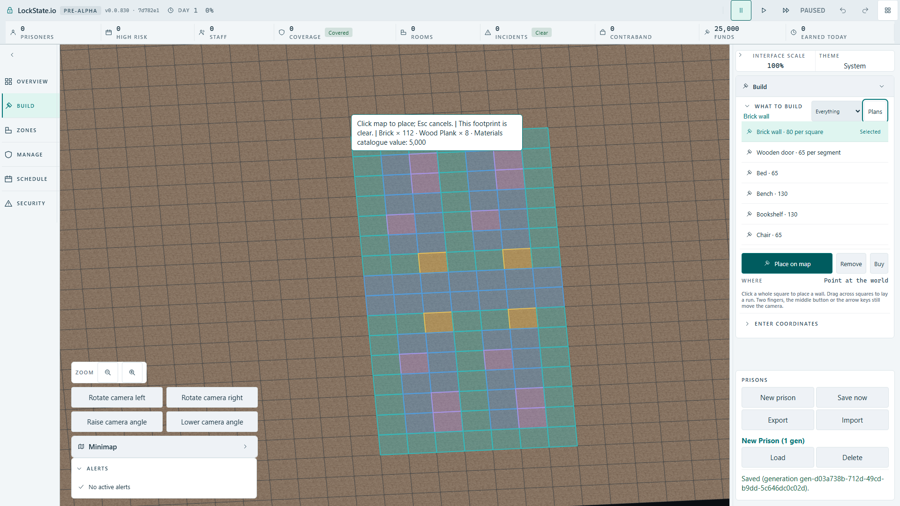
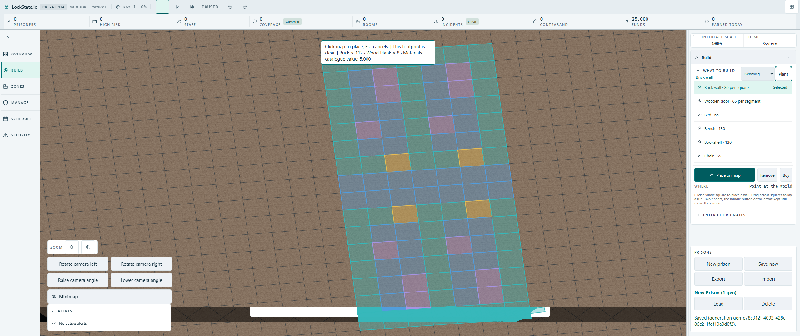

# Approved room-plan preview fit

Owner decision received 2026-10-02: variant 3, full-footprint fit and camera pan, preserving the selected world origin until actual pointer movement. The review comparison remains in `docs/design/2026-10-01-room-preview-fit-variants` on its dedicated branch.

The production controller requests a fit only when the floor footprint exceeds the actual HUD-safe rectangle. It never changes world tile size or worker validation. When a fit is applied, RAF polling and a same-position pointer release retain the exact origin. Physical pointer movement unlocks it; changed selections or mirrors refit the retained origin. Escape and standing down reset it. Top-down placement is unchanged. No new player text or persistent fields.

Checkpoint verification: removing the locked-origin assignment causes two independent unit failures (x4 becomes34, revised origin x2 becomes12). Restoring it passes the controller/bridge/fit suites. Actual production placement, Escape and both screen-size cases now pass as documented below; the updated overlapping-placement browser proof also passes.

## Actual production controls

`room-preview-fit-production.spec.ts` passed both 1920 x 1080 and 2560 x 1080 cases in 19.9 seconds on one browser worker. It selects and mirrors the 112-square row, verifies every actual polygon lies inside the measured HUD-safe rectangle, turns the real camera with KeyE without physical pointer movement and confirms the retained worker origin. Escape during a held mouse press hides the ghost and leaves zero placement commands. A fresh re-arm and actual mouse click submit exactly the preflight origin and mirror flag. The browser uses the normal URL, without the draft comparison port.

The view-change mutation (ignoring camera/HUD signature changes) independently fails the retained-origin refit test; restoring it passes. Both origin-lock and view-revision mutations were reverted before the production artifact build.

The older stationary-row overlap browser test was updated to the approved fit/pan contract and passed 1/1 in 11.7 seconds on the production artifact built from clean checkpoint a8e8c84333. It retains the blocked overlapping placement check by targeting the actual rendered first-square centre, rather than assuming the old cursor remains the hotspot after camera panning. The actual worker rejected the second click and the command count remained one.

Additional gates: design tokens 76/76, rendering/input module boundaries 10/10, second-locale contract 18/18. Removing physical camera-gesture preparation produces one failed bridge assertion (no physical-movement report); restoring it passes 9/9. All mutations were reverted.
