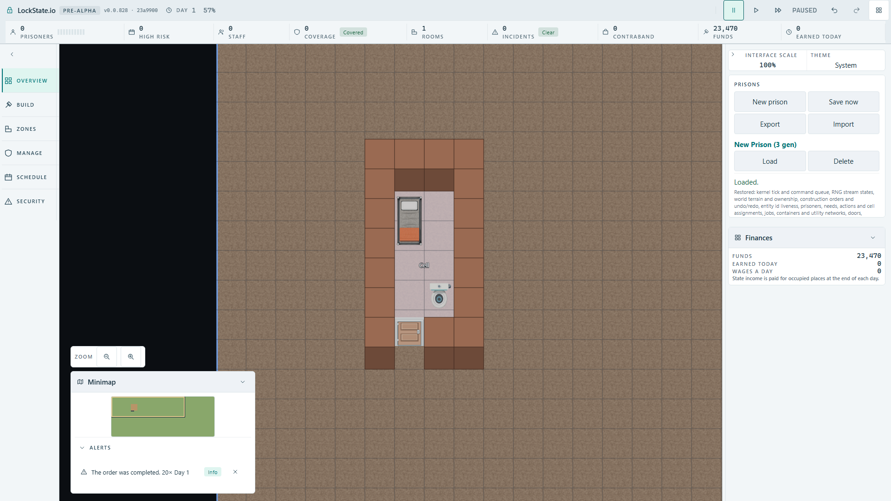
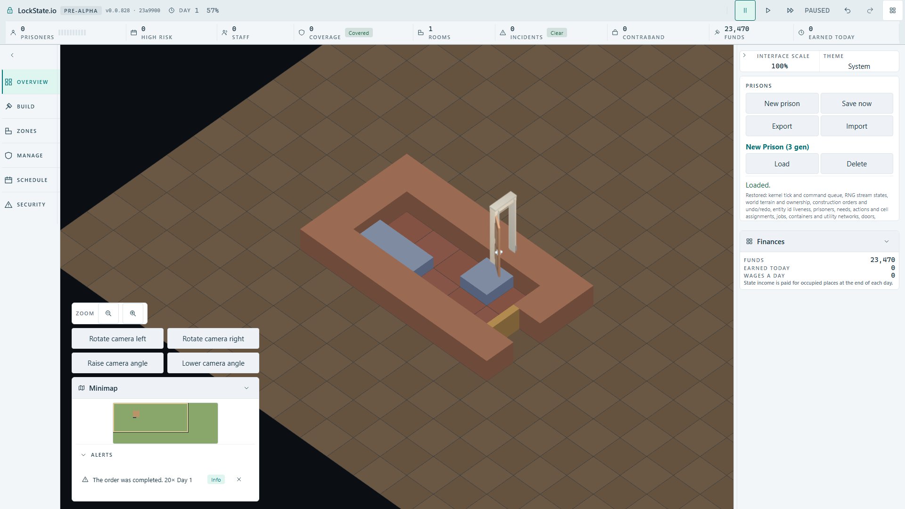

# Completed cell: combined camera and template integration QA, 2026-10-01

Integration tree: `23a990094d` combines camera PR #1894 at `28b5d208fc`
with template/collision/rendering PR #1898 at `94d1a60d7a`.
This is an isolated QA branch, not a main deployment.

## Measured

`tests/browser/integrated-square-walls.spec.ts` builds a basic cell through
scheduled simulation commands and deterministic kernel steps until all orders
complete. It checks the occupied wall square and blocked traversal, creates a
real save envelope, imports it through the production file picker, loads it,
navigates with the minimap, saves and loads again in both production renderers.
This uses a completed fixture; it does not prove mouse-driven template placement.

Full HD browser: 2/2 passed. Completed wall top faces occupied 65,348 pixels in
top-down and 73,098 pixels in oblique. The same pixel threshold passed after
production Save/Load. Mutating the wall footprint width from 1 tile to 0.1
made both tests fail: 5,270 and 6,600 pixels against the minimum 15,000.
The mutation was reverted and the final run passed 2/2.

Square wall rendering/barrier unit tests: 4/4 passed. TypeScript build passed.

## Visible limitation

The angled screenshot shows the real square shell and door, but the bed and
toilet are still fallback blocks in this integration snapshot. The models and
material integration are therefore not visually complete. This QA does not
claim that the whole art migration is ready.

