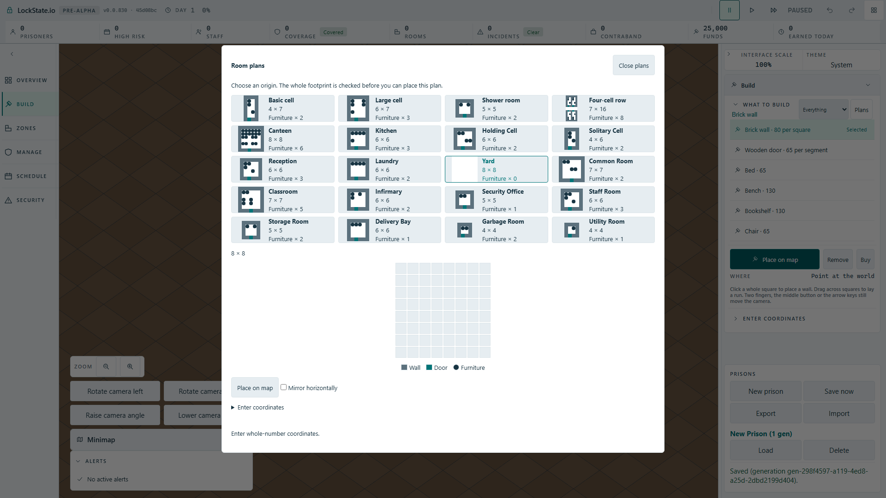
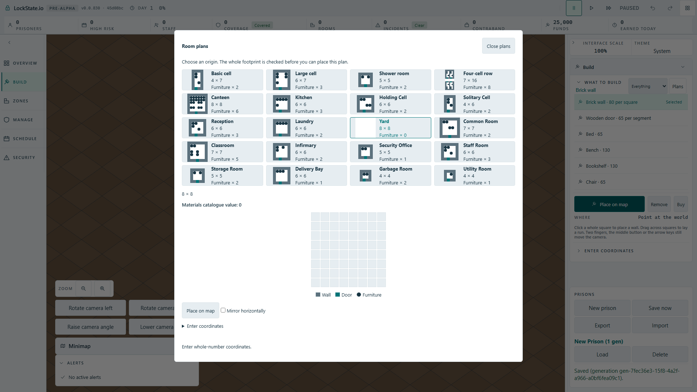

# Independent map quote after editing advanced coordinates

Issue: https://github.com/woogitsu/lockstate/issues/1912

## Reproduction

Built production artifact from root base 45d08bc24d, Full HD 1920 by 1080, angled renderer. Open New prison, Build and Room plans. Open Enter coordinates, clear X and close that disclosure. Selecting Yard leaves the materials quote empty even though the visible Place on map action uses pointer coordinates independently. The previous readout should switch to Yard catalogue value zero; invalid numerical fields must only disable numerical submission.

The real regression failed after selecting Yard: expected `Materials catalogue value: 0`, received an empty quote element throughout the existing ten-second assertion budget. No network-abort signature occurred. Before/after screenshots are actual rendered game pixels.

## Repair and proof

The static worker quote is now queried independently of numerical preflight. Both results retain the same revision guard, so old responses cannot paint a newer choice. An unavailable quote remains empty, never fabricated zero; invalid coordinates still disable their submit. No new player copy, scene/projection, art, format or timing changes.

The real repaired artifact test passed 1/1 in 8.7 seconds. The strengthened flow passed 1/1 in 9.2 seconds: it checks the selected Basic cell quote 35 Brick/2 Wood Plank/catalogue value 1,530, mirrored diagram row-by-row, unchanged value after mirroring, all 28 map footprint squares and exactly one mouse-issued PlaceRoomTemplate command with mirrorX true. The numerical submit remains disabled while X is empty.

