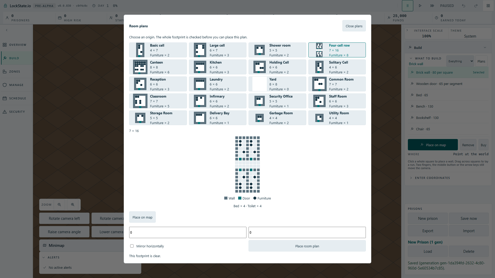

# Full HD room-plan catalogue cards

## Actual problem observed before implementation

In the bundled angled game at 1920 by 1080 the catalogue showed 20 text-only
buttons. Dimensions, contents and footprint were unavailable until selecting
each plan. Selecting Four-cell row expanded the modal to almost the complete
viewport, with its fixed-size 16-row diagram consuming the middle of the form.
The initial screenshots were visually inspected before editing production code.

## Change

All 20 plans remain selectable with the same localized accessible names.
Cards expose authored dimensions, actual object count using the existing
Furniture label, and complete footprint miniatures including multi-tile objects.
The selected diagram fits a 220-pixel height budget including tile gaps. The
existing dialog viewport guard now measures its border box; its grid row tracks
match the square sizes. All colors reuse existing HUD tokens.

## Verification

TypeScript and the production Cloudflare build passed. The new browser case
passed in the bundled client through the existing workerd artifact preview:
1/1, 5.3 seconds test duration, one worker, unchanged 60-second deadline.
It verifies all 20 cards, a bed's two-tile footprint, shell-free Yard's 64 tiles,
fixture counts, Four-cell row's selected controls without vertical scrolling,
and real mouse arming with 112 projected footprint polygons.

The first card implementation failed the real viewport assertion, and the
border-box/grid-row sizing correction made it green. Mutating the card
miniature to treat all fixtures as 1 by 1 made the browser test fail: expected
three occupied cells, received two. Restoring the actual footprint port made
the same built-client test pass.

The inherited player-string inventory was regenerated from the existing
locale source using the official generator export. No locale key or sentence
changed. Inventory and Polish plural contracts passed: 2 suites, 20 tests.
