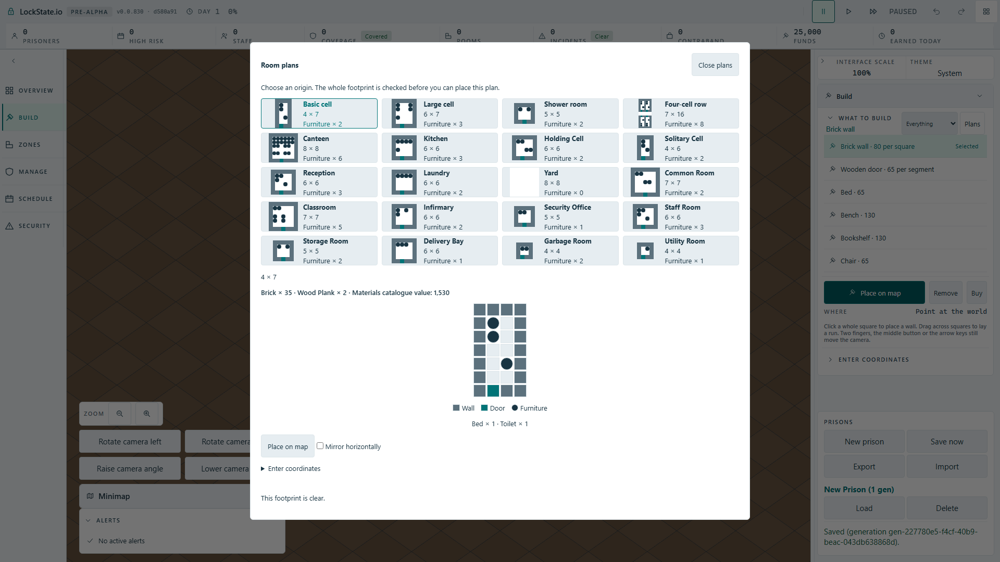

# Room plan material quote and coordinate controls

The prior Full HD cards screenshot still applied exactly to the root base: the preview, quote port, tool and catalogue source had no delta. It showed no material quote in the dialog and two unnamed visible zero coordinate fields beside the map workflow.

The dialog now uses the existing worker quote to show material names and exact quantities plus the approved Materials catalogue value label. The same formatter supplies the map ghost. This is the full catalogue value, not an estimate of money debited after existing stock is consumed. The existing approved Enter coordinates disclosure keeps the numerical route available, with visible Plan origin X/Y labels; Place on map remains the primary visible control. No new copy or palette was authored.

## Evidence

- Production artifact at 1920 by 1080, one browser worker: cards, material quote/map ghost and real numerical placement plus Save/Load claim tests passed 3/3 in 24 seconds. A stricter rerun asserted the independent worker quantities 35/2, catalogue value 1,530 and the expanded coordinate submit staying in view: 1/1 in 6.4 seconds.
- The basic cell readout is Brick times 35, Wood Plank times 2, catalogue value 1,530. Selecting Yard changes the quote to genuine zero; selecting the cell restores its own quote. Editing coordinates does not change that static material quote.
- Twenty room cards and the full square miniature remain visible. The selected object footprint spans every occupied square. The screenshot below was visually inspected: the material quote is legible above the diagram, no unlabelled coordinate fields compete with map placement, and primary controls fit on screen.
- Unit plus localization and design-token contracts passed 97/97; TypeScript compilation passed.
- Mutation: replacing the authoritative catalogue value with zero caused the English and Polish quote tests to fail 2/3. Restoring it returned all 97 checks to green. No timeout, scanner or token budget was changed.
- Standalone repairs remove the undeclared tile-size token and record the Furniture numeric legend in the existing exact-expression localization inventory. The new material legend receives the same explicit numeric-data justification; the catalogue-value sentence remains a whole locale message.

