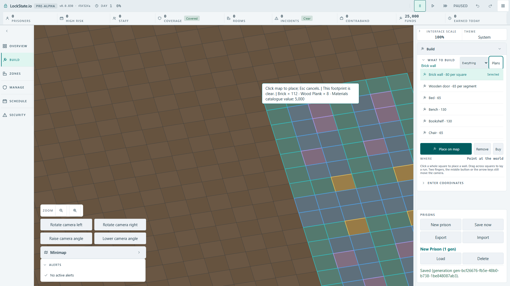
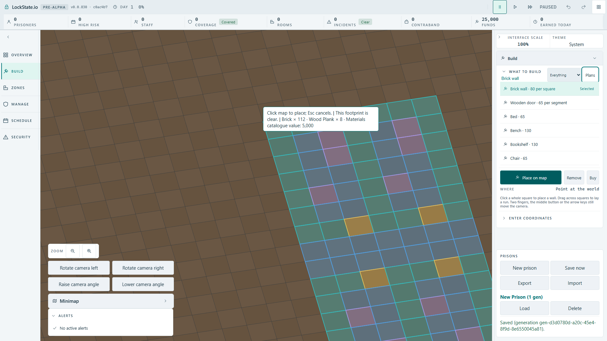

# Stationary cursor with mirrored four-cell row and camera movement

Base: integrated full-room root 45d08bc24d plus independent quote repair f5f32fa68b.

The template SVG bridge previously changed its target only on pointer events. Changing the camera transform by keyboard left the preview anchored to an old world origin until the next pointer event; clicking could therefore submit a different origin from the footprint shown immediately before the click.

Independent unit reproduction selected mirrored cell-row-four, hovered screen (800,400), then changed picking by four tiles without a pointer event. It expected preflight origin (29,12), received old (25,12). The source repair remembers the last screen point and refreshes picking before each preview paint, retaining deduplication so repeated frames on one tile do not create worker queries. Eight bridge cases plus row and catalogue cases passed 13/13; TypeScript compilation passed.

A real Full HD production artifact browser regression has been prepared: check pointer containment within the projected origin square before and after keyboard camera turn; place the mirrored 112-square row; re-arm the same plan and require worker refusal of overlap with no second placement command. The baseline production artifact failed its real cursor-containment predicate after KeyE camera turn (false versus expected true throughout the existing ten-second assertion budget). The repaired artifact passed 1/1 in 9 seconds: all 112 mirrored-row squares stayed on the actual map, the cursor remained inside the target origin square after turn without pointer movement, and one real click dispatched the mirrored cell-row-four command. Re-arming at the same point showed blocked state; the next click obtained a new authoritative worker preflight with view.data.ok false, and no second placement command was sent.

The shared playtest tee deliberately omits projection replies, so the browser spec adds a narrow test-only capture of world/room-template-preflight replies. The first strengthened collision collector waited on the omitted shared data; the next read used the wire view wrapper incorrectly. Both collector defects were corrected without changing production or weakening the refusal assertion. Normal Build scene preview is a separate camera-agent scope.

Before/after screenshots below are actual Full HD game pixels after camera turn. The source query remains deduplicated: repeated preview frames on the same target do not add preflight calls.

