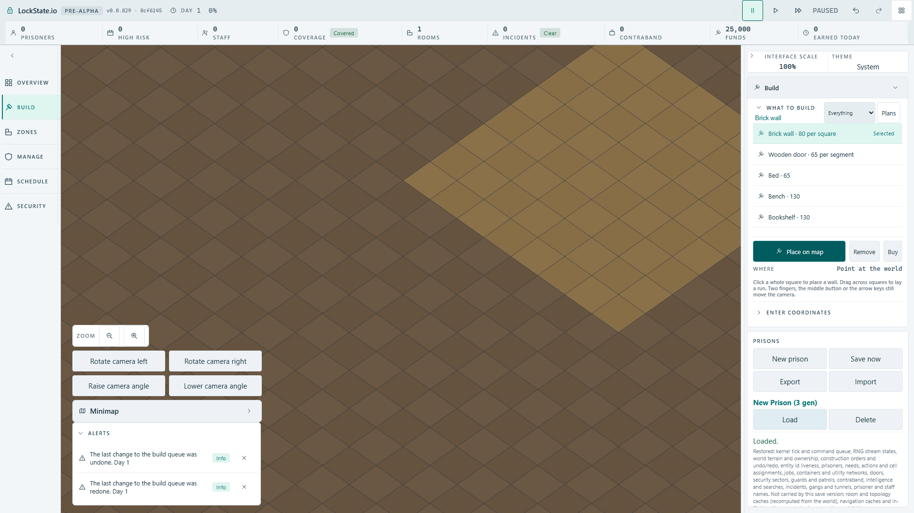

# Shell-free Yard history: implementation and browser QA

## Implemented production behavior

Yard placement records a reversible world zoning transaction. It creates no
wall BuildOrder. Undo removes the pending zoning obligation or completed Yard;
Redo reruns footprint preflight and restores the obligation only when clear.
Save/Load restores the external transaction handlers from room-template state.
The existing history availability projection now exposes those transactions
so the actual HUD Undo and Redo controls are enabled when appropriate.

Standalone backend commits: `53009f866b`, `c0c6011646`, `d3b2ad35ec`.
The combined QA branch includes the interrupted-pointer fix `b7a8c9ddac`.

## Evidence obtained

- Unit matrix covers all 20 plans through completion, encoded Save/Load,
  Undo, encoded Save/Load, Redo and completion.
- Separate two-Yard history test preserves completed and pending ordering.
- Rejected Yard Redo leaves no pending obligation and creates no wall order.
- Removing the zero-shell reconciliation guard makes that refusal test fail;
  restoring it makes the test pass.
- Before external history availability was implemented, the real browser reached
  completed Yard Save/Load but the HUD Undo control was disabled. The added
  production availability assertion likewise failed before the fix.
- After the availability fix, completed-transaction and construction-history
  suites passed: 2 suites, 30 tests. TypeScript passed on the backend checkpoint.

## Browser verification still incomplete

`tests/browser/yard-mouse-history.spec.ts` exercises actual Full HD angled mouse
placement, interrupted pointer release without a new press, and HUD
Save/Load/Undo/Redo. It also asserts that no PlaceBuildOrder is sent for Yard.
This complete browser test has not passed yet and is not completion evidence.

The last run ended before the New prison control existed. Trace showed only
`main`, no runtime console error, 473 requests and pending worker modules,
zod and the medic actor manifest at the unchanged 60-second deadline. Main
and oblique manifests had returned 200. A local isolated Vite dependency cache
was used to investigate shared-cache interference; it did not resolve this cold
bootstrap. That local config override is not committed. No timeout was raised.

Keep the stack draft while the requested save metadata and truthful generic
building Undo/Redo message decisions remain pending. Do not merge this QA stack
as a standalone product change.

## Built-client verification (later checkpoint)

The same Yard spec passed against the bundled client through the existing
Cloudflare/workerd artifact preview pipeline: 1/1, 11.2 seconds test duration,
14.3 seconds total, one worker, unchanged 60-second test deadline and zero
retries. Full HD angled view uses actual controls and verifies rooms 1 -> 0 -> 1
across completed Save/Load, Undo, Save/Load, Redo and Save/Load. No wall order is
sent. A blur interrupts the held pointer; its release sends no placement and a
fresh press places exactly once. The hover preview stays armed across blur,
which is the production bridge contract; it is not required to disappear.

This disproves a production startup deadlock in the recorded case. Cold dev
module transfer consumed the earlier deadline: the Phaser prebundle response
alone took 23.56 seconds; registry fetch began 58.56 seconds into the trace.
No new product Issue or timeout adjustment was made for this environment delay.

Reproduction used `playwright.artifact.config.ts` with a temporary derivative
selecting only `yard-mouse-history.spec.ts` and retaining failure traces. The
derivative changed neither server, browser, retries, timeout nor deployment.
Build was run through the installed Vite binary with CLOUDFLARE_ENV=production,
since the normal wrapper reproduced already-open Windows Issue #1542 (spaced
checkout path split by shell). The resulting client bundle was served by the
existing workerd preview. The local derivative is not a new required CI gate.

