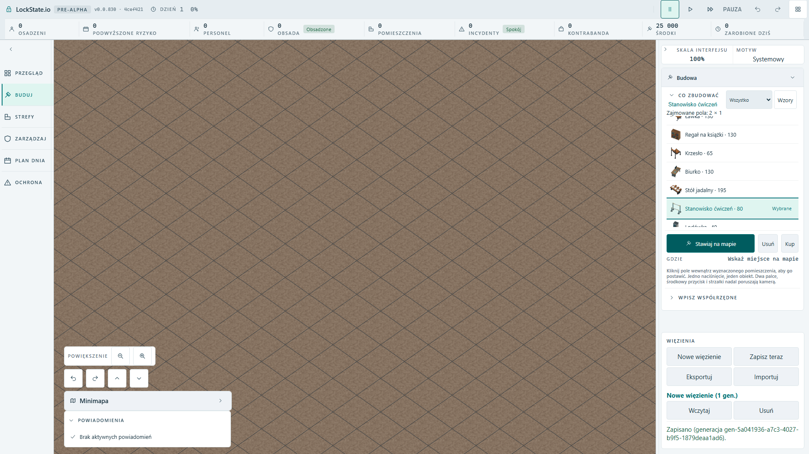

# Actual active Build row visibility audit

Question: do partially clipped Bench/Fridge rows at ordinary scroll edges also mean the keyboard-focused/selected row is clipped?

Actual artifact build from feature root4cef4218c3, Polish browser locale,1920x1080,100% UI scale and angled renderer. New prison, Pause, Build; focus the first catalogue row, then ArrowDown and Enter through all22 choices. After each native selection the test measures the actual selected row against the list's visible client rectangle. The test also requires native focus and selected aria-checked state, so it cannot pass by inspecting an unrelated visible row.

Result:1/1 green20.7s, terminal exit0. Every active selected rectangle stayed inside the list's viewport. Opened the selected Security console and Exercise station screenshots; name, price and occupied dimensions are readable. Some inactive first/last scroll-edge rows are partially visible, which is normal scroller behavior and is not reported as a bug.

The source-only suspicion was that selected labels can wrap after native focus while revealSelectedRow is filter-only. This bounded real-player audit did not reproduce that failure. No Issue, source fix or arbitrary layout change was made. The test is added as future coverage; this record claims actual100% Polish FullHD active-row visibility, not all UI scales or all screens.

