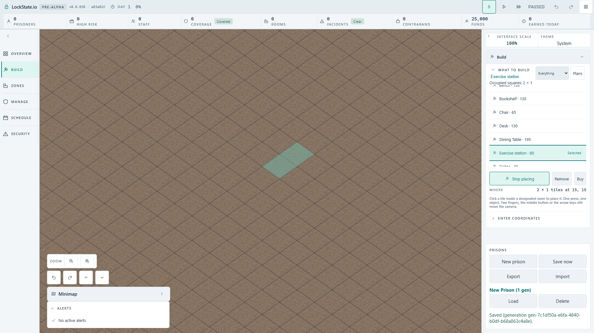
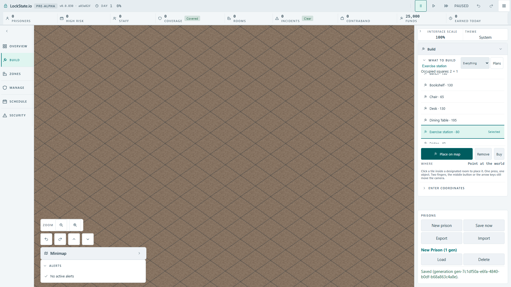

# Selected-object occupied dimensions

Owner-requested usability enhancement for whole-square building. Parent authorized a truthful static occupied-dimensions label; no new placement rule, procurement promise, save field or wall-run semantics.

- Main supplies optional objectFootprint through the existing canonical objectFootprintOf lookup used by ObjectTool.
- Selected catalogue content shows localized occupied-square dimensions; catalogue valuation remains unchanged.
- Object hover uses the existing localized area-at-anchor formatter. Removal still names only its target tile. Wall runs retain their original formatter and command semantics.
- Selection refresh repaints the current anchor with the newly selected dimensions without waiting for pointer movement.
- Unit baseline: occupied-dimension case red (old `7, 7` instead of `2 x 1 tiles at 7, 7`); removing the production footprint branch reproduces exactly that red assertion. Restored focused suites: 83 green. Locale/token/boundary/message suites: 115 green. TypeScript green.
- First probe incorrectly called Localizer.t and lost the multiplication glyph in the PowerShell/Python boundary; corrected harness uses Localizer.format and a Unicode escape. Those probe failures are not game regressions.

Actual Full HD keyboard station/bench selection and Escape verification remain pending a browser lease. This source checkpoint does not claim runtime completion.

## Actual production keyboard flow and regression #1939

The artifact build was loaded in the real angled renderer at1920?1080. New prison ? Pause ? Build ? native keyboard Bench selection ? arm ? map hover15,15 ? roving Arrow keys to Exercise station ? Enter ? Escape. The selected catalogue dimensions remain2?1, station catalogue value80, and the exact occupied target remains2?1 at15,15 until Escape clears it. The screenshot shows the two filled world squares; this is an actual production ObjectTool preview, not a manually supplied renderer feed.

This uncovered [#1939](https://github.com/woogitsu/lockstate/issues/1939): the composition root disarms the already inactive wall tool when changing object selection, and that tool erased the active object's shared readout. The fix publishes withdrawal only on an actual armed?disarmed transition. No cached UI pointer is restored; real active-tool disarming still clears its claim.

Evidence, all one worker and unchanged limits:

- Actual pre-fix baseline: one failure after14.7s, target `Point at the world` instead of `2 ? 1 tiles at15,15`.
- Focused regression: undefined target before repair;41 focused tool/readout/footprint tests pass after repair, TypeScript and production build pass.
- Actual fixed flow:1/1 pass,5.8s.
- Production mutation: remove only the transition guard, rebuild;1/1 fails after14.8s at exactly the preserved-anchor assertion.
- Restore guard, rebuild:1/1 passes,5.6s. Artifact suite terminal exit0; lease returned to parent. This is the accepted proof, not a retry of an unchanged failure.

Fresh issue searches found closed#550 (missing pointer readout wiring, a different mechanism) and#1925 (tooltip coverage); no duplicate for inactive sibling withdrawal.

