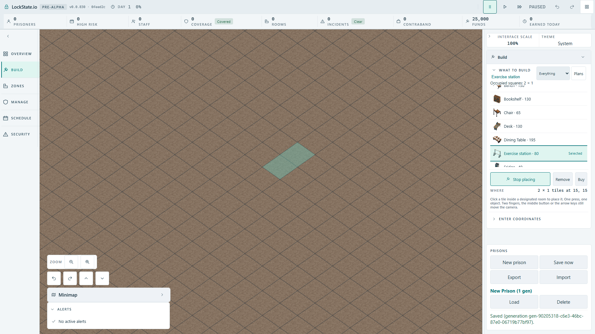
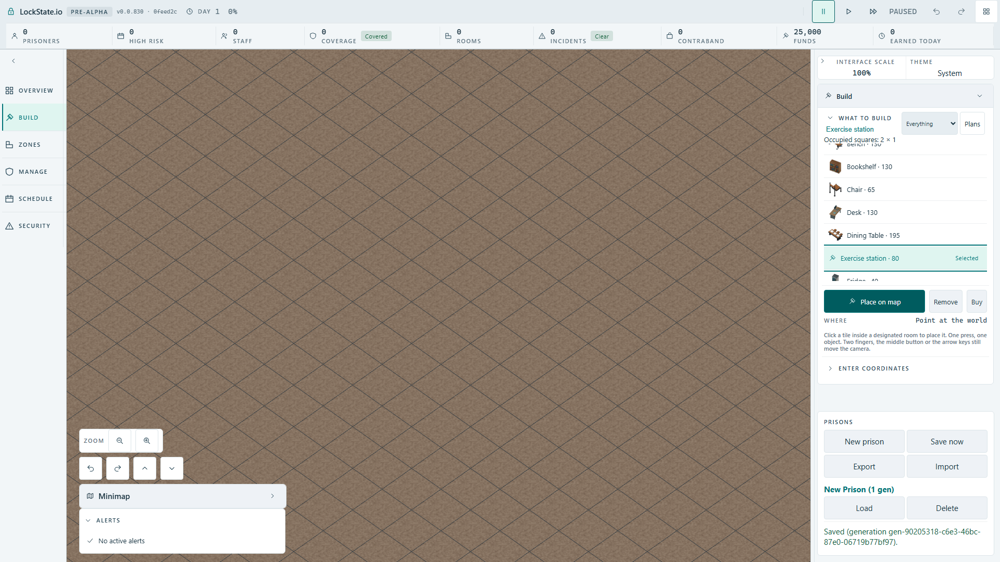

# Authored Build catalogue thumbnails

Source checkpoint: HUD receives only an optional authored image URL through HudBuildableViewModel. The composition root retains the verified oblique catalogs already loaded for production boot. A presentation-only helper resolves the existing object mapping and a 45-degree catalogue pose; the catalog selects its nearest authored frame. UI does not read scene or simulation internals. Unknown objects, top-down mode without catalogs and image-load errors retain the existing hammer icon. Accessible names, catalogue costs, occupied dimensions, selection and keyboard controls remain unchanged.

Existing row/tap geometry is retained: image fits tap-target minus the existing two vertical gutters, with no additional row or header height.

Verification: 155 focused thumbnail/token/boundary/catalogue tests and TypeScript pass. Source mutation removes the authored URL return: real-catalog assertion fails undefined; restoring it passes 2/2. Actual Full HD bench/station selection and PNG proof is pending a browser lease, so this source checkpoint is not runtime completion.

Authored frames include transparent export margins (station 256px, bench 512px). The UI now trims nonzero alpha bounds once after same-origin decoding, keeping the real object aspect ratio inside the unchanged row box. Empty or failed images keep the hammer. Alpha bounds unit mutation substitutes whole-image 8x8 for real 4x2 bounds: one assertion red; restore passes. Actual image-failure fallback is included in the pending player test.

Read-only alpha measurements from the actual authored selected frames: station 256x256 has a 134x147 occupied pixel rectangle; bench 512x512 has 122x111. Raw-frame scaling would give the bench only about 6.7px visible width in the 28px box; trimming gives it 28px without increasing the row. These are source-image measurements, not browser screenshot acceptance.

## Actual production acceptance

Actual artifact build at 1920x1080 in the angled renderer: New prison, Pause, Build. Bench is selected with native Enter, then armed and hovered at 15,15. Roving Arrow-key focus selects Exercise station with Enter without moving the map pointer. The actual authored station image replaces its hammer, the occupied 2x1 target stays at 15,15 and the station price remains 80. Escape clears placement. The row remains the same height as the existing wall row and accessible names remain the existing catalogue labels.

Baseline 1/1 green 7.7s. Source mutation replaces real alpha bounds with whole-frame bounds and rebuilds production:1/1 red 4.0s, bench natural width 512 fails expected less than 512. Restore actual alpha bounds and rebuild:1/1 green 8.4s, terminal exit0. One browser worker and original limits throughout; unchanged failures were not retried.

The final run also assigns a real missing image URL to the existing image element. Its HTTP 404 load failure hides the thumbnail and reveals the hammer; selected name, price 80 and occupied 2x1 dimensions stay intact. Console collection asserts zero CSP violations. Production img-src already allows data: and blob:; no headers, deployment configuration or fallback resource permission changed.

All three screenshots below were opened and inspected. The cropped bench and station are recognizable; the original 512px bench export would have spent most of the 28px box on empty transparent pixels. FullHD acceptance is complete for these two object selections and fallback; this does not claim a separate manual inspection of all authored objects.

