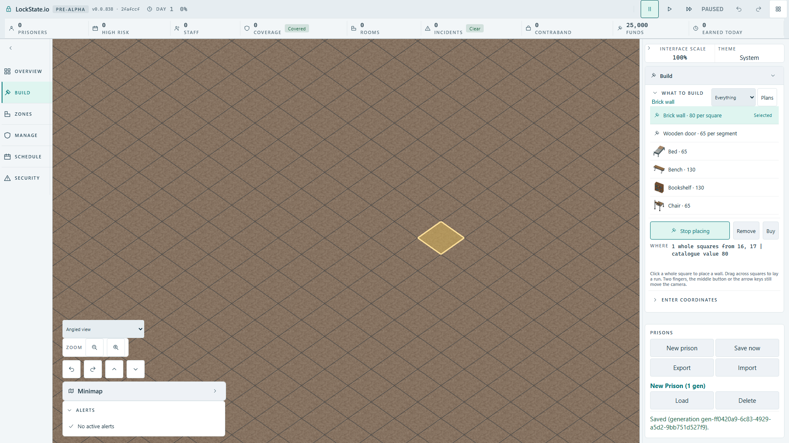

# Horizontal wheel camera — actual native acceptance

[Issue #1979](https://github.com/woogitsu/lockstate/issues/1979) was initially
published with the [source-only callback proof](README.md). This later record
adds actual built-client evidence without changing that checkpoint's provenance.

## Runtime and actual interaction

The shipped production client and dedicated simulation worker ran at 1920×1080,
UI 100%, through the existing artifact config and an untracked local matcher.
Each case creates and pauses a prison, arms Brick wall, confirms the pointer
hits canvas at (1100,600), then uses genuine native wheel (-120,0) and (120,0).
The passive DOM trace confirms both wheel deltas and canvas event ownership.
No wheel handler, pose, world or worker command is injected by the test.

The selected target remains one whole square and catalogue value 80. Native
vertical (0,-100) and diagonal (80,100) gestures still change the minimap view
and preserve the square beneath the stationary cursor. Both scenes remain armed.
The real worker-command tee records zero commands throughout the camera gestures.

## Baseline, separate producer negatives and exact restoration

| Built source stage | Fixed renderer | Angled renderer |
| --- | --- | --- |
| Both original callbacks, without the two guards | RED 5.6s | RED 7.9s |
| Corrected source | GREEN 7.1s | GREEN 10.0s |
| Remove only fixed callback guard | RED 5.7s | GREEN 10.6s |
| Remove only angled callback guard | GREEN 7.4s | RED 8.0s |
| Exact source bytes restored and rebuilt | GREEN 7.5s | GREEN 10.4s |

All four intended native failures occur at actual painted-canvas equality after
the first horizontal wheel, not at setup or network timing. Separate negative
JSON records also show the minimap viewport changes. The unaffected renderer
passes in each producer negative. Neither negative changes the quote or emits
a worker command; this isolates the unwanted camera mutation.

In final restoration all four horizontal observations preserve exact canvas PNG
bytes, minimap viewport style, the complete selected square/cost sentence and
the zero-command array. Independent nonzero vertical/diagonal controls pass.

Ten raw horizontal observations, five complete terminal logs and two full-page
screenshots are retained in [native/](native/). The final screenshots were opened
and visually inspected. The logs retain the existing wrapper's no-retry report
for expected failures with custom output paths; no network retry occurred.

## Exact source and acceptance limits

The production correction remains only the two `deltaY === 0` early returns
published as `cb36300ad1`. Both source files were restored from byte arrays,
with hashes matching the [offline checkpoint](README.md). Final production
source diff is zero; final browser processes are terminal and port 5403 has no
listeners. Both TypeScript checks and each required production build passed.

The unchanged case/expectation limits are 60/10 seconds, one worker and zero
Playwright retries. No new tracked browser config was introduced.

Acceptance covers native fixed and angled views at FullHD 100%, the two
horizontal directions, diagonal/vertical zoom and retained armed Brick wall.
The zero-motion callback remains unit-only. Other UI scales, physical trackpad
hardware, Save/Load, merging, main CI and deployment are not claimed by this run.

