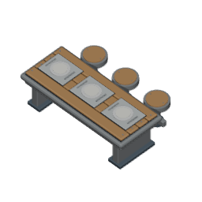
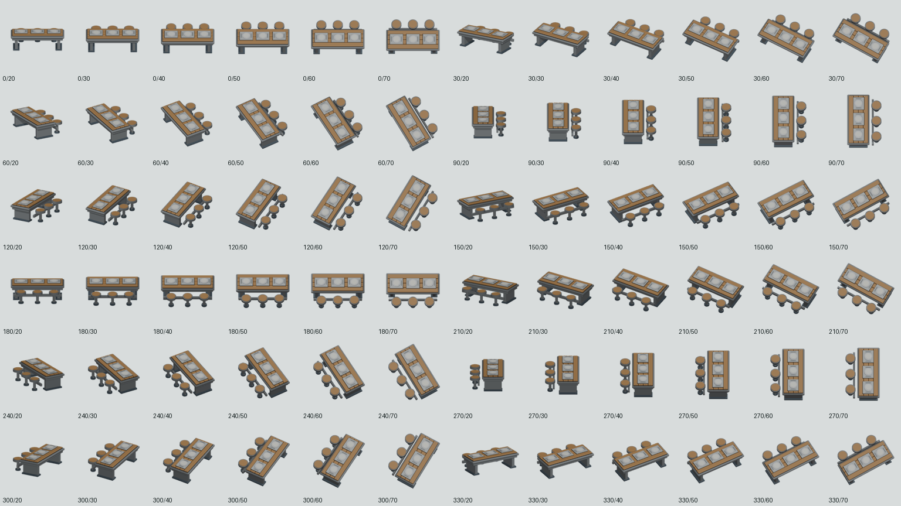

# Retained Canteen dining table: square export checkpoint — 2026-10-02

## Current checkpoint

This source/export checkpoint starts at integrated `e44ac6f66e`. A fresh remote audit found earlier dining art, so the existing authored table was reused. This checkpoint extracts and aligns that existing authored prop. The runtime registry still uses its previous manifest. Native player construction, rotated placement, Save/Load and pixel mutation acceptance remain pending integration and an exclusive browser lease. No hosted completion is claimed.

The durable camera/art plan already records the table among the five existing legacy fixture mappings. Current source has no standalone dining `.blend`, but `environment.mvp.catalog.blend` contains a detailed 62-mesh table collection. Published earlier work includes `3ddf0fe427` and `74c026362f` oblique exports, `2e7e49c62c` refinement and `1a4e3e49e9` place settings. Those were inspected before choosing reuse. The existing four walnut planks, bolted steel frame, three fixed stools, trays, plates and utensils are retained.

## Actual source geometry

The original collection origin is scene grid (28,28,0). Relative evaluated vertex bounds, including bevels, are [-1.419999957,-0.860000432,0] to [1.419999957,0.960000515,0.944999993]. Its registered old 512px export declares target [0,0,0], whereas the game's object anchor is the minimum corner of an authoritative 3x2 rectangle. Centered geometry around that declared target therefore extends across the min-corner anchor.

`extract-canteen-dining-table.py` appends only that original collection, removes its scene-grid parent transform, preserves geometry/modifiers/materials, packs source images and saves a standalone source. The original catalog is unchanged. The new provenance file lists every retained mesh name, evaluated vertex count and modifier type, and pins both source hashes.

- original catalog SHA256: `57db9afb7e48996cef9aaedda72b8e874e865eb56862ee4add8b177a9713887d`
- standalone source SHA256: `c1a1e8b0cfd2e47fe420ebbaa3eeb72c426d896d0a42b5a708c9bcbb83230fd1`
- retained meshes: 62; no foreign collection geometry appended.

[Original evaluated mesh audit](original-evaluated-source.json) and `assets/source/blender/furniture.canteen.dining-table.provenance.json` preserve the audited set. The source file remains centered; the shared exporter performs one translation (1.5,1,0). Final evaluated bounds are [0.080000043,0.139999568,0] to [2.920000076,1.960000515,0.944999993], grounded and entirely inside 3x2. The native guard also rotates every evaluated vertex through all four clockwise quarter turns and checks its corresponding 3x2 or 2x3 occupied rectangle.

## Shared export and red/restore evidence

The wrapper reuses `render-kitchen-fixtures-oblique.py` without changing that file. It supplies the standalone source, exact authored mesh/provenance check, 256x256 output,64 pixels per tile and target [1.5,1,0.4725]. All 72 actual camera positions and aiming directions are validated against the square projection basis. Workbench materials use the existing authored material colours; the original packed material data remains in the source.

Two complete renders matched all 72 PNG bytes and the manifest bytes. Manifest SHA256: `4fdb3fcc21fd528152d0aca1576ca6cd3a40dbf45fe522dbed98cb3b9afeb610`. Every frame has transparent pixels along all four borders, checked during export and independently by PNG inflation in the unit gate.

| Deliberate mutation | Obtained failure |
| --- | --- |
| Export width 3 -> 2 | actual geometry escapes 2x2 |
| Actual orthographic span 4 -> 2 | actual camera is not64 pixels per tile |
| Actual camera aimed around source origin | actual target/yaw basis mismatch |
| Append one byte to referenced PNG | frame SHA256 assertion fails |

All native mutations returned exit 1 using Blender's explicit `--python-exit-code 1`. Exact wrapper restoration SHA256 is `627acebd1c746f2da61979ffaec9e074a35125f8b432d0a76cf2e83736a6a096`; native verification returned exit 0. Referenced PNG byte restoration returned the integrity test to 1/1 green. [Native mutation records](native-guard-mutations.json) are committed. App/tools TypeScript passed.

## Opened actual renders




The 45/45 preview and contact sheet were opened. The sheet is composed solely of the actual 72 PNG exports, resized to 128px each for inspection. It is not a player screenshot. Preview SHA256: `ea44c2638dd7ff7013cedfbdcb4605daf2f7fb511bec0e7e73c6ce2ed6630a6f`.

## Repeat and remaining acceptance

```powershell
& 'C:\Program Files\Blender Foundation\Blender 5.2\blender.exe' -b --python-exit-code 1 --python tooling/blender/extract-canteen-dining-table.py
& 'C:\Program Files\Blender Foundation\Blender 5.2\blender.exe' -b --python-exit-code 1 --python tooling/blender/render-canteen-dining-table-oblique.py -- --verify
& 'C:\Program Files\Blender Foundation\Blender 5.2\blender.exe' -b --python-exit-code 1 --python tooling/blender/render-canteen-dining-table-oblique.py
node node_modules/vitest/vitest.mjs run tests/unit/oblique-canteen-dining-table-integrity.test.ts
```

Exports use Blender 5.2.1 LTS, upstream build identifier 9e2066aef7ef. The inspected executable SHA256 is `284f4041f98e113f3dc10654a7193ffaaa9bfdfec8b87fa116620a48b5f6d4cb`. Render determinism is from that pinned host with the committed standalone source; byte-identical `.blend` regeneration across hosts is not claimed.

Next concrete gate: switch only the existing dining-table registry manifest to `/game-content/oblique-furniture.canteen-dining-table.v1.json`, preserving its asset/object identity; verify occupied anchors and facing in actual normal/rotated Canteen construction, Save/Load and isolated plate/wood palette consumer mutation. No registry, renderer, UI, gameplay, or CI file was changed in this checkpoint.
