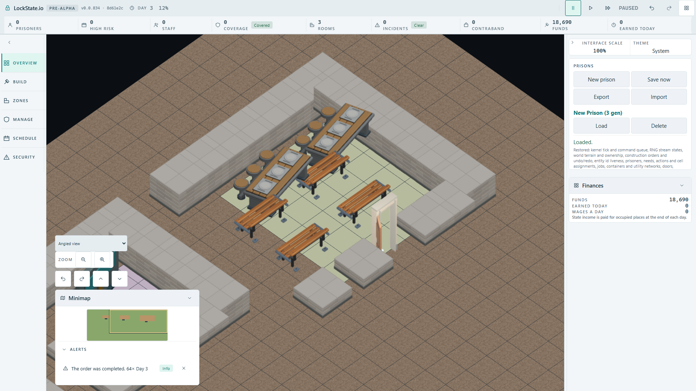
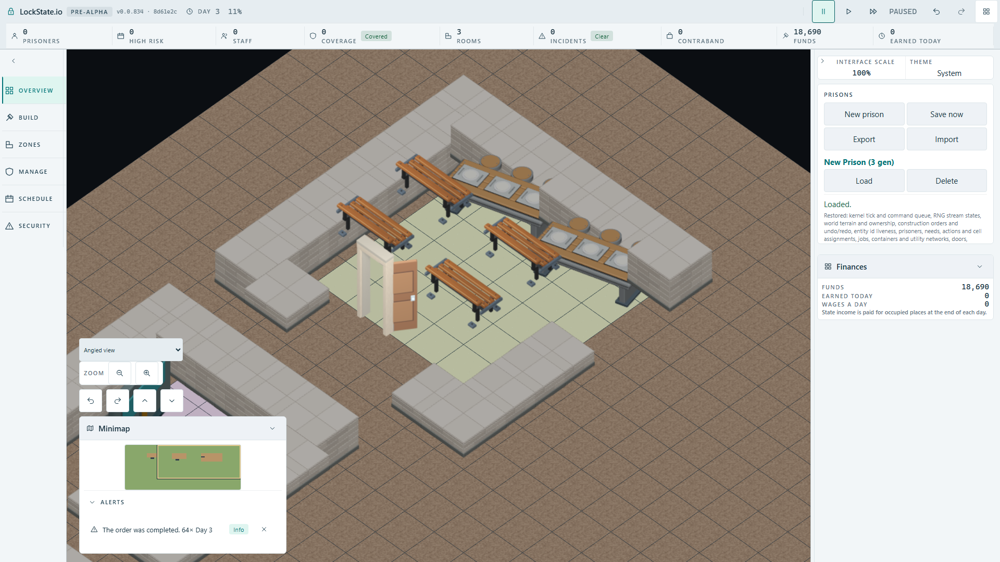

# Actual Canteen player acceptance — 2026-10-02

The production client was built from `8d61e2cbaab06f1c5be5578a54e6397c853443e6`. The native fixture uses real Storage Room and Delivery Bay construction, saves that completed capacity, and loads it into a fresh context for each Canteen orientation. It selects the room plan and clockwise rotation through player controls, places the plan at (20,5), waits for actual worker construction, then saves and loads through the client and IndexedDB. No objects or completion state are injected. Case timeout 60s and construction-count progress guard 10s were retained throughout.

## Terminal runs

| Run | Capacity | Canteen | Result |
| --- | --- | --- | --- |
| Initial broad-region baseline | 45.5s | normal 55.6s | normal green; first rotated route stopped at one remaining order after 10s without count progress |
| Exact rotated-route repeat, failure capture added | 44.4s | rotated 54.4s | 2/2 green |
| Dining binding removed, normal route | 45.6s | normal 50.1s | capacity green; four plate assertions red, every count 0 |
| Dining binding removed, rotated route | 43.9s | rotated 49.8s | capacity green; four plate assertions red, every count 0 |
| Exact source restored, unified suite | 43.8s | normal 49.3s, rotated 51.5s | 3/3 green, 2.5 minutes |

The first rotated timeout did not reach a model assertion and had no full worker snapshot. A read-only failure capture hook was added afterward; the repeated rotated route, both negative routes and final suite completed construction. The timeout remains an observed limitation rather than a claimed production fix or diagnosed permanent defect.

## Independent table regions and saved state

Each region counts RGB(177,177,173) pixels with a threshold strictly greater than 200. FullHD 1920x1080 rectangles are disjoint and calibrated against the actual completed and loaded screenshots.

| Orientation | Worker-completed anchors, unchanged after Load | Regions (x,y,width,height) | Restored before / after Load |
| --- | --- | --- | --- |
| 0 | (21,6),(24,6), orientation 0 | (680,410,170,150); (860,295,190,125) | [655,666] / [655,666] |
| 90° clockwise | (25,6),(25,9), orientation 1 | (850,320,210,95); (1040,420,190,125) | [643,635] / [643,635] |

Removing only the `object.dining-table` authored model binding left each completed object and orientation intact before and after Load, but both isolated regions became 0 at both stages in each route. This yielded eight expected pixel failures, then exact restoration yielded 3/3 green. Raw records: [normal negative](normal-consumer-mutation.json), [rotated negative](rotated-consumer-mutation.json), [normal restored](normal-restored.json), [rotated restored](rotated-restored.json).

`src/rendering/assets/oblique-object-mapping.ts` restored byte-exact SHA256: `a9eada806ff523bc9933da9b7a2e8a731c5a896286e33b0551119d8e389dd2d4`. Its final Git diff is empty. Both builds reported the same content-hashed simulation worker filename `worker-C_ujJkqC.js`; restored worker SHA256 is `b905c81193a39fa7356c70bdc532dfa1f64df940aed9f786c55c7127a506234a`. No simulation source was changed by the consumer experiment.

## Opened final loaded images

Both final loaded FullHD images were opened. The normal tables follow their 3x2 occupied rectangles; the rotated tables follow 2x3 rectangles with the authored stools, planks and plates rotated together. The tall wall occludes part of the right rotated table, consistently with the world view.

SHA256: `2d5e814ca10deb4ebb105d2b0881a4954a90849f78f2df1c447840cbc7748eb5`.

SHA256: `f0bb375fc4b276e54aa77424ed389695e3a4d50c6b90524d16f1bee885793fbf`.

The [normal negative image](normal-mutation-loaded-fullhd.png), SHA256 `fec1c389dfc8b87496a611c1e627e3904e9617c9a28ddbfc145e46aba2cb9eb4`, and [rotated negative image](rotated-mutation-loaded-fullhd.png), SHA256 `17cabcdcfe72ccc213f705e6adc583af34bad0c63099b6ab9f3672d5eee71471`, were also opened. They show the fallback table appearance while the completed layout remains present.

The browser lease was released after the terminal restored run. The temporary local artifact configuration is untracked and removed. The coordinator owns integration and routing this accepted fixture into the existing artifact gate. No hosted CI result is claimed here.

After exact source restoration, the four focused source/descriptor/mapping/coverage suites passed 48/48. The native player proof is the separate 3/3 browser result above.
