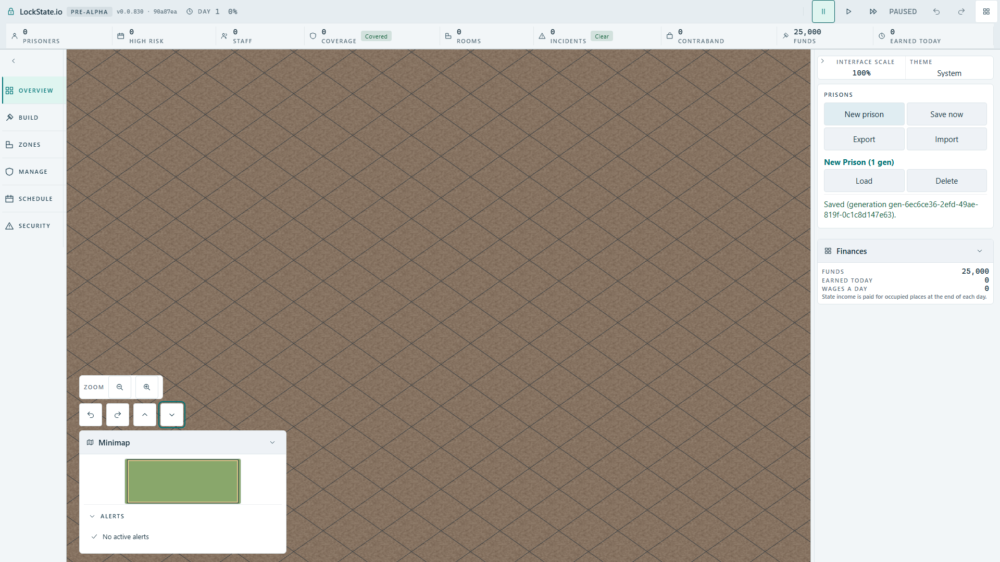

# Compact camera controls checkpoint

The existing adjustable-camera port retains four actions and their authored
localized labels. The HUD now uses its existing bordered icon-button primitive:
labels stay in screen-reader text and pointer titles, glyphs are aria-hidden,
and every button retains the existing tap-target and focus treatment. Left and
right use the existing opposed arrow glyphs; elevation uses opposed chevrons.
The group remains between zoom and minimap in the same approved shell slot.

No camera input, remapping, pose mathematics, actor feed, art registry, save state
or player-facing text was changed. The compact single row uses existing spacing
and sizing tokens rather than a new palette or smaller hit targets.

Executed: original text-only controls fail the focused icon/label contract.
The replacement gives 98 passing cases across actual control construction and
activation, design tokens, orchestration boundaries and HUD messages. Inverting
all callback directions makes the control test fail; restoring passes the same
98 cases. TypeScript passes after narrowing the browser test's indexed label.

## Production Full HD result

The actual production artifact case now passes (1/1, 11.0 s; 14.1 s suite).
The real group measures within 208x48 pixels, with four reachable targets at
least 44x44, above the minimap. Keyboard Tab visits each existing named action;
Enter on each changes the composed world image. The preserved screenshot was
opened and confirms the four-button row and visible focused lower-angle button.

Restoring the original two-column auto-width layout and rebuilding makes the
same case fail in 2.6 s: measured width 398 exceeds 208. Restoring the compact
source returns the actual artifact case to green. Callback-direction inversion
also remains covered by the red unit mutation recorded above.

The first restored browser probe used WebGL canvas.toDataURL and incorrectly
observed unchanged readback data. The final oracle uses canvas.screenshot, the
same browser-compositor path as the existing production camera tests. No
source behavior, timeout, worker count or acceptance assertion was weakened.
TypeScript and the production build pass. The one browser lease was returned
to the parent after terminal exit0; its temporary config was removed.

