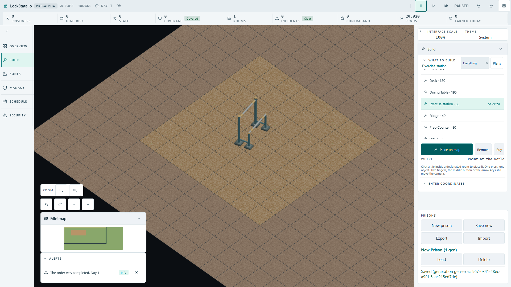
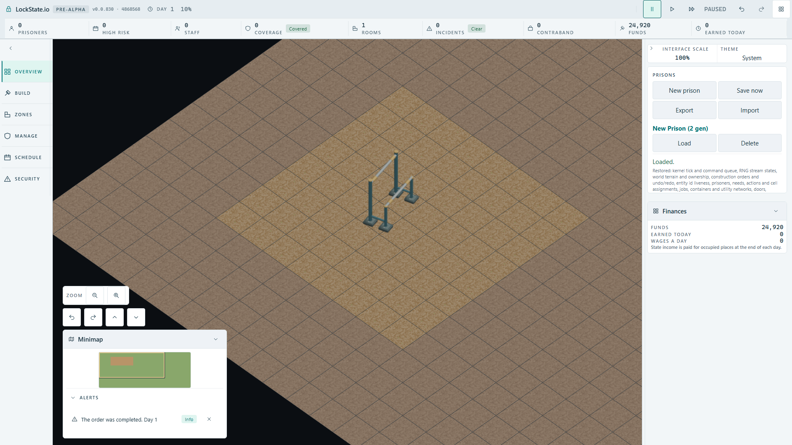

# Exercise station through the real angled player flow

Production artifact based on `773b27088a`; test: `tests/browser/exercise-station-player-build.spec.ts`. No manual RenderFeed, source game changes, new copy, save fields or deployment changes.

## Evidence

- Actual New prison, room-plan Yard UI at (4,4), real worker applies the 8x8 zone.
- Actual Build catalogue selects Exercise station (catalogue value 80); mouse placement at (7,7).
- Compositor pixel samples verify both occupied square interiors are filled and a third square is outside the ghost.
- Actual worker construction finishes one exercise-station order and publishes placed object at (7,7). Visible funds change from 25,000 to 24,920.
- Numeric placement at (8,7), the existing second occupied square, runs through the actual UI and worker. After execution ticks there remains only one order and one station.
- Actual Save now and Load preserve the station in the worker snapshot and its authored steel pixels on the canvas.
- Final restored artifact: **1/1 green**, 24.9 s; suite 27.8 s, one worker, original 60 s limit.
- Mutation removes only the new entry in `src/rendering/assets/oblique-object-mapping.ts` and rebuilds production. **1/1 red**, 15.3 s: authored steel pixel count **0**, expected >1000. Mapping restored and rebuilt before the final green run.

## Harness corrections

The first test assumed an expanded minimap and a `summary` in the Build coordinates disclosure; the real controls are a Minimap Expand button and a collapsible-section button. Corrected the harness after inspecting the actual page. A data-URL fetch for pixel decoding was blocked by the production CSP; decoding now uses a Blob from screenshot bytes, without changing CSP. The first broad blue-green pixel range also accepted the flat fallback: tightened it to the actual authored teal steel (near-equal green/blue channels), then obtained red mapping mutation and restored green. Those unsuccessful probes are not counted as production regressions.

Opened the ghost, completion and loaded Full HD images: both-square ghost is filled; final station is visibly the Blender equipment rather than a flat fallback.

