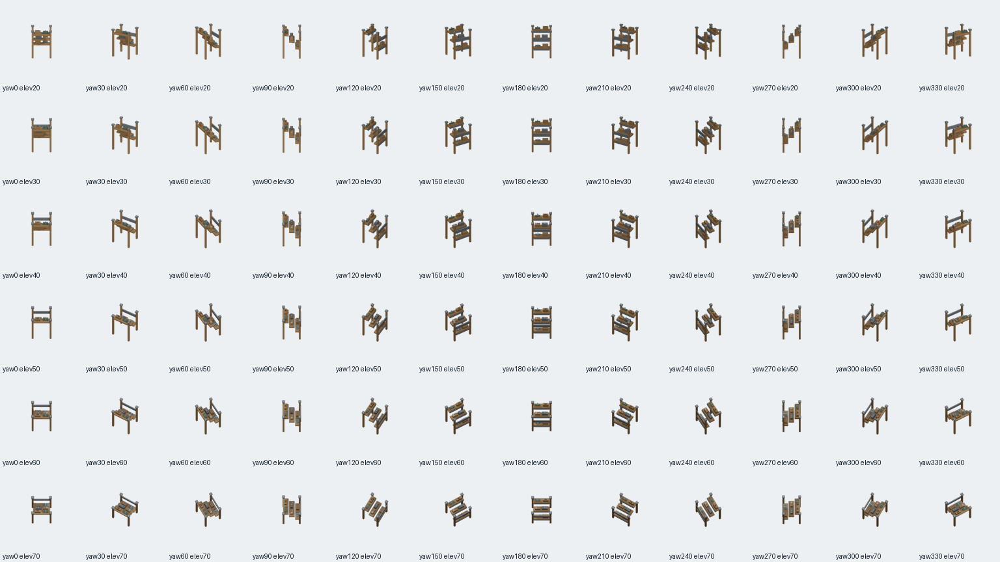
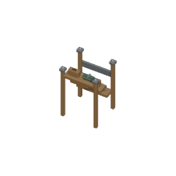

# Retained generic wooden rack: shared source alignment ? 2026-10-02

## Current source checkpoint

This isolated work starts at freshly verified published root `72e825f842229033c461f0be0649a0b02eef26ce`. It retains the existing 48-mesh generic wooden rack and aligns its source/footprint/camera through the unchanged shared square pipeline. This is an authored-source alignment task; previous legacy densification is recorded rather than claimed as new work. The source checkpoint preceded native acceptance; actual completed acceptance is recorded below. No hosted completion is claimed.

Canonical identities remain `object.storage-rack`, buildable `storage-rack-wooden`, default asset `furniture.storage.rack.wooden`, existing descriptor `/game-content/oblique-cell-storage-rack.v1.json`. The authoritative footprint remains 1?1, with existing cost/capabilities/save semantics. Registry and mapping rows are unchanged. The already accepted `room.storage-room` ? `furniture.storage-room.timber-rack` visual override remains untouched; its context/consumer suites pass 7/7.

## Authorship and actual retained geometry

Fresh audit inspected earlier dense export `b7f6e98ad13ab3e199c700d71ab651ae79afbda8` on `codex/oblique-cell-rack-dense-20260929`, plus `art/oblique-rack-consumer-20261001` and `art/storage-room-rack-20261002`. Current default registry still consumed 9 legacy 512px poses targeting [0,0,0], from geometry centered around the catalog grid origin (14,28,0). The current default is separate from the aligned 72-pose Storage Room counterpart. Correct metadata alone would cancel during projection; source geometry must occupy the actual min-corner rectangle too.

- Original catalog `assets/source/blender/environment.mvp.catalog.blend` stays byte-identical, SHA256 `57db9afb7e48996cef9aaedda72b8e874e865eb56862ee4add8b177a9713887d`.
- [Actual original source audit](original-source-audit.json) lists all 48 retained meshes, evaluated counts/material assignments and local bounds: [-.49500030279159546,-.4549993872642517,0]..[.49500030279159546,.4549993872642517,1.4079999923706055]. The assembly already fits centered 1?1, so no scaling or recentering is needed.
- Standalone `assets/source/blender/furniture.storage.rack.wooden.blend`: 5738127 bytes, SHA256 `3806d996ce473e166aaa00bef379655aac2c41ef4d45f7f32b48a893ff4b4eed`. Only catalog grid parenting is removed; authored parts and their relative spacing are retained.
- [Actual original/new scene comparison](actual-retention-comparison.json) checks every evaluated vertex after parent-origin removal, material assignments/diffuse RGBA and modifier lists. All 48 parts match within 1e-5, and materials/modifiers are exactly equal. Retained geometry includes three worn shelves, four posts/bolts, braces, steel caps, crates, canvas packets, carton labels, blankets and toolbox. Supplies remain authored visual detail.
- Provenance `assets/source/blender/furniture.storage.rack.wooden.provenance.json` pins original/new source hashes, exact 48 mesh names/counts/modifiers, centered bounds and retained material RGBA. The wrapper callback verifies source identity and the exact retained mesh set.

The shared loaded-scene translation (.5,.5,0) gives actual evaluated bounds [.004999697208404541,.04500061273574829,0]..[.9950003027915955,.9549993872642517,1.4079999923706055]. All actual evaluated vertices remain grounded within 1?1 through four clockwise rotations. No model/colour override, core, HUD/input, workflow or shared exporter is changed.

## Actual camera, complete repeat and negative controls

The actual camera is 256?256 with ortho span 4 tiles: exactly 64px/tile. Pivot [128,128], camera target [.5,.5,.7039999961853027] matches actual evaluated source height midpoint. All 72 actual camera transforms independently match the shared yaw offset basis and aim toward that target. Both source extractor and exporter explicitly call the pinned version guard.

Two complete renders directly compared actual bytes for all 72 PNGs and the manifest: identical, manifest SHA256 `4a309852bc01924357801b47619dea7c6daf6f205b4b78b249ae29078bb69047`. [Repeat evidence](repeat.json). The existing manifest now references the correct shared twelve-yaw/six-elevation grid; historical sparse frames remain in the repository.

[Native guard mutations](native-guard-mutations.json) change actual loaded mesh X -.1, actual camera span ?.5, actual camera origin X -.5, or remove actual `Worn shelf.1` before the mesh-set audit. Each exits 1 using `--python-exit-code 1`; exact original wrapper bytes restore native `--verify` exit 0, SHA256 `3f827b0d0a37ee56faeb8b66fd0f43065a784fa0f07cb96046f8f33244e75ef5`. The checks prove actual source preparation/camera behavior rather than only manifest declarations.

An appended null byte to an actual referenced PNG turns full byte-integrity red; exact restoration returns 2/2 green. [Frame evidence](frame-mutation.json). All 72 published frames pass full SHA256, PNG signature/dimensions and independent decompression checks of all four transparent borders. Four focused source/descriptor/mapping/room-template coverage suites pass 48/48, accepted Storage Room context/default-consumer suites pass 7/7, and both TypeScript projects pass. The old synthetic rack renderer harness is updated only from obsolete 45?/45? to exact new 60?/50? pose/key; it has not been run or used as native player evidence at this checkpoint.

## Opened actual exports

Opened contact sheet, SHA256 `c1e7c443db013deff762f4e167d708051a3e35d699c6fae1aebc0e857bc17289`.

Opened full-size actual PNG, SHA256 `202442426b0b2ce783a842dde469dfc26b646001c77fe2888511837772e40629`.

The inspected host is Blender 5.2.1 LTS, upstream build identifier 9e2066aef7ef, executable SHA256 `284f4041f98e113f3dc10654a7193ffaaa9bfdfec8b87fa116620a48b5f6d4cb`. Repeat determinism is measured on this host with this retained source; cross-host byte-identical source regeneration is not claimed.

Weakest claim: source/footprint/shared-camera evidence is verified, but the default generic consumer's actual player appearance is not yet established. A later native route must build the real Storage Rack outside a published Storage Room context, preserve the accepted Storage Room variant, open actual completed/loaded FullHDs and prove an isolated palette red after default-consumer removal, then exact restoration green. This source checkpoint does not claim that queued native acceptance.

## Native route preparation checkpoint

The source checkpoint is0c1cfa7c5cfbc49bf046c0dae515646bf00fdaa7. `tests/browser/generic-wooden-rack-player-build.spec.ts` prepares three actual bounded cases: worker-built Storage Room/Delivery Bay capacity with actual IndexedDB save; native individual Storage Rack placements at(23,6)/(24,7) inside worker-built Staff Room; and a genuine clockwise90-degree Storage Room at(20,5), followed by native UnzoneRoom over its5-by-5rectangle.

The individual public PlaceObject schema and HUD producer carry definitionId/x/y only, with no object orientation choice. Therefore the individual route is truthfully orientation0. The rotated template is the existing orientation1producer; removing only its designation should preserve rack anchors(23,6)/(23,8) and orientation1 while removing the accepted Storage Room context from rendering. The zoning service unregisters room instances and clears zoning, without deleting placed objects. Actual native execution must verify this transition; if occupied-room refusal or object loss occurs, the rotated request stops and that limitation is reported. No unsupported UI rotation, object/save injection, new buildable or palette rule is added. Accepted Storage Room overrides remain unchanged.

Native60s case and10s construction-count guards, exact PlaceObject/template/UnzoneRoom commands, read-only object snapshots and actual Save/Load remain in place. Candidate per-rack crops and>20pixel floors are provisional until actual FullHD images. The actual retained tabletop material diffuseRGBA(.45,.27,.12,1) supplies timber provenance; candidate source-frame RGB(117,88,55) occurs506times, but is not native calibration. Both actual loaded images must be opened and independently calibrated. Removing only the default generic rack mapping must falsify both gates per route with construction/anchors/save unchanged; exact mapping/source restoration and final full green remain required.

Application TypeScript passes for this prepared fixture. No browser run occurred: HUD owns the exclusive lease. No tracked config/workflow is added; accepted artifact gate routing remains parent-owned.

Initial calibration was partial: capacity39.8s and actual individual placement/SaveLoad33.6s passed, but the rotated fixture timed out before Unzone because native Remove rooms automatically folds the whole Rooms panel. The fixture now uses the existing panel Expand control before coordinates; no production behavior or60s/10s budget changes. The opened individual FullHD also showed unrelated fallback walls/desk from this new worktree's unhydrated public LFS pointers. Existing cached public art is hydrated before a fresh accepted calibration/build. Initial partial pixels are not labelled native palette acceptance.

## Actual fully hydrated calibration checkpoint

At b61518d4e1 after public LFS hydration and verified production buildexit0, all3native calibration cases pass43.0/48.5/41.4s with original60s/10s guards. Both loaded FullHDs opened. Individual q0PlaceObject racks remain at(23,6)/(24,7)orientation0 through actual Save/Load. Genuine rotated template racks remain at(23,6)/(23,8)orientation1 after native UnzoneRoom and actual Load, with roomcount2 rather than3. This legitimately reaches the default consumer after context removal; it does not introduce or claim unsupported individual rotation UI.

[Measured calibration](player-calibration.json) records original source-candidate counts and independent, non-overlapping native crops. Actual timber RGB93,69,42 gives275/339 normal; RGB117,88,55 gives362/93 rotated; before/after Load counts equal. The rotated rear rack is partially behind the wall, so its visible timber is measured. The tracked fixture now requires each normal region>200 and each rotated region>70. This checkpoint establishes native route/transition/persistence and calibration; default-only consumer mutation and exact restoration remain pending. Accepted StorageRoom override and48retained authored meshes remain unchanged.

## Current native acceptance checkpoint

[Actual native acceptance](player-acceptance.md) supersedes the historical pending/preparation state above. Genuine individual orientation0 and genuine rotated StorageRoom-to-Unzone orientation1 both reach the default consumer and preserve their actual worker-built objects through Load. Eight independent expected pixel reds follow default-only mapping removal; exact original mapping/source bytes and equal worker bytes restore full3/3green42.9/49.9/38.9s with original60s/10s guards. Both final loaded FullHDs were opened and committed with raw evidence/hashes.55focused/app-toolsTypeScriptgreen. Browser lease explicitly released to root/HUD. Accepted StorageRoom override,48authored meshes and canonical identities remain unchanged; no hosted or unsupported individual rotated UI claim.
