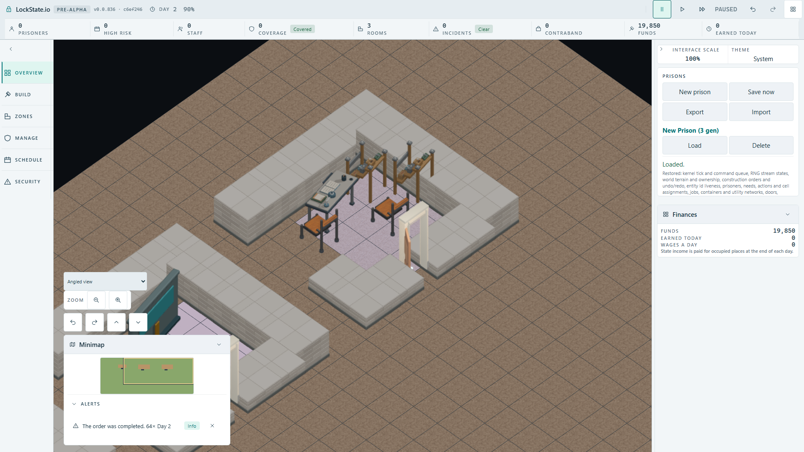
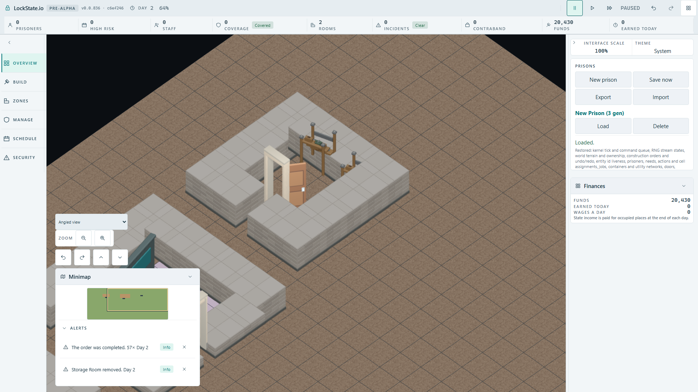

# Generic wooden rack native acceptance ? 2026-10-02

Status: the actual built client completed real worker construction, two default rack consumers, orientation persistence, independent timber pixels and IndexedDB Save/Load. Hosted deployment and integration into the canonical artifact gate are not claimed.

## Genuine native routes

Three serial cases use native controls with unchanged 60s case and 10s construction-count progress guards. The first builds Storage Room at (5,5) and Delivery Bay at (12,5), then saves actual IndexedDB state. Each later route starts in a fresh context from that capacity save.

| Route | Native actions | Persisted rack anchors/orientation |
|---|---|---|
| Individual placement | Build Staff Room at (20,5), buy two wood planks through the rack row, submit two native PlaceObject orders, wait for real worker completion | (23,6)/(24,7), orientation 0 |
| Rotated context transition | Build genuine clockwise 90-degree Storage Room at (20,5), wait for workers, remove its designation through native Zones controls | (23,6)/(23,8), orientation 1 |

The public PlaceObject schema and HUD producer currently have no object rotation field/control. Therefore this proof does not claim individual rotated UI placement. The second route uses the existing template rotation producer and legitimate UnzoneRoom transition: room count changes from 3 to 2, while both rack objects retain orientation 1. Actual Load keeps room count 2 and both anchors/orientations. The accepted Storage Room visual override remains unchanged; once the target designation is removed, the default generic rack mapping is exercised. No synthetic world object, completion, orientation or save state is injected. Exact commands and read-only worker snapshots are retained in raw evidence.

## Calibration and independent consumer falsification

Initial preparation encountered the native removal panel's automatic fold, before any Unzone command. The fixture was corrected to use its existing Expand control. Its first individual FullHD also exposed unrelated public LFS pointers in the new worktree. Those initial partial results are documented in README and are not counted as palette acceptance. Public cached assets were hydrated before the accepted production build and calibration.

Fully hydrated calibration at b61518d4e1 passes 3/3 (43.0/48.5/41.4s). Both actual loaded FullHDs were opened. The original retained timber diffuse RGBA (.45,.27,.12,1) gives different native lit faces by orientation: normal RGB (93,69,42), counts 275/339; rotated RGB (117,88,55), counts 362/93. Each pair is identical before/after actual Load. [Calibration](player-calibration.json) records the separate non-overlapping rectangles, original candidate counts and floors. Normal regions each require >200; rotated regions each require >70. The rotated rear rack is partly behind the wall, so its visible timber is measured explicitly.

Calibration checkpoint c6ef246b6c35ad292c7b0877c9fe177677b0288c was committed/pushed before the consumer mutation. Remove only the default mapping `'object.storage-rack': 'furniture.storage.rack.wooden'`, keeping the accepted context override. Rebuild the real production client. Run the two routes separately so one failed case cannot skip the other:

| Missing-consumer route | Capacity/target duration | Independent palette failures | Counts before/after Load |
|---|---|---|---|
| Individual orientation 0 | 45.1/53.2s | 4 expected failures, exit 1 | 0/0 and 0/0 |
| Genuine orientation 1 after Unzone | 42.2/38.7s | 4 expected failures, exit 1 | 0/0 and 0/0 |

Both actual native construction routes, exact commands, anchors/orientations and Save/Load assertions remain valid. Both negative loaded FullHDs were opened. This independently falsifies contamination by the Staff Room desk/chairs, doors, walls or bare ground. [Mutation/restoration evidence](consumer-mutation-and-restoration.json) pins the negative raw records and images.

## Exact restoration and final green

The default mapping is restored to exact original bytes, SHA256 `a9eada806ff523bc9933da9b7a2e8a731c5a896286e33b0551119d8e389dd2d4`, with empty source diff. Original catalog (25561293 bytes, SHA256 `57db9afb7e48996cef9aaedda72b8e874e865eb56862ee4add8b177a9713887d`) and retained standalone rack (5738127 bytes, SHA256 `3806d996ce473e166aaa00bef379655aac2c41ef4d45f7f32b48a893ff4b4eed`) directly match saved original bytes. All 48 authored mesh components remain retained. Both production builds exit 0.

The entire actual emitted worker file is compared directly between mutated/restored builds: 427658 bytes equal, SHA256 `cfbb8ce76a61288be2998256b117dfa6d9bf1e833470cbd1ba6c4ccc183e17b3`. Thus the negative result is not caused by changing simulation/core code.

Final restored native run passes 3/3 in 42.9/49.9/38.9s with unchanged budgets and original pixel counts. Six focused source/descriptor/mapping/coverage/accepted-context/consumer suites pass 55/55. Both application and tools TypeScript builds exit 0. [Accepted run](accepted-player-run.json) retains commands, anchors, counts and complete image hashes. Every browser process is terminal, and exclusive lease was explicitly released to root/HUD before evidence publication. Temporary local manual configs were removed; no tracked config/workflow was added.

## Opened final loaded FullHDs

Opened normal loaded SHA256 `fa4d94da61026441bb72cf9c39a00f4fa69b44804324f5b583a24d2809e929bb`.

Opened rotated loaded SHA256 `9d0942aace26f1a11f692a95288e2aa29414d9e23f038f24377ad8e3c42437a7`.

## Limits

This establishes the default retained rack's native consumers at these actual camera poses and the legitimate rotated context transition. It does not add unsupported individual rotation, establish all native camera views, or claim hosted deployment. The 72-pose byte repeat, transparent borders and actual source/footprint/camera transforms were verified separately in the source checkpoint. The older synthetic renderer harness remains a distinct pose check.
