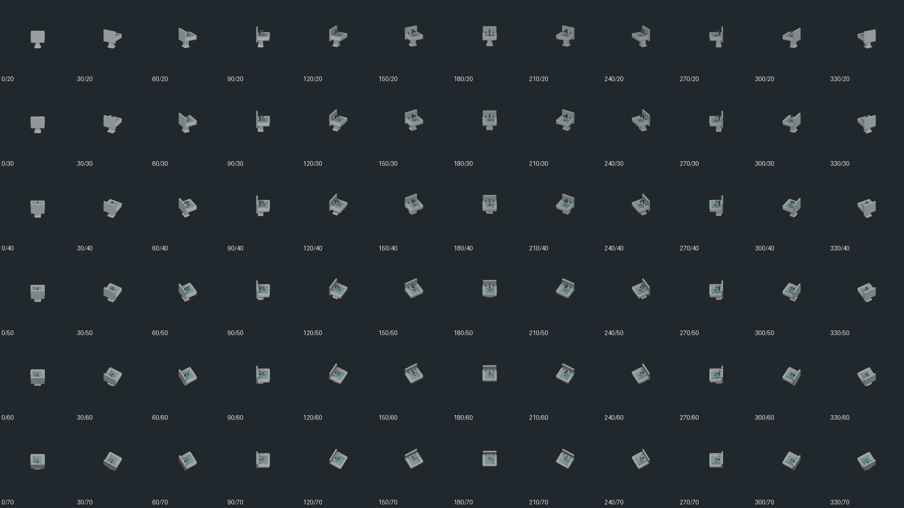
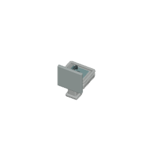

# Existing handwash sink: shared square alignment — 2026-10-02

## Current checkpoint

The existing authored one-tile sink was audited from integrated `c0fc74c97f`. Its original source is retained byte-exact; only its exporter and existing manifest are corrected. The canonical registry descriptor already points to that manifest and needs no change. No gameplay, HUD, input, workflow or other model source changed. Native verification, two complete exports, decoded frame checks and deliberate mutation/restoration are complete. Actual player construction is unavailable for this object because the existing content contract deliberately has no sink buildable; no player or hosted completion is claimed.

## Proven defect and retained source

The original 128px exporter uses an actual orthographic span of1.65 tiles, giving77.5758 pixels per tile, while its manifest declares64. The source is centered around(0,0), and its actual camera targets(0,0,0.4), while the declared camera target is(0.5,0.5,0.4). Its old yaw basis also differs from the shared square camera. These are exporter mismatches rather than a reason to recreate the authored prop.

The original `fixture.cell.sink.handwash.blend` SHA256 remains `ffcf0973794e39e59b5ee65e259d7149daf616bd0518a1c78a1c5f5a9b502158`. [Original evaluated audit](source-evaluated.json) and `assets/source/blender/fixture.cell.sink.handwash.provenance.json` pin all17 mesh names, evaluated vertex counts and modifier types: the porcelain basin, pedestal, backsplash, drain, faucet, valves and blue handles are retained. No mesh is filtered out or replaced.

Original evaluated bounds are [-0.379999995,-0.389999986,0]..[0.379999995,0.330000013,1.009999990]. The loaded scene receives one shared in-memory translation(0.5,0.5,0), with no scale change. Its evaluated bounds become [0.120000005,0.110000007,0]..[0.879999995,0.829999983,1.009999990], grounded and within the authoritative1x1 footprint. Actual evaluated vertices remain within1x1 at all four approved clockwise quarter turns.

`render-handwash-sink-oblique.py` imports the existing shared kitchen exporter without modifying it. Its existing optional source callback verifies the pinned source hash and exact authored mesh set. The exporter renders256px frames with a real span of4 tiles, exactly64 pixels per tile, pivot[128,128], and target[0.5,0.5,0.505]. The camera target height is the evaluated source height midpoint. All72 actual camera offsets and aim vectors are checked against the independent square yaw basis.

## Repeat, borders and mutation evidence

Two full exports produced identical manifest bytes and all72 actual PNG bytes. Manifest SHA256 is `b27aeb53e2a7dc051b5d8bc66b0a251e07f50a9324bf861d23973cf81145092b`. Every PNG is256x256, hash-named, and has fully transparent borders on all four sides, checked both in the native exporter and by independent PNG inflation in the integrity test.

| Native deliberate mutation | Result |
| --- | --- |
| Translate actual loaded meshes outside1x1 | evaluated footprint guard red |
| Halve actual camera span | actual64 pixels-per-tile guard red |
| Shift actual camera origin | actual target/yaw guard red |
| Omit authored faucet mesh | exact retained mesh-set guard red |

Each native mutation exited1 using Blender's explicit `--python-exit-code 1`; exact restoration exited0. [Native records](native-guard-mutations.json) pin restored wrapper SHA256 `facc5ffdacdd472f7b63d4e386aa0275499882485e69822e7718ac30c91f410e`. Appending a byte to a referenced actual PNG made the integrity suite red; exact byte restoration returned3/3 green. [Frame/repeat records](repeat-and-frame-mutation.json) retain those results. Source/registry/mapping suites passed29/29, and both TypeScript projects passed.

## Opened actual exports



The contact sheet contains only the actual72 exports resized to128px each and was opened. SHA256: `80decbbbda1d92cb059e07c41874e590b56e6523005b86b8c5422335f5bb59e4`.



The full-size256px frame was opened. SHA256: `e3df7c69991b3912a4a23265f61fcc14a8131745f8dc96cbd67c860b63915a02`.

## Reproduction and real player boundary

```powershell
& 'C:\Program Files\Blender Foundation\Blender 5.2\blender.exe' -b --python-exit-code 1 --python tooling/blender/render-handwash-sink-oblique.py -- --verify
& 'C:\Program Files\Blender Foundation\Blender 5.2\blender.exe' -b --python-exit-code 1 --python tooling/blender/render-handwash-sink-oblique.py
node node_modules/vitest/vitest.mjs run tests/unit/oblique-handwash-sink-manifest-integrity.test.ts
```

The pinned host is Blender5.2.1 LTS, upstream build identifier9e2066aef7ef, executable SHA256 `284f4041f98e113f3dc10654a7193ffaaa9bfdfec8b87fa116620a48b5f6d4cb`. Determinism is measured on this host with the original committed source.

`src/simulation/construction/definition.ts` explicitly documents that `object.sink` has no construction row because no room definition requires it and issue#141 owns the content decision. `room-template-catalog.ts` likewise includes no sink in Basic/Large Cell or Shower Room plans. Consequently an actual native worker-build/SaveLoad fixture cannot honestly be prepared for this sink within the authorized art-only scope. The next constructible essential prop is the existing shower head; its real Shower Room route can reuse the capacity bootstrap without introducing a buildable or injected world object.
