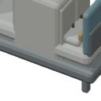
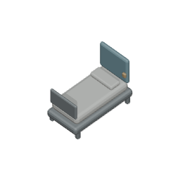
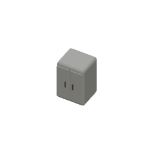

# Infirmary source/export alignment - 2026-10-02

## Current checkpoint and next player gates

Export work is based on integrated checkpoint `e8bb730290`. The original Blender models are byte-identical. All 144 committed poses were exported twice with identical PNG and manifest bytes. The evaluated-source, actual camera and frame integrity gates passed after deliberate mutations failed. This is an export checkpoint. Actual Infirmary player construction, isolated bed/cabinet pixel regions and Save/Load acceptance are pending the exclusive browser lease and an integrated artifact. No hosted delivery is claimed.

The next route is the actual Storage Room and Delivery Bay capacity/save bootstrap, followed by native Infirmary placement at (20,5), completion through workers, authoritative medical-bed anchor (21,6) and medicine-cabinet anchor (23,6), an angled fullHD screenshot, real Save/Load, then separate renderer binding/palette mutation evidence. Renderer sources, UI and gameplay were outside this export change.

## Proven source and framing defects

The old exporter used a 128-pixel image and orthographic scale `max(footprint) * 1.35`: 47.407 pixels per tile for the 1x2 bed and 94.815 for the 1x1 cabinet, while both manifests declared 64. The actual camera targeted the source origin while the manifests declared occupied-footprint centres; its yaw basis also differed from the game's square pipeline.

The cabinet source includes the previously authored bed: 20 mesh objects, with 11 bed meshes unselected and 9 cabinet meshes selected. The old exporter rendered all 20. Its supposed 1x1 asset therefore included a 1.82-tile bed and visibly clipped the image border.



## Original source identity and retained geometry

| Asset | Original and final source SHA-256 | Source meshes -> exported meshes |
| --- | --- | --- |
| Medical bed | `1737b03a3ee1342e813e7096e0aef189f05d714d5a69437a8fe490c026d232be` | 11 -> 11 |
| Medicine cabinet | `17670457233caef94855cdaf64b2cf1bd3c8623318941cbd3ce2e5c50224ac75` | 20 -> 9 |

Bed retained names: `bed_base`, `mattress`, `rail`, `rail.001`, `leg`, `leg.001`, `leg.002`, `leg.003`, `headboard`, `pillow`, `control`.

Cabinet retained names: `cabinet_body`, `inner`, `shelf`, `shelf.001`, `shelf.002`, `door`, `door.001`, `handle`, `handle.001`.

The wrapper verifies the original source hash and exact saved selected mesh-name set before excluding foreign meshes. Preparation changes only the scene in memory. It grounds the bed by +0.090000004 in Z and the cabinet by -0.030000031 in Z, then the shared pipeline places them around the minimum corner of their occupied rectangles at unchanged authored X/Y scale.

| Asset | Evaluated final minimum | Evaluated final maximum | Declared target |
| --- | --- | --- | --- |
| Bed, 1x2 | [0.039999992, 0.089999974, 0] | [0.960000038, 1.910000086, 1.350000024] | [0.5, 1, 0.675] |
| Cabinet, 1x1 | [0.090000004, 0.114999995, 0] | [0.909999967, 0.932499945, 1.179999948] | [0.5, 0.5, 0.59] |




The cabinet's authored doors face source +Y. Their handles remain visible in the front poses, including yaw210/elevation40 shown above. No source facing or model detail was replaced.

## Shared callback scope

`render-kitchen-fixtures-oblique.py` accepts optional `prepare_source=None` immediately after loading a source. Existing callers omit it. Only the medical wrapper passes its preparation callback. Stove, prep-counter and fridge previews from that unchanged default path were rendered and byte-compared with their existing committed yaw45/elevation45 evidence; all three were identical.

## Export and mutation evidence

Both assets use the shared 256x256 export, exact 64 pixels per tile, pivot [128,128], canonical yaw camera basis, deterministic pixel/PNG normalization, and transparent-edge checks. Every evaluated vertex including modifiers is contained in its declared footprint and grounded. The medical camera verifies its scale, declared target, yaw basis and aim across all 72 poses per asset. The unit gate independently decompresses and checks all four transparent PNG edges in every exported frame.

| Production mutation | Observed red guard |
| --- | --- |
| Retain foreign bed meshes in cabinet export | actual geometry escapes 1x1 footprint |
| Camera placed around origin instead of declared target | actual camera target/yaw basis mismatch |
| Orthographic camera scale 4 -> 2 | actual scale differs from 64 pixels per tile |
| Append a byte to a referenced bed PNG | manifest/frame SHA-256 mismatch |

Actual Blender mutation results are preserved in [actual-export-guard-mutations.json](actual-export-guard-mutations.json). Exact source-script restoration hashes after those guards:

- medical wrapper: `7d0463c65932b3786d22285eb0d05166a8e00c3530daa1d1a53d901358252f9b`
- shared square exporter: `a3e481fd158707c8e615fa87eee19a110716b81e14b11e903225d374d5c643d6`

Two full exports matched all 144 PNG bytes and these manifest SHA-256 values:

- bed: `044618dbc6dc4eb8297276c1e57ee1b3e182a00b5af05f105ea7c45a35836748`
- cabinet: `a11e50040c8cbacce296079ce4b41e0bf9e3d52a75729efb4c440599227a3e81`

The new medical integrity gate initially failed both old manifests. After export, the medical/utility/kitchen/art-pipeline suites passed 14/14. Application and tools typechecks and the production build passed. An early kitchen byte check encountered unhydrated LFS pointer files in this isolated checkout; hydration restored that pre-existing integrity gate to green. All 144 obsolete medical frame paths were removed from the original manifests' exact file list.

## Repeat the source and export gates

```powershell
& 'C:\Program Files\Blender Foundation\Blender 5.2\blender.exe' -b --python-exit-code 1 --python tooling/blender/render-medical-oblique.py -- --verify
& 'C:\Program Files\Blender Foundation\Blender 5.2\blender.exe' -b --python-exit-code 1 --python tooling/blender/render-medical-oblique.py
node node_modules/vitest/vitest.mjs run tests/unit/oblique-medical-fixture-integrity.test.ts
```

Renders were produced with Blender 5.2.1 LTS, build `9e2066aef7ef`. Repeat-byte evidence is from this pinned host toolchain.

## Prepared player gate - execution pending

Export checkpoint `40349455d2` is pushed. The two-stage `infirmary-player-build.spec.ts` and untracked local `.local-infirmary.config.ts` are prepared; collection lists exactly two cases. They have not executed yet because another agent holds the exclusive browser lease.

The draft uses independent source palette colours from the default yaw300/elevation40 frames: bed headboard RGB [79,102,108] in screen rectangle [750,400,170,260], cabinet inset RGB [64,76,76] in [880,340,150,190]. These screen regions remain provisional until the actual built-client screenshot is inspected. The worker result is checked before the pixel gate, and its actual rows and both pixel counts are saved even if the pixel gate fails. Renderer-binding mutations will be run after baseline acceptance, with byte-exact mapping restoration and an artifact rebuild.

```powershell
$env:LOCKSTATE_ARTIFACT_TEST_PORT = '5197'
node node_modules/@playwright/test/cli.js test --config tests/browser/.local-infirmary.config.ts
```

The capacity state will come from the first stage's native IndexedDB save, and the fixture state from actual worker completion. Runtime acceptance and publication remain pending.

The extra tracked artifact configuration was removed after the coordinator identified its conflict with the existing browser-configuration contract. The prepared case will be added to the existing artifact matcher and excluded from the dev matcher after actual acceptance. The local config is a manual execution aid, and is excluded from the delivery.
