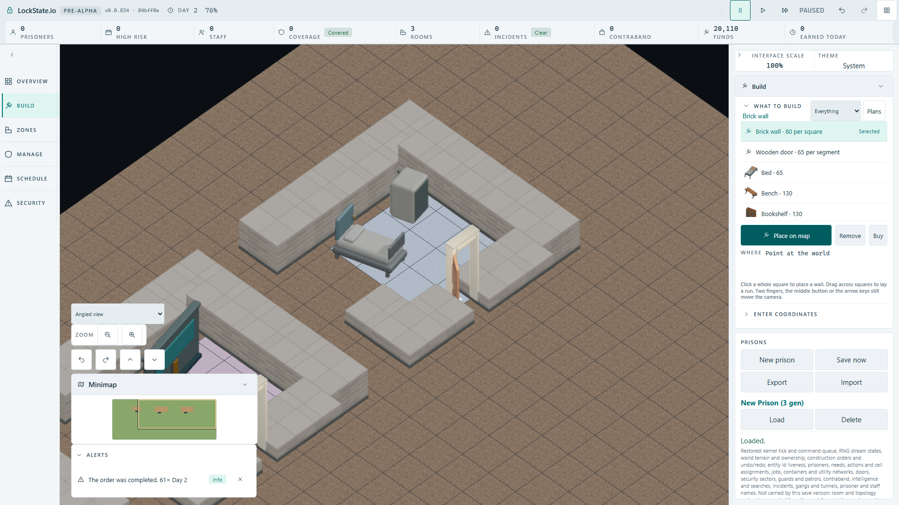
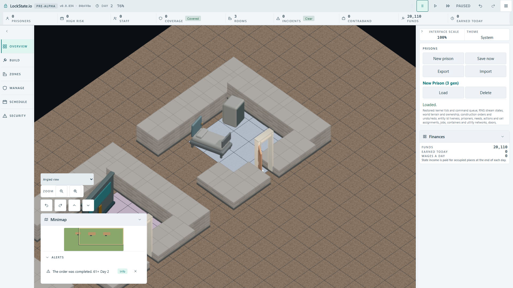
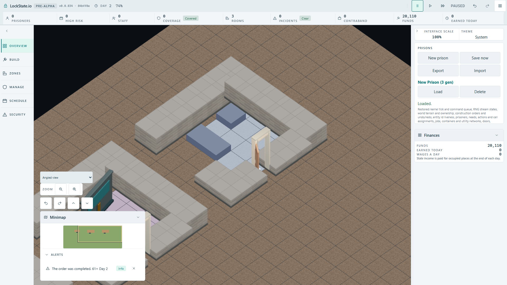

# Infirmary built-client player acceptance — 2026-10-02

Actual local player acceptance at integrated `84bff0e11cf1b806b77bc8db836d251f5ef6bc60`, served from the production build through the existing artifact preview. This proves the local built client; hosted delivery and hosted CI remain separate.

## Player route and observations

The two serial cases use native controls. The first constructs Storage Room at (5,5) and Delivery Bay at (12,5), waits for workers to complete construction, and makes an actual IndexedDB save. The second loads that saved capacity, places Infirmary at (20,5), waits for its construction, and saves/loads again. A read-only worker snapshot probe observes completed objects; it does not insert world objects or drive construction.

The emitted Infirmary command is `PlaceRoomTemplate(infirmary-basic, origin={x:20,y:5})`. Before and after Load, completed objects are exactly:

- medical bed at (21,6), orientation0;
- medicine cabinet at (23,6), orientation0.

Both FullHD screenshots were opened. The bed occupies its authored 1x2 area. The cabinet is a standalone 1x1 object with no leaked bed geometry. Its rear is visible at this camera direction, consistently with the unchanged source facing; front doors and handles are separately visible in the exported front preview.

## Independent palette regions and mutation

At1920x1080, the bed headboard RGB(79,102,108) is counted only inside rectangle(705,425,170,175). Cabinet RGB(64,76,76) is counted only inside rectangle(830,350,100,130). Each must exceed100 pixels and match its own count after Load. The preliminary bed rectangle missed most of the headboard and reported61; opening that screenshot established the corrected isolated region. The threshold was retained.

| Run | Terminal cases | Bed before / after Load | Cabinet before / after Load |
| --- | --- | --- | --- |
| Calibrated baseline | 2 passed;41.4s/35.7s | 883/883 | 1366/1366 |
| Both actual oblique bindings removed | 1 passed,1 failed;43.1s/36.7s | 0/0 | 0/0 |
| Exact source restoration and rebuild | 2 passed;44.2s/38.1s | 883/883 | 1358/1358 |

The mutation removed only the two medical entries from `src/rendering/assets/oblique-object-mapping.ts`, rebuilt production, and repeated the same actual route. All four independent pixel assertions failed while authoritative object anchors and orientations remained correct before and after Load. Soft pixel assertions allow both consumers and persistence evidence to be recorded before the terminal failure. No assertion was disabled.

The restored mapping SHA256 is `a9eada806ff523bc9933da9b7a2e8a731c5a896286e33b0551119d8e389dd2d4`; its Git diff is empty. The restore run's cabinet count differs by8 pixels from the earlier run; the proof requires stable before/after Load counts within a paused run, not a byte-identical full screenshot across simulation runs. The four mutation counts remain zero. Raw records: [baseline](player-baseline.json), [mutation](player-consumer-mutation.json), [restored](player-restored.json).

Medical integrity tests passed2/2 and tools TypeScript passed. Original bed/cabinet `.blend` hashes remain the values in the source audit. No renderer, UI, gameplay, or Blender source changes remain in this checkpoint.

## Opened evidence

- completed PNG SHA256: `5b08cd45db45aa7605788668e1054a7f2440e3dc29e5ec0ee652612ec3856ee1`
- loaded PNG SHA256: `eddb1f61b3df6ebda3c8de9df21674c8512d46296c9fcfb8352f36fdd2876613`
- mutation loaded PNG SHA256: `012df62ede466023d00988186cb9409b138d32162c8b2bcd50b3aa70a05a7f9c`

The scoped test is `tests/browser/infirmary-player-build.spec.ts`. The manual run used an untracked `.local-infirmary.config.ts` extending the existing artifact config and selecting only this spec. No extra tracked artifact configuration is added. The integrated canonical artifact matcher and dev ignore still need this accepted spec added by the coordinator.

Current checkpoint: baseline, mutation, exact restore, worker state, Save/Load and opened player images verified locally; browser lease released. No hosted completion claim.
