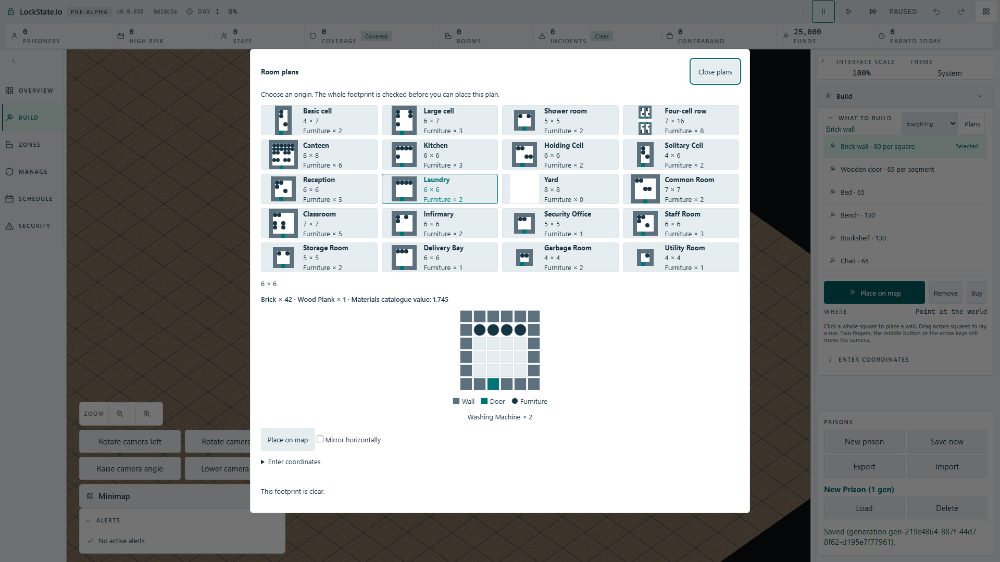
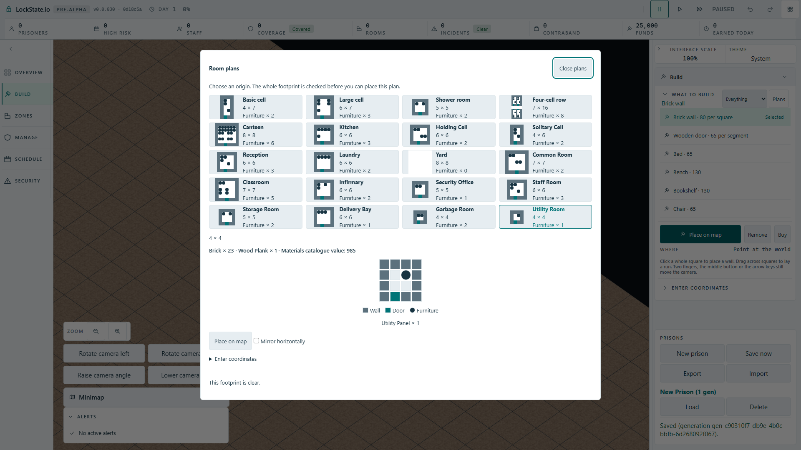

# Keyboard room-plan selection and rearming

Issue: [#1923](https://github.com/woogitsu/lockstate/issues/1923).
Source checkpoint: `0d18c5a7a3` on the isolated `codex/template-keyboard-rearm-20261002` branch.

## Observed failure

The actual Full HD angled game lost its genuine canvas hover while the template tool was unarmed. Opening the native Room plans dialog and selecting/arming entirely by keyboard therefore produced a hidden world ghost until another physical mouse movement. Escape and keyboard-only rearming had the same cause. The baseline production-artifact case failed after the first Basic cell ghost stayed hidden for ten seconds (16.3 s case).

No evidence showed that UI button coordinates became a world origin. The fix retains only a real canvas pointer position, clears it after a physical pointer move onto UI, and lets the existing approved fit controller prepare the newly selected footprint from that map position. No placement command is generated by selection, focus or Escape.

## Regression evidence

- The new bridge unit case failed before the source change: no preflight target after keyboard arming from a previously observed map hover.
- Restored bridge/fit suites: 14 passed; TypeScript build passed.
- Mutation removing the remembered-hover fallback: added unit case failed; the production fallback was restored.
- Actual production artifact at 1920×1080, one browser worker: both cases passed in 52.5 s, covering all 20 cards, mirror toggles, observed worker preflight template IDs/mirror flags, genuine quote, visible floor polygons, Escape and repeated keyboard arming. Zero `PlaceRoomTemplate` commands were sent.
- An initial all-card harness run waited for `isChecked()` on the closed native dialog. This was a test bug; mirror state is now observed before the dialog closes. It is not reported as a game regression.

The final screenshots show the reopened native catalogue after each ten-plan sequence; they document the actual Full HD surface, while the browser assertions establish the visible ghosts throughout the sequence.

The browser test uses normal `/?renderer=oblique` and the actual built artifact. No query-only fitting policy, fake worker quote, timeout increase or automatic retry was used. This branch is an integration checkpoint; it is not evidence of publication to main.