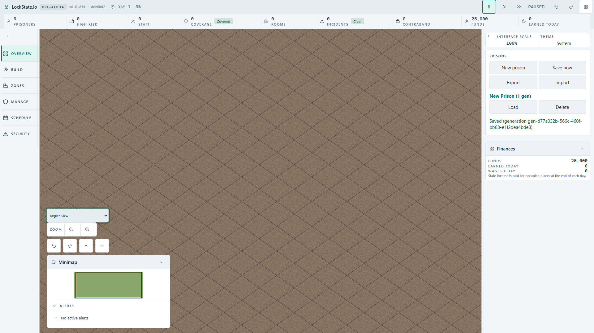

# Live View keyboard focus ? actual production acceptance

Issue: [#1956](https://github.com/woogitsu/lockstate/issues/1956).

## VERIFIED: native regression

At 1920?1080, actual Tab/Enter creates a prison through the worker and focuses View. Native ArrowDown successfully activates Angled, but disabling the select during asynchronous replacement loses focus to the body. The old source failed both prepared cases after a successful activation (19.8 seconds each). An actual registry 503 rollback retained focus through native validity feedback; its successful retry then lost focus again. This is a HUD focus defect, independent of renderer geometry or save fields.

## Correction and navigation intent

The control records whether it was focused before disabling. After replacement it restores focus with preventScroll only if the active element is the body and no Tab or pointer navigation occurred during loading. A different focused control is preserved. Temporary document navigation handlers are removed after completion. The select remains genuinely disabled during loading, preventing duplicate requests; rollback and native validity feedback retain their existing behavior.

## Actual proof

`tests/browser/live-view-keyboard-focus.spec.ts` uses native Tab, Enter and ArrowDown/ArrowUp, never programmatic focus or selectOption:

- World -> Angled -> World retains focus for the next keyboard action.
- Real registry 503 refusal returns to World and permits immediate keyboard retry.
- A held registry response allows actual Tab navigation while busy; completion preserves the player's new focus.

Production build baseline with the correction: **3/3 passed, 35.0 s**. Mutating only the focus recovery line out of the production source and rebuilding: **1/1 failed, 20.0 s**, focused selector expected but inactive. Restoring and rebuilding: **3/3 passed, 34.5 s**, terminal exit 0. One browser worker, existing 60-second case and 10-second assertion budgets, no retries or budget changes.

The same production mutation fails the focused DOM unit (1 red/5 green); restored unit suite **6/6 green**, TypeScript green. Unit cases also protect pointer navigation and another control's focus. They do not replace the native browser proof.

The screenshot was opened: View is visible above compact camera controls with its native focus border. The screenshot proves the visible final control; the test assertions prove focus and navigation through the actual worker-driven application. The correction does not change camera poses, worker lifecycle, deployment, renderer defaults or save format.

## Follow-up: asynchronous refusal after intentional navigation

Integrator review identified an additional path: native reportValidity can focus an invalid selector after a player has deliberately navigated elsewhere during a delayed 503 refusal. Source checkpoint 5ea9fe850c applies the same navigation/active-element guard to the popup, while always retaining truthful validity, error callback and mode rollback. A focused unit mutating that guard out fails (reported 1 instead of 0; 1 red/6 green); restored 7/7 green and TypeScript green.

A fourth actual browser case holds the real registry response, tabs away, releases a 503 refusal and asserts unchanged focus plus retained failure validity. **Native acceptance of this fourth path is pending the shared browser lease.** The earlier 3-case runtime acceptance does not establish this new refusal/navigation path.
