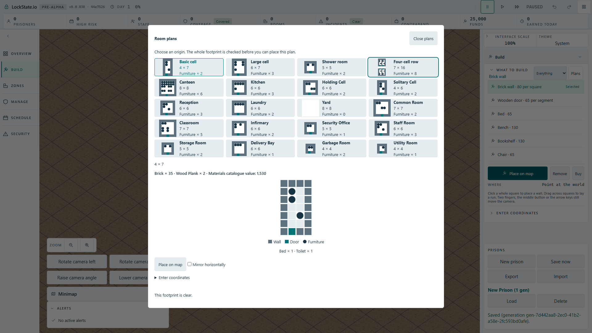

# Native modal keyboard context

Source/unit reproduction from root b6ebf85e8a: both world scenes supplied text-entry or world as the keyboard active context. Native room-plan card buttons are not text-entry controls, so the registered ArrowRight and KeyE camera bindings remain eligible beneath a showModal() dialog. This is an unused existing modal context, not a new player-control policy.

Reproducing the old active-context expression with the actual KeyboardInputAdapter and default bindings fails two assertions: ArrowRight emits camera.right while a modal card owns focus, and an already held camera key stays active when the modal opens. The fix uses an injected document to select the existing modal context for native dialog:modal, preserving text-entry precedence and ordinary non-modal HUD buttons. Both scenes pass their ambient document explicitly; no additional browser-global seam or allowlist change is introduced in input.

Checkpoint: modal context plus input/rendering boundaries 13/13, TypeScript passed. Fresh GitHub all-state duplicate search `modal camera dialog` returned no Issues. Actual production browser reproduction and mutation now confirm the bug as documented below. Tracked as Issue #1918.

## Actual production proof

[Issue #1918](https://github.com/woogitsu/lockstate/issues/1918).

Native Full HD production composition passed 1/1 (11.2 seconds), then removing only the modal detector reproduced the failure in 6.3 seconds: the unobscured underlying map pixels changed while the focused room-plan card stayed in the native modal. Restoring the detector, rebuilding the production artifact and running the same test passed 1/1 (11.5 seconds). One worker, unchanged 60-second test budget, no retries.

The test verifies native :modal and actual card focus, holds ArrowRight and KeyE, compares actual map clip bytes before and after, then confirms Tab remains in the modal, Escape restores focus to Room plans and KeyE resumes changing world pixels after close. This proves that camera inputs are suppressed by the modal, rather than a broken camera making the stability assertion pass.

The PNGs show the actual full page after the camera-key sequence, not generated mockups. Their difference outside the native modal corresponds to the reproduced underlying camera movement.

The mutation was reverted before final verification. No owner decision is required: the declared modal context and registered bindings already establish the behaviour.
