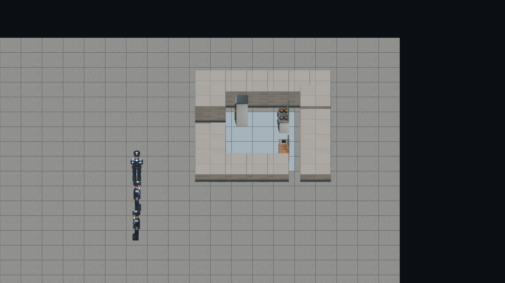

# Actor facing in the angled camera

The [eight-case contact sheet](guard-facing-contact-sheet.png) uses existing, SHA-checked Blender guard frames at elevation 45°. Its columns are four world movement headings and its rows are camera yaw 0° and 90°. It demonstrates that the current 24-yaw × 3-elevation catalog already contains front, back and side views for moving actors; no second actor model or new frame set is needed. Rebuild the sheet with `python tooling/research/actor-facing-contact-sheet.py`.

## Authored orientation and coordinates

The unrotated `SpriteRoot` in `actor.guard.base.blend`, `actor.prisoner.base.blend`, `actor.cook.base.blend`, `actor.medic.base.blend` and `actor.staff.base.blend` has zero rotation. The face/visor geometry points toward Blender local −Y. The existing guard catalog visually confirms front at yaw 0°, back at −180°, right-facing profile at −90°, left-facing profile at +90°. The role catalog was aligned to this same basis in PR #1920.

World movement uses +X east and +Y south (`RenderActor.deltaX`, `deltaY`). The separate eight-direction atlas contract orders rows South, Southwest, West, Northwest, North, Northeast, East, Southeast, starting at a front-facing South pose; the atlas exporter rotates the source `SpriteRoot` by 45° per row. The angled renderer uses its independent 15° yaw frames, but the same world heading convention. `groundToScreen` in the angled camera places +X to screen right and +Y down at camera yaw 0°; at yaw 90° +X points down and +Y left.

For a nonzero world movement vector `(dx, dy)`, compute `headingFromSouth = atan2(dx, dy) × 180/π`, then select `assetYaw = wrap(cameraYaw − headingFromSouth)` in `[−180°, 180°)`. Pick the nearest available 15° yaw frame, and the usual nearest camera elevation. Do not derive facing from screen-space motion after projection: the camera has already rotated the screen axes.

| World heading | Camera yaw 0° | Camera yaw 90° |
| --- | --- | --- |
| South `(0,+1)` | 0° front | +90° left profile |
| East `(+1,0)` | −90° right profile | 0° front |
| North `(0,−1)` | −180° back | −90° right profile |
| West `(−1,0)` | +90° left profile | −180° back |

The table and actual pixels establish the sign. Adding heading to camera yaw would show the wrong side at camera yaw 90°; selecting camera yaw alone would make East and South look identical. The sheet generator asserts both front/back pairs and the side pair, then verifies every used PNG SHA against `oblique-actor-guard.v1.json` before drawing.

Verification: the generator completed all eight SHA-checked cases. Temporarily replacing only `cameraYaw − headingFromSouth` with `cameraYaw + headingFromSouth` made its camera-90° East/West assertion fail; restoring the original expression regenerated the sheet successfully. The research index contract passed 5/5 after adding this record and a missing index row for the already existing native-modal keyboard record.

## Runtime boundary

`RenderActor` carries `deltaX`, `deltaY` and optional `facing`, but the current `actors-from-snapshot.ts` publisher passes zero movement and no facing for prisoner/guard. The angled projection currently drops these fields and selects a camera-only actor frame. The consumer needs to retain or derive a *world* heading when movement is available, then apply the formula above. A stationary actor can keep the last supplied facing; if neither movement nor facing exists, South is the honest default. The present snapshot cannot recover a prior travel direction after stopping. This study changes no production scene, save format, movement or camera code.

## Runtime consumer integration for issue1927

The combined branch now selects the existing eight-direction world motion contract through selectActorPose, then subtracts its south-based heading from camera yaw. Actor frame identity is keyed by actor id rather than shared role id, so simultaneous guards may face different ways. Actor-only updates compare supplied motion, facing and role as well as position; changing facing at a fixed tile repaints the actual image. No simulation, protocol or save fields change. Missing movement/facing still uses the existing South default, and unknown art retains the Graphics fallback.

Before implementation, the focused projection case failed three missing relative yaws; restoration passes4/4. Deliberately replacing the real scene's relative-yaw selector with camera yaw alone makes the actual browser case fail: all three keys become90 degrees rather than-90,0,90. Restoring the selector passes1/1 in6.9seconds (13.9seconds suite), including a second stationary facing-only update from North to South. The screenshot below was visually inspected. Root focused projection/modal/research verification passes13/13 and TypeScript passes. This consumes published headings, not a new walking animation or an assertion that the current immutable snapshot publishes movement.

The complete authored-actor browser file also passes5/5 in48.5seconds after the independent-heading fix, covering staff pixels, canonical prisoner/guard occlusion, actor pooling and solid reuse/depth alongside this facing case.
