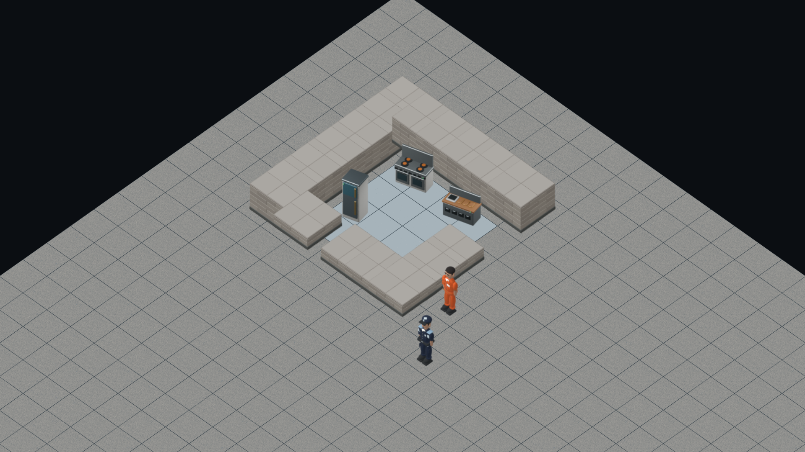

# Authored actors in the actual angled scene

Verified at 1920×1080, yaw45/elevation45, in the actual Phaser scene using a kitchen render-feed fixture. The existing Blender prisoner and guard frames now replace the orange procedural glyph where their catalogues are available. Continuous simulation feet retain their tile-centre anchor and authored images use the same sorted depth as furniture and square walls.

The browser case compares actual canvas pixels with the actor images visible and hidden. It finds no changed lower-body pixels for the actor behind the wall, visible lower-body pixels for the foreground prisoner and visible authored pixels for the guard. Both the existing graphics-fallback depth case and authored-pixel case pass (2/2, 18.0seconds).

Deliberately setting actor image alpha to zero preserves texture keys and image counts but fails the foreground-pixel assertion with zero changed pixels. Restoring production alpha passes the authored case (1/1, 12.1seconds). A separate prisoner-to-guard mapping mutation fails the role/continuous-anchor unit case; restoring it passes both focused cases. TypeScript passes.

Limits: these are static existing Blender frames, not completed walking animation or facing selection. This render-feed fixture does not prove worker actor lifecycle, actor Save/Load or every camera pose. Unknown roles and absent textures retain the graphics fallback. Other staff-role frame production is a separate art-agent task. This is feature-branch evidence, not a production-release claim.
