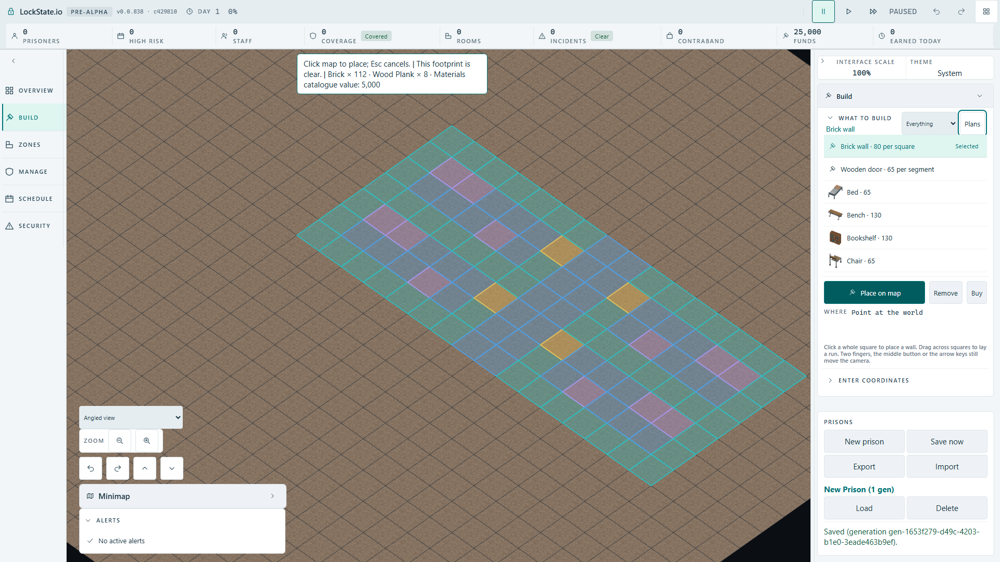
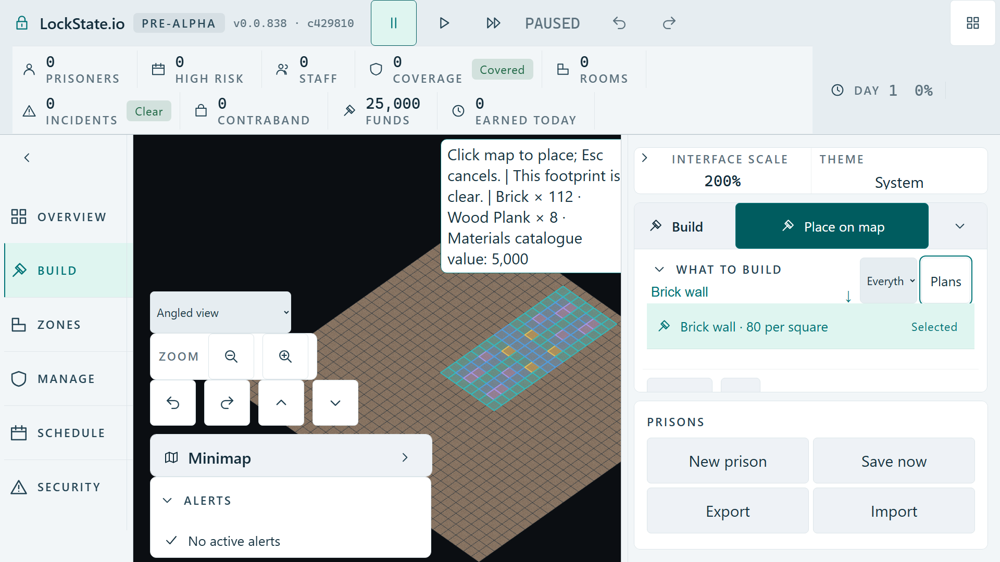

# Keyboard-armed fitted plan and its first stationary click

Date: 2026-10-02. Evidence tier: **VERIFIED** by opened production sources,
actual production camera math, genuine Chromium input over the built client,
real worker preflight/placement messages and producer-only mutation.
Tracked finding: [Issue #1974](https://github.com/woogitsu/lockstate/issues/1974).

## Existing contract and missing boundary

The [recorded owner decision](../../design/2026-09-28-adjustable-camera/README.md#owner-decision-full-large-pattern-preview-2026-10-02)
requires the whole pattern to fit, permits camera pan, and retains the chosen
construction origin until physical mouse movement. No new anchoring policy,
layout, copy, camera control, simulation rule or save format is selected here.

Opened source establishes the path: the world bridge retains unarmed map hover,
resets the fit controller during unarmed frames, then prepares the first newly
keyboard-armed preview with `physicalMove=false`. The controller previously
locked and fitted that preview without recording its physical screen anchor.
The first stationary pointerdown/up uses `physicalMove=true`; the undefined old
anchor was classified as movement, clearing the chosen origin and repicking
through the camera which fitting had just panned.

Existing fit tests started with physical movement. Existing bridge tests
covered keyboard hover retention with a simple pick port. Existing browser fit
tests moved the mouse after arming. Their combined missing boundary was first
keyboard arming, a real fitted camera, and confirmation without physical movement.

## Pure reproduction, correction and sensitivity

Published branch: `codex/hud-angle-footprint-fit-audit-20261002`, based on
`3c3f450474ff77d0c67e36ae58549b6b075bf69e`. Diagnostic checkpoint `bc90075d28`
uses the production controller and `computeObliqueFit`: camera target 1024,1024,
viewport 1920×1080, zoom 1.25, yaw −45°, elevation 45°, pointer 880,380, and safe
rectangle 550,94–1556,1072. Both 7×16 and 16×7 footprints fit at origin 17,13.
The same-position press repicks 21,15 and 26,11 respectively. The two new cases
fail; four inherited cases pass, 204 ms.

Correction `7faf08fc8ea8285e4e16623c5302cb9b6e2bdf25` changes only
`src/ui/room-template-preview-fit.ts`: record the first retained screen anchor
before fitting and clear the chosen origin only when a physical point changes.
The first genuine mouse movement after keyboard arming still repicks normally.

Corrected fit/controller/bridge/math group: 22/22 green, 833 ms. Replacing only
the corrected production movement/anchor block with its original block restores
the two incorrect origins: two red, four green, 232 ms. Byte-exact correction
restoration returns 22/22 green, 902 ms. An additional first genuine movement
control passes in the final 23/23 group, 868 ms. These are pure checks; actual
native acceptance is recorded separately below.

## Actual native Full HD baseline

Native spec: `tests/browser/room-preview-retained-hover-fit.spec.ts`, prepared
at `adeab3902e` and framed for both orientations at `c429810e40`.

At 1920×1080, create and pause a prison in Angled view. Open Build, hover the
unarmed map at 740,420, then use focus plus native Enter to open Room plans and
select Four-cell row. Set 0° or 90° through native select keys, enable Mirror
horizontally before rotation through Space, and arm with Enter. This cursor
framing permits both orientations within the initial owned 32×32 parcel.
Actual worker preflight proves clear at origin 15,12; all 112 projected fields
fit between the measured HUD rectangles and inside the canvas, and the genuine
quote includes materials catalogue value 5,000.

The exact original producer was restored and rebuilt before the baseline. The
first real mouse down at the unchanged screen point changes its worker target:

| Interface scale / rotation | Before press | After original pointerdown | Baseline | Producer mutation |
| --- | --- | --- | --- | --- |
| 100% / 0° | 15,12 | 17,13 | red, 5.6 s | red, 5.6 s |
| 100% / 90° | 15,12 | 22,8 | red, 4.9 s | red, 5.1 s |
| 200% / 0° | 15,12 | 21,−2 | red, 4.5 s | red, 4.7 s |
| 200% / 90° | 15,12 | 25,−6 | red, 4.6 s | red, 4.7 s |

Both 200% origins and the 100% rotated extents leave the initial owned parcel.
The negative tests stop at the incorrect pointerdown target. They do not prove
that a later release submitted or completed a misplaced plan, nor that the
worker accepted an out-of-terrain placement.

## Fixed native consumer and exact restoration

Corrected native group: **4/4 green, 27.8 s**, cases 7.3/6.5/5.7/5.8 s.
Each case verifies unchanged origin, 112 projected points and quote through
stationary pointerdown; zero placement before release; exactly one genuine
`PlaceRoomTemplate` at origin 15,12 with the selected mirror/quarter-turn; and
no other build/remove command. Captured native event coordinates remain equal
through keyboard selection and the map press/release. The accepted ghost
disarms. Keyboard rearming followed by genuine 64 px mouse movement repicks a
different origin; Escape cancels without a second placement.

After that green run, changing only the production movement/anchor block back
to the exact original block and rebuilding causes **four red** cases at the
same four incorrect origins shown above. No test, assertion, worker, camera
math, scene, pointer bridge or timeout is changed by this mutation.

Fixed production bytes were restored exactly:

- source SHA-256: `SHA256:6392115D4582F3FC444D852860D7A023B0DB61EC81080E98D2EFCE7A63984AB2`;
- normalized Git blob: `blob:47726a8d7c5aff51180097dba28cfd363270cd44`, matching the published correction;
- zero production diff against that checkpoint;
- app/tools TypeScript and production build green;
- rebuilt `index-BMpUrKzf.js` matches the prior fixed bundle byte-for-byte,
  `SHA256:5E3D701ED63C364023BC9D11D4581D4DEAA18DED5E75890717EAC63ECFD84343`.

Final exact-restored native group: **4/4 green, 28.1 s**, cases
7.3/6.6/5.7/5.6 s. Every launched browser process is terminal, own preview
process count is zero and port 5402 has zero listeners. Original 60 s tests,
10 s expectations and one worker remain. No network-abort retry ran. The failed
runs' existing wrapper reports no readable default last-run file under the
explicit retained output directory and does not retry; it is not a network
change signature.

Actual frames were opened and inspected. These retained frames show the initial
fitted patterns; later inspected confirmation frames show queued construction,
not completed buildings:

## Nonduplicate check and acceptance limits

Fresh all-state searches covered preview fit, retained hover, stationary room,
room origin click, keyboard preview fitting, fitted keyboard origin and
stationary click plan. Full current bodies #1914, #1947, #1968, #1931 and #1586
were read. Their respective camera-pose synchronization, session replacement,
held-key release and catalogue focus boundaries differ from this first
keyboard-armed fit anchor initialization. No exact report appeared in those
searches; #1974 records this verified producer cause.

Acceptance is local built Chromium, Angled view, Full HD 100%/200%, a mirrored
Four-cell row at 0°/90°, native retained-hover/fit/placement coherence and actual
movement repicking. The pure checks cover the selected controller boundary.
Other templates, 180°/270°, other engines, construction completion,
SaveLoad/UndoRedo, integrated CI, main and deployment are not established here.
The correction is published. The coordinator has integrated its source on a
separate delivery worktree and started the integrated native group; its result
is not established by this report. The separate frozen CI candidate was not
changed by this task. The weakest remaining claim would be extending this proof
to those untested surfaces; it needs their actual cases.
