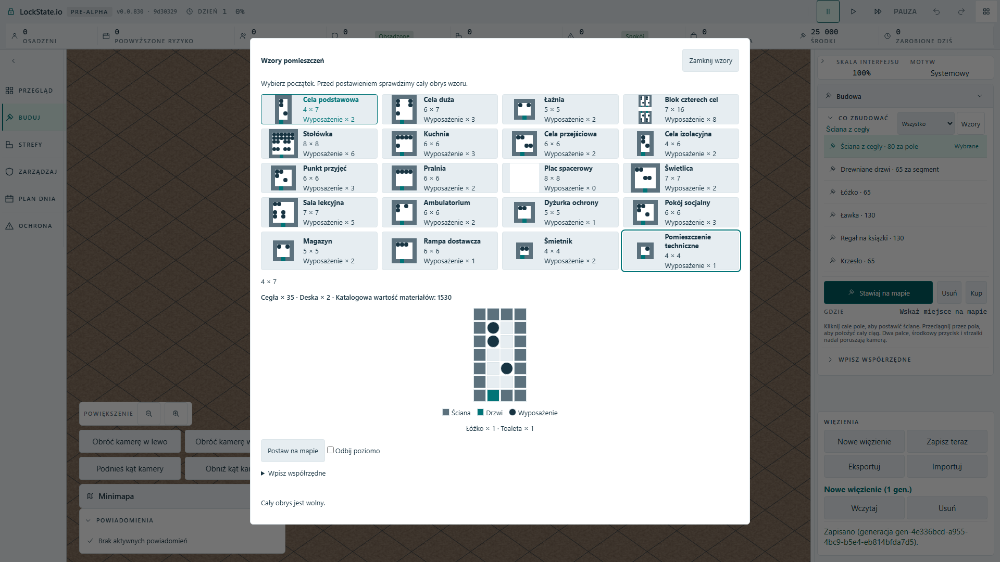

# Room-plan keyboard catalogue ? #1931

## Actual Polish Full HD observation

Production artifact, `?renderer=oblique`, 1920x1080, Polish browser preference.
All 20 cards remain visible, each card centre reaches that card in hit testing,
and the full localized names fit their label boxes. The attached screenshot was
opened for visual inspection, including the longest two-line technical-room name.
This audit did not find or claim a name-clipping defect.

The reproduced problem was keyboard focus: the new dialog had 20 default Tab
stops and no arrow/Home/End wiring. End on the first card never reached the last
card. The existing Build/Rooms catalogue already uses a shared one-stop focus
ring and explicit Enter/Space activation; this dialog now uses that same helper.
Arrowing changes focus only, preserving the selected plan and quote. Activation
changes the selection, and Tab leaves the ring for the map-placement action.
No new player text, layout palette, command or save field was introduced.

## Executed proof

- Baseline artifact case: red at End-to-last-card focus after 13.9 s.
- First fixed case: green in 6.8 s.
- Mutation: disable the shared roving binding while retaining tabindex updates;
  rebuilt artifact goes red at End-to-last-card focus after 14.8 s.
- Restore: final expanded case green in 13.3 s (16.2 s suite).
- Final case checks all 20 labels and hit targets, Home/End and wrap-around,
  arrows through every card without selecting, one tabindex=0, Enter selection,
  nonempty worker quote, Tab to map action and Escape returning to the opener.
  It confirms no room-placement command was issued during catalogue navigation.
- Roving arithmetic, UI token, orchestration-boundary and HUD-message suites:
  107 passing cases. TypeScript and production build pass.

The first attempted test had damaged Polish literals from the local shell text
encoding and timed out before opening the catalogue; this harness error was
corrected to explicit Unicode escapes and is not evidence of a game regression.
One browser worker was used at a time. Lease returned to the parent after the
terminal final result; no other agent was granted the lease directly.

