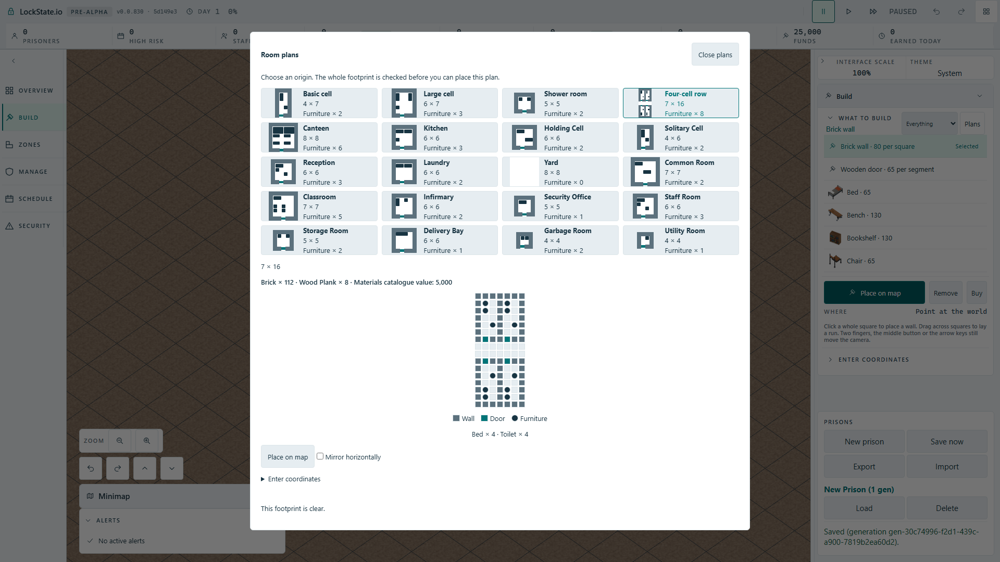

# Room-plan miniature fixture grouping

## Existing behavior and chosen increment

Source review on feature root `3a8486754c` found all 20 plans already have canonical card diagrams. No second preview system is needed. The existing diagram renders one circle per occupied fixture square: a two-square bed looks like two individual marks despite Furniture counting one object.

Keep the existing four-column catalogue, card names, dimensions, furniture counts, native accessible names and roving keyboard contract. Keep the existing 56-pixel diagram envelope and modal height. Draw one inset rectangle per authored object across its full occupied footprint, using the existing object-footprint UI port and canonical instantiated plan. Structural squares and doorway colors retain their existing tokens. No player text, save format, placement command or quarter-turn control changes.

## Obtained source evidence

- All 20 canonical plans and the explicit bed rectangle: 21 unit cases green.
- Design-token gate with the miniature suite: 97 tests green.
- Production mutation changing every footprint to 1 by 1: 16 failures, 5 passes; restoring full footprints: 97 tests green.
- Module boundary gates: 46 tests green. TypeScript build green.

## Obtained runtime verification

Production Cloudflare artifact, actual angled 1920 by 1080 player UI: New prison, Build, Room plans. A single-worker browser case measured all 20 miniature envelopes at most 56 pixels on either axis and every fixture rectangle inside its diagram. The basic cell has two fixtures including one elongated two-square bed; the large cell has three and the four-cell row eight. Door bars leave visible clearance rather than looking like full walls. The modal and Place on map control stay within the Full HD viewport. Actual Four-cell row selection and map arming produce the real 112-square world ghost.

Baseline session 25807: exit 0, one pass, 20.4 seconds. Production mutation in room-template-preview.ts forcing every fixture grid-row span to one: session 63003 exit 1, one failure, 19.4 seconds; the actual bed height became 7 pixels, below the required 12.6 pixel aspect-ratio bound. Restored source rebuilt: session 59155 exit 0, one pass, 20.5 seconds. Original 60-second budget, one worker and zero retries were retained.

Opened and visually inspected the saved Full HD screenshot: all 20 cards visible, basic/large/four-cell layouts distinct, full fixture rectangles visible, selected large preview and controls usable. Small card schematics communicate arrangement and footprint, not individually textured furniture artwork. This proves Full HD at the existing default UI scale, not every browser scaling setting.

## Source-scale and contrast audit

The existing min(8, 56 / height, 56 / width) cell size bounds every complete plan diagram by 56 pixels on each axis. The largest four-cell row is 7 by 16: 3.5 pixels per square and 24.5 by 56 overall. A single-square fixture retains 2.5 pixels after the one-pixel total inset; a two-square bed stays one 2.5 by 6 pixel rectangle. These are source dimensions, not a claim of runtime readability.

WCAG relative-luminance arithmetic over the shipped token ramps gives wall/floor, door/floor, fixture/floor ratios respectively 5.11, 5.58, 13.05 for light and 5.41, 9.49, 12.44 for dark. Door/wall is only 1.09 in light and 1.75 in dark. Miniature doors therefore use a short bar with floor-colored clearance above and below, retaining existing semantic tokens and the square footprint; shape distinguishes an entrance from a full wall without relying only on hue. The selected large preview and its worker collision highlighting are unchanged.

The native dialog retains width min(960px, viewport minus 40px), maximum height viewport minus 80px, and its existing overflow container. No HUD collision rectangle or simulation collision extent changes. Fixture overlays are decorative, aria-hidden through their miniature parent, and pointer-events none; the native card button remains the only selection target.

The catalogue cards retain the existing normal-orientation reference; choosing Mirror still updates the selected large preview and worker request through the unchanged canonical plan. The fixture projection also accepts a mirrored canonical plan without remirroring its coordinates; an explicit opposite-side whole-bed unit case covers that contract. The entire decorative miniature now has pointer-events none, while its existing aria-hidden parent keeps diagram descendants out of the button name and accessibility tree. No card click or roving focus listener is replaced.
