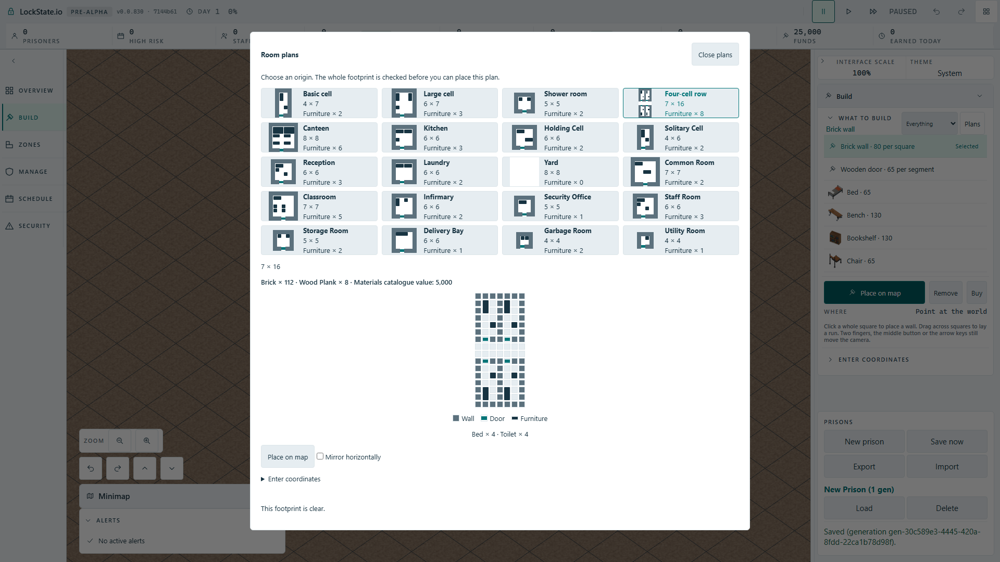

# Selected room-plan legend shapes

## Scope and finding

At source base `1f01d1a8cf`, the selected plan drew grouped fixture rectangles, but the Furniture legend retained `hud-template__tile--object` and its 50% border radius. The legend therefore described the old individual dots. The existing door legend also lacked the clearance bar now shown by the actual selected diagram.

The correction reuses the fixture style for the Furniture swatch, with aspect ratio 2 in the existing 0.9rem swatch width. Door swatches reuse the same bar pseudo-element as the selected diagram and card miniatures. Wall, Door and Furniture text and decorative accessibility remain unchanged. Dialog dimensions and approved fit policy are unchanged.

## Obtained source evidence

Actual dialog DOM listener test: before correction 1 failed / 8 passed; correction plus design-token gate 85 passed. Production mutation restoring the old object class: 1 failed / 8 passed. Restored source plus token gate: 85 passed. TypeScript and production Cloudflare artifact build passed.

## Runtime evidence status

`tests/browser/room-template-legend.spec.ts` is prepared for actual angled Full HD startup and Four-cell row selection. It checks furniture aspect/radius, door-bar clearance, existing labels, eight selected fixtures and bounded dialog geometry. First shape run passed 1/1 in 4.5 seconds; restoring the old object-circle class failed 1/1, then restored source passed 1/1 in 4.5 seconds. All runs used one worker and the unchanged 60-second test / 10-second assertion budgets.

Opening the actual screenshot exposed a missed CSS cascade: the generic tile background replaced fixture ink in the legend. The swatch was a rectangle but pale like a floor. Commit `bb2e978795` adds the explicit semantic fixture background and an actual computed-color equality assertion against the selected diagram. The color correction is now verified: baseline session 25759 exited 0, 1/1 passed in 5.0 seconds; removing only the legend background override made session 85147 exit 1 (actual floor RGB 230/237/241 versus fixture RGB 24/52/66); restored source session 35245 exited 0, 1/1 passed in 4.9 seconds. The final PNG was opened and shows the dark rectangular Furniture swatch matching the selected fixtures, plus doorway clearance. The actual selected Four-cell row and all catalogue cards remain visible inside the unchanged modal.

## Weakest claim

The real screenshot and measured geometry establish a visible, matching legend at 1920 x 1080 with English labels. This focused proof does not constitute a usability study or verify every locale and interface scale. A different scale or locale clipping the legend would need a separate reproduction.
