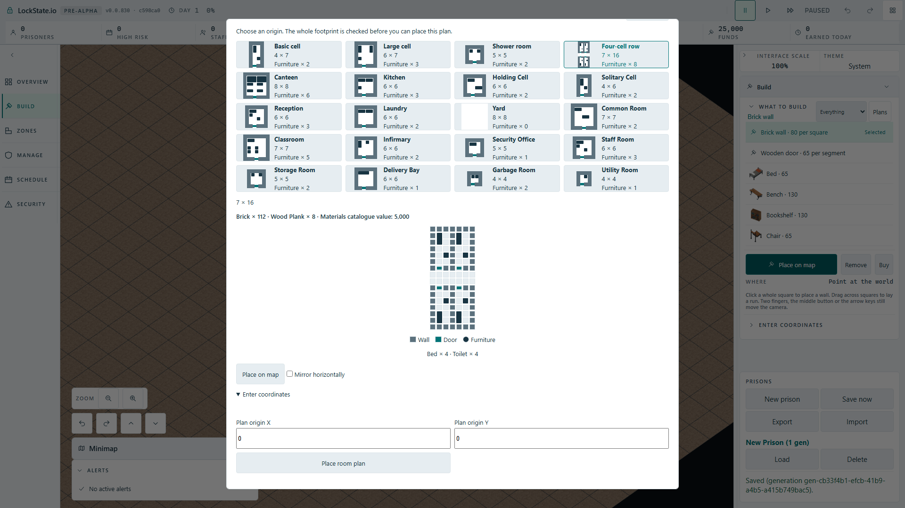
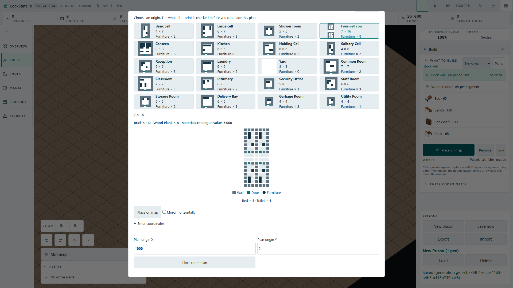

# Pending room-plan reopen status (#1946)

Fresh remote search and reading #1934 distinguish this confirmed issue: #1934 is a late numeric submit completion; this issue retains a previous verdict before a fresh preflight has completed. The actual dialog immediately disabled Submit and cleared the quote but kept old Ready/Blocked text and collision marks.

Actual dialog/tool listener tests hold a fresh preflight after a prior Ready or Blocked verdict. Both fail against previous source (two failures, four passes). Withdrawing old status and tile/fixture collision marks and setting aria-busy for the current query makes six cases green. Removing the production invalidation block causes both failures again; restoring gives six green. TypeScript green.

No existing truthful pending string exists in the template keys. Unavailable would incorrectly claim failure, and Save Loading describes a different operation. The fix marks real query state with aria-busy, leaves prior text empty, and preserves disabled Submit. Current result, invalid coordinates or current failure finish busy state. No new player string, promise, save format or fit policy.

## Obtained real worker proof

Actual Cloudflare production artifact in angled Full HD. New prison -> Build -> Four-cell row -> Place on map shows 112 actual world ghost polygons. Escape hides the ghost. Reopening the same selected plan, expanding the existing coordinate form and delaying a real preflight demonstrates both prior Ready and prior Blocked cycles. While each query is held: selected card preserved, status empty and aria-busy true, numeric Submit disabled, all old tile/fixture collision marks absent, and current worker catalogue quote 5,000 present. Releasing each request uses the real worker reply: busy ends and the current truthful verdict returns. Final modal Escape restores focus to the native Room plans button. No PlaceRoomTemplate command was sent.

Baseline session 6336: exit 0, one pass, 7.7 seconds. Production mutation omitting the refresh invalidation block: session 66719 exit 1, one failure, 16.2 seconds; status remained This footprint is clear with aria-busy false during the held current query. Restored source rebuilt: session 34520 exit 0, one pass, 8.5 seconds. Original 60-second test, 10-second assertion budgets, one worker and zero retries retained.

Opened both final screenshots after scrolling the existing native dialog container to its advanced-form bottom: disabled numeric Submit and absence of obsolete status/markers visible, full selected diagram preserved. Expanded coordinates legitimately scroll inside the existing bounded modal; no modal/HUD geometry was changed. The empty status has accessible busy state, not a fabricated failure/loading sentence.

The focused source suite additionally checks invalid coordinates do not query and current failures end busy honestly: eight cases green.

