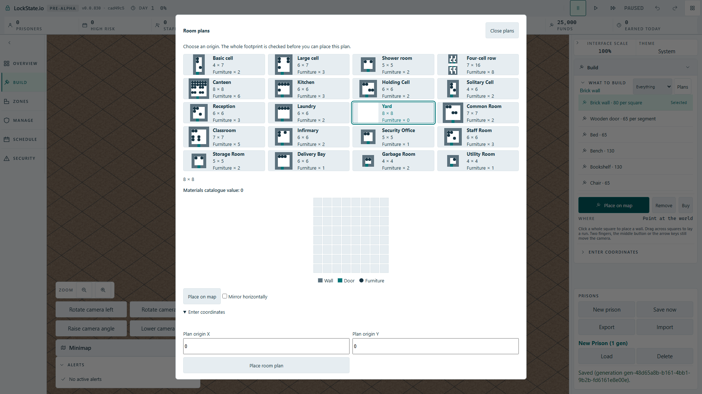

# Numeric room-plan status revision ? #1934

`createRoomTemplatePreview` already guards delayed quote and inspect results,
but its numeric placement completion did not. Choosing a new card while the
old operation was pending could make the new card report blocked, submitted or
unavailable from the old operation. The fix reuses the existing refresh revision
for the result and catch paths; no new strings, command or save state is added.

Focused DOM tests construct the actual dialog and RoomTemplateTool. Each test
starts the numeric placement, holds its preflight/accepted-placement/failing-
placement promise, selects Yard, waits for the replacement clear verdict, then
releases the previous operation. Focus, enabled state and the replacement
availability status are asserted after the actual async listener chain finishes.

Executed: original listener gives 3 red cases. Fixed listener gives 25 green
cases across dialog-status, tool, roving and UI orchestration suites. Removing
both production revision guards makes the same 3 cases fail again; restoring
the source returns all 25 cases to green. TypeScript passes.

## Actual worker and production artifact proof

The committed case ran in the real Full HD angled app. It delays only the next
room-template preflight request at the actual Worker.postMessage boundary,
selects Yard with Enter, waits for the replacement worker quote/clear verdict,
then releases the original request. It waits for the correlated real worker
reply and the resulting promise chain before inspecting the dialog again.

Disabling both guards and rebuilding the production artifact gives one red case
in 14.6 s: the selected Yard reports the obsolete blocked result. Restoring the
source and rebuilding gives one green case in 4.3 s (7.1 s suite). The case
checks selected-card focus, current catalogue value zero, clear availability,
enabled numeric submit and no PlaceRoomTemplate command from the cancelled old
selection. The screenshot was opened: selection and current quote are visible;
the status is below the fold because the advanced coordinates are expanded,
so its content is proved by the real DOM assertion rather than this image.

The exclusive browser lease was returned to the parent after terminal exit0.
The temporary suite configuration was removed after the completed run.

