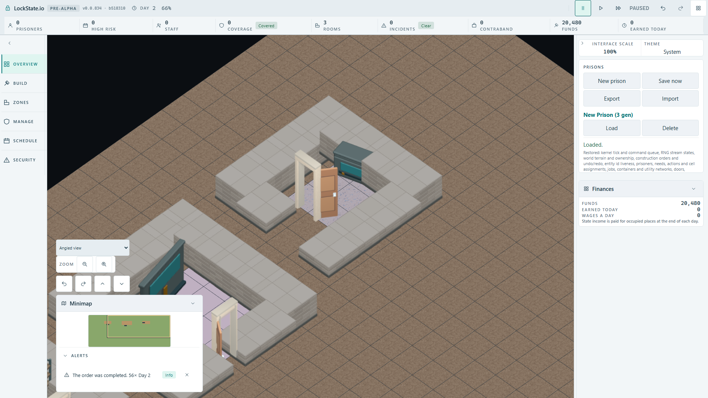
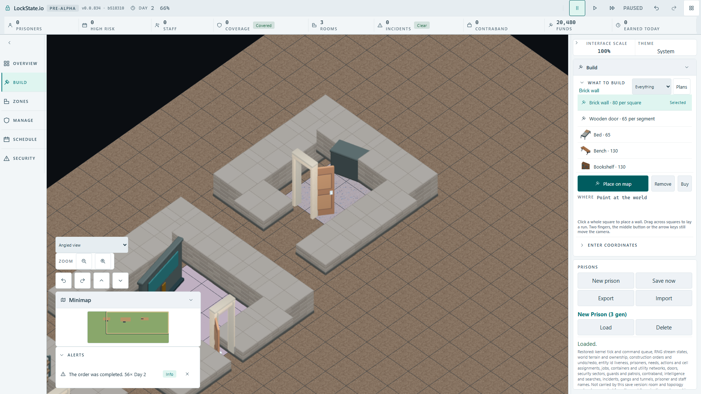

# Rotated console rendering in the built client - 2026-10-02

## Accepted player route

Production artifact built from integrated checkpoint `b51831047a`. Chromium ran at 1920 x 1080 with the angled renderer. The player created Storage Room and Delivery Bay, completed their construction and saved through the real IndexedDB save panel. The second stage loaded that save and selected Security Office, clockwise rotation 90 degrees, origin (20,5), using the native room-plan dialog. All construction completed through the simulation worker.

The actual completed console was `object.security-console@23,6:orientation=1` before and after Save/Load. Its authoritative 2x1 source occupies a rotated 1x2 rectangle. The inspected loaded screenshot shows the front display and matching long-axis direction inside the rotated room. The browser acceptance here covers this 90-degree fixture; the four orientation geometry and source-axis cases have a separate unit gate.



## Consumer mutation and exact restoration

The production `objectArtYaw` consumer was temporarily changed from camera yaw plus quarter turns to camera yaw minus quarter turns, then the artifact was rebuilt. The same player route still passed the worker anchor/orientation and command assertions, but its front-display pixel assertion failed with zero pixels. The image shows the console rear.



The production file was restored from its exact byte backup, with no remaining production diff, then rebuilt and rerun. Source-file SHA-256 before mutation and after restoration:

`317c8cb38e53bbc37c773a4518d1ae0b2e282c44f7594b4a86e002c1db4531a8`

| Gate | Result | Front display pixels |
| --- | --- | --- |
| Integrated baseline | 2/2 passed, 43.2s + 33.4s | greater than 200 before/after Load |
| Production yaw-sign mutation | capacity passed; renderer case failed, 43.4s + 28.0s | 0 after completion |
| Exact restored artifact | 2/2 passed, 43.6s + 35.6s | 1116 before and 1116 after Load |

The screen-space count uses rectangle (800,380,360,230), green greater than twice red, green/blue difference below 10, and opaque alpha. This includes the console's authored cyan front across its available poses. The mutation rules out a false positive from other pixels in that region. The actual snapshot rows, native placement command and restored pixel counts are preserved in [worker-and-pixel-evidence.json](worker-and-pixel-evidence.json).

Loaded PNG SHA-256: `25e84cb8e9dc8b423920c9af211cfeeebbac24c991e9c0a24712c542f9c63199`.
Mutation PNG SHA-256: `e25083666bf847aa091de2986ef738c38e385bd7d0699110c9b705aee45fccc3`.

## Independent source-axis check

The Blender exporter places the camera along `(sin(phi), -cos(phi), z)`. Its authored positive X projects as `(cos(phi), sin(phi) * sin(elevation))`. The game's ground projection sends positive world Y to `(-sin(phi), cos(phi) * sin(elevation))`. A clockwise quarter turn maps authored positive X into positive world Y, so the local frame yaw must be `phi + pi/2`. Subtraction would face the opposite direction. Four independent long-axis projection tests cover that composition; reversing only the production sign makes eight assertions fail. Restoration passed all 101 cases across the four focused renderer suites. Application typecheck and the production build passed.

## Repeat the artifact gate

After building the production artifact:

```powershell
$env:LOCKSTATE_ARTIFACT_TEST_PORT = '5197'
node node_modules/@playwright/test/cli.js test --config tests/browser/playwright.rotated-object.artifact.config.ts
```

The test uses the native UI and worker snapshot reads; construction and saved state come from the player's actions. Its timeout stays at the existing artifact suite's 60 seconds per case, with zero blanket retries.
