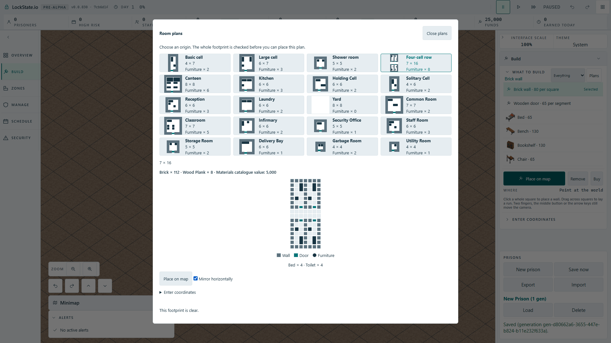

# Selected room-plan fixture diagram

Source inspection on feature root 30451a8250 and the previously saved real Full HD card screenshot showed an inconsistency: grouped furniture rectangles in catalogue cards, but separate circles on every occupied square in the selected large diagram. One two-square bed looked like two dots.

The selected diagram now reuses the canonical fixture rectangle projection. Existing tiles retain their original order and count for worker blocked-square indexing; overlays are appended after those tiles with explicit grid coordinates. A blocked square inside furniture also outlines its containing overlay so the furniture cannot conceal worker collision feedback. Door bars reuse the card shape, with the selected diagram's existing floor token. No names, text, fit policy, camera, save fields or modal dimensions change.

## Obtained source evidence

Focused actual dialog-listener DOM case confirms a whole 1 by 2 bed, two fixtures in the basic cell, all 28 tile positions, decorative overlay accessibility, normal and mirrored geometry, and worker blocked-square feedback on both tile and full fixture.

Production mutation omitting the fixture's blocked outline: one failure and three passes. Restoring it gives 80 dialog/token tests green. TypeScript build green.

## Obtained actual Full HD proof

Cloudflare production artifact, actual New prison -> Build -> Room plans -> Four-cell row -> Mirror horizontally -> Place on map. The selected diagram retains 112 indexed tiles and eight full fixture rectangles. The bed is elongated in both orientations, door bars have clearance, all 20 cards and the modal controls stay visible, and real map arming produces 112 world ghost polygons.

Baseline session 57037: exit 0, one pass, 21.1 seconds. Production mutation forcing only selected-diagram furniture to a one-row span: session 7975 exit 1, one failure, 19.3 seconds; selected bed height 10.875 pixels instead of greater than 19.575. Restored source rebuilt: session 94609 exit 0, one pass, 21.4 seconds. Original 60-second budget, one worker, zero retries and the existing production-serving configuration unchanged.

Opened and inspected the saved screenshot: single rectangles for whole beds rather than disconnected dots, mirrored row geometry, doorway bars, all cards, existing legend, cost and map controls visible. The existing Furniture legend label and its sample icon were retained. This proves the default Full HD UI scale, not all zoom/accessibility settings. Worker collision highlighting is covered separately by the actual listener DOM mutation above.

