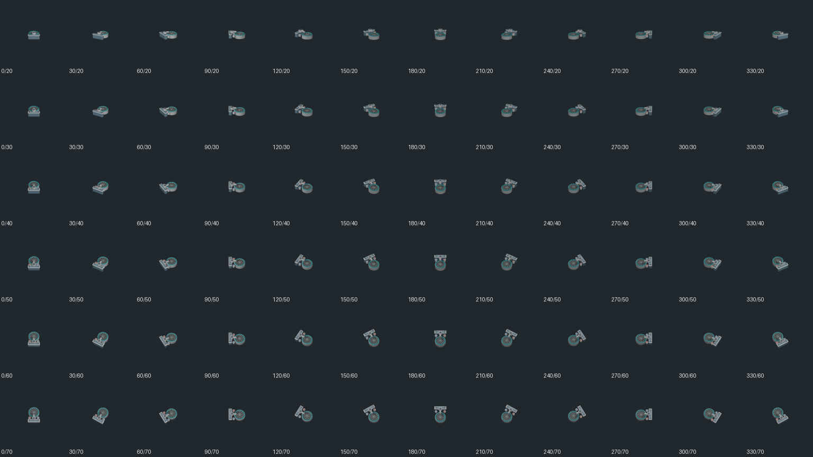
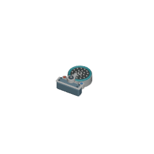

# Retained Shower Head: shared square export — 2026-10-02

## Current checkpoint

Source/export work starts at integrated `5f20b9eb15`. The existing authored shower fixture is reused rather than duplicated: its 43 meshes are extracted from the unchanged catalog into a standalone source and exported through the existing shared camera pipeline. The canonical `object.shower-head` -> `fixture.shower.head` mapping and existing `/game-content/oblique-shower-head.v1.json` registry descriptor remain unchanged. Native guards, repeated full exports, decoded frame borders and mutation/restoration are verified. Actual worker-build/SaveLoad/palette acceptance is the next gate; no browser or hosted completion is claimed yet.

Fresh remote audit covered `codex/shower-head-refine-2026-09-25`, `codex/shower-fixture-wall-profile-2026-09-27`, and `art/oblique-shower-head-alias`; alias commit `5d687059b3` already supplies the current canonical mapping. Catalog history includes `571079ee28` (shallow wall fixture) and `65409e33af` (angled nozzle face). The current committed catalog is authoritative for this extraction. The retained assembly includes the mounting plate, pipe arm, nozzle shell, teal ring, 21 nozzles and two colored service valves.

## Source geometry and actual alignment

The old registered 512px manifest declares camera target [0,0,0] while the authored source geometry is centered in its one-tile footprint. The renderer places the object at an occupied min-corner anchor. A target-only metadata change cannot align those original centered points with that anchor; the loaded geometry needs the corresponding translation.

- Original catalog SHA256 remains `57db9afb7e48996cef9aaedda72b8e874e865eb56862ee4add8b177a9713887d`.
- Standalone source SHA256 is `ac0cbe6a3673dd8db19c76375ddeb3d6f23d0cab6aa2e56b298ad8a8e70806fe` (137916 bytes).
- `assets/source/blender/fixture.shower.head.provenance.json` pins the original/new source hashes, all 43 retained mesh names, evaluated vertex counts and modifiers.
- Evaluated source bounds relative to its catalog parent are [-0.354999989,-0.499999613,0.709999979]..[0.354999989,0.475000679,1.139999986].
- One shared loaded-scene translation (0.5,0.5,0) gives [0.145000011,0.000000380,0.709999979]..[0.855000019,0.975000679,1.139999986]. No scaling or added geometry is used; the original wall-mounted height is retained.

The wrapper imports `render-kitchen-fixtures-oblique.py` without modifying it. Its existing source callback verifies exact source hash and retained mesh records. Every actual evaluated vertex is checked against the authoritative 1x1 occupied rectangle at all four clockwise quarter turns. The actual camera renders 256px with a four-tile span, exactly 64 pixels per tile, pivot [128,128], and target [0.5,0.5,0.925]. Its height is the evaluated source midpoint. All 72 actual offsets and aim vectors are checked against the square yaw basis.

## Repeat and negative controls

Two complete exports matched every one of the 72 actual PNGs and the manifest bytes. Manifest SHA256 is `59137179545e9fd167164e0635c6c3a2e7b64ddadd0c2554ff3c80408f19bb21`. Native export and an independent PNG-inflation test verify all four transparent frame borders, 256x256 geometry, signatures and full byte hashes.

| Deliberate native mutation | Obtained result |
| --- | --- |
| Translate actual loaded meshes outside 1x1 | evaluated occupied rectangle guard red |
| Halve actual camera span | actual 64 pixels-per-tile guard red |
| Shift actual camera origin | actual target/yaw guard red |
| Omit authored nozzle shell | retained mesh-set guard red |

Each native mutation exited 1 with `--python-exit-code 1`; exact restoration exited 0. [Native records](native-guard-mutations.json) pin restored wrapper SHA256 `551389baf661a2d710db86c4abf0aa651def05aaeccd52b75ec95fb3325cfef5`. Appending a byte to one referenced PNG made the integrity suite red; exact restoration returned 2/2 green. [Repeat/frame records](repeat-and-frame-mutation.json) preserve the terminal results. Four focused source/descriptor/mapping/coverage suites passed 48/48, and both TypeScript projects passed.

## Opened actual exports



The contact sheet contains only the actual exports resized to 128px each and was opened. SHA256: `b2918449a9d934d9e8c63cbe44385484ee33c30b7ec3fefc7a31e93fd6ff228b`.



The full-size 256px frame was opened. SHA256: `b432075feef3daf1cb687f9fbac4cf3ea5f92918e2e49b888f8b3f2e898fd92f`.

## Repeat and next player gate

```powershell
& 'C:\Program Files\Blender Foundation\Blender 5.2\blender.exe' -b --python-exit-code 1 --python tooling/blender/extract-shower-head.py
& 'C:\Program Files\Blender Foundation\Blender 5.2\blender.exe' -b --python-exit-code 1 --python tooling/blender/render-shower-head-oblique.py -- --verify
& 'C:\Program Files\Blender Foundation\Blender 5.2\blender.exe' -b --python-exit-code 1 --python tooling/blender/render-shower-head-oblique.py
node node_modules/vitest/vitest.mjs run tests/unit/oblique-shower-head-integrity.test.ts
```

The inspected host is Blender 5.2.1 LTS, upstream build identifier9e2066aef7ef; executable SHA256 `284f4041f98e113f3dc10654a7193ffaaa9bfdfec8b87fa116620a48b5f6d4cb`. Render determinism was measured on this host with the committed extracted source; cross-host byte-identical `.blend` regeneration is not claimed.

Unlike the sink, this fixture already has a real `shower-head-brick` buildable and `shower-room` plan. The prepared `tests/browser/shower-head-player-build.spec.ts` reuses actual completed Storage Room/Delivery Bay capacity, then constructs a Shower Room at (20,5) through the player. Its two completed shower objects are expected at (21,6)/(23,6), orientation0; clockwise90° plan rotation yields (23,6)/(23,8), orientation1. The initial broad RGB(70,91,101) region is provisional and must be calibrated into separate per-fixture regions using actual screenshots. Actual snapshot fields, independent palettes and missing-consumer red/exactrestoregreen are required before acceptance is claimed. No core, HUD, input or workflow changes are included; local manual configuration remains untracked.
