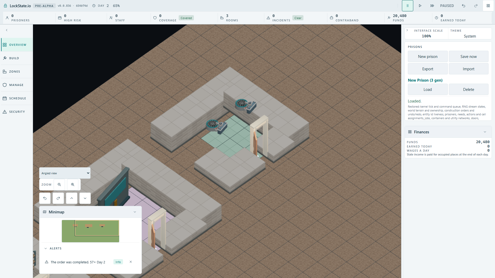
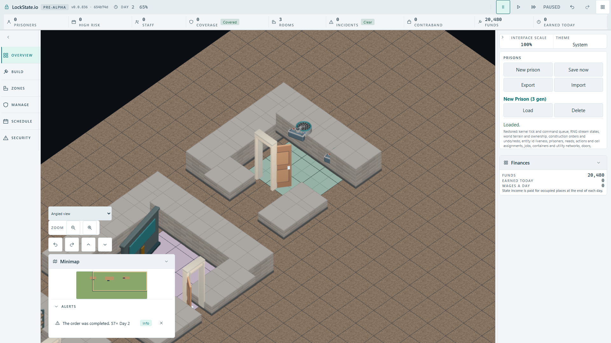

# Actual Shower Room player acceptance — 2026-10-02

The calibrated native fixture and production artifact use checkpoint `654b74df7a9bbcac1ab71c8bf6bba4d5ec221e32`. Each route constructs real Storage Room/Delivery Bay capacity through the player and workers, saves it, then loads it in a fresh context before placing a Shower Room at (20,5). It selects the real clockwise rotation control, waits for actual worker completion, reads authoritative snapshots, and uses the client plus IndexedDB for Save/Load. No objects or completion state are injected. The case timeout remains 60s and the construction-count progress guard remains 10s.

## Obtained terminal runs

| Route | Capacity | Shower fixture | Obtained result |
| --- | --- | --- | --- |
| Initial normal calibration | 43.5s | 35.0s | worker/SaveLoad anchors correct; provisional source-preview RGB yielded 0 and two palette assertions red |
| Rotated broad-region calibration | 44.7s | 35.3s | 2/2 green; correct rotated anchors and 114 broad authored pixels before/after Load |
| Missing model binding, normal | 44.9s | 35.6s | capacity green; four separate fixture pixel assertions red, all 0 |
| Missing model binding, 90° | 43.5s | 35.1s | capacity green; four separate fixture pixel assertions red, all 0 |
| Exact restoration, unified three-case suite | 44.2s | normal 34.9s; 90° 34.5s | 3/3 green, 1.9 minutes |

The initial red calibration case was a mismatch between a provisional color taken from one source pose and the actual runtime-selected pose. Actual screenshots were opened, source art was unchanged, and the final separate regions were calibrated from those completed/loaded screenshots before the production consumer mutation. No construction progress timeout occurred in these routes.

## Completed objects and independent pixels

RGB(95,119,131) is counted independently in each FullHD region. The final restored arrays are unchanged after real Load.

| Clockwise plan rotation | Completed anchors, retained after Load | Separate regions (x,y,width,height) | Final before / after Load |
| --- | --- | --- | --- |
| 0 | (21,6),(23,6), orientation 0 | (780,450,115,90); (900,360,115,90) | [93,93] / [93,93] |
| 90° | (23,6),(23,8), orientation 1 | (900,360,110,100); (1000,450,110,110) | [86,28] / [86,28] |

Each normal region and the first rotated region must exceed 50 pixels. The tall wall partly occludes the second rotated assembly; its visible authored fragment has 28 pixels and must exceed 20. This second region proves that visible fragment, rather than claiming the whole fixture is unobstructed. Both source assemblies are separately present in the authoritative snapshot, and all source geometry/rotations are verified by the native evaluated mesh guards.

The deliberate production mutation removed only the existing `object.shower-head` authored binding. Both routes still completed the two real objects at the correct anchors/orientations and preserved them through Save/Load, while both regions became 0 at both stages. Four expected failures per orientation therefore produced eight total pixel failures. Raw records: [normal negative](normal-consumer-mutation.json), [90° negative](rotated-consumer-mutation.json), [normal restored](normal-restored.json), [90° restored](rotated-restored.json).

## Exact restoration and unchanged simulation worker

The original mapping was restored byte-exact and its Git diff is empty. SHA256: `a9eada806ff523bc9933da9b7a2e8a731c5a896286e33b0551119d8e389dd2d4`. The actual simulation worker binaries from the missing-binding and restored builds were retained and compared directly: byte-identical, SHA256 `81f02fefa77ece546e98c70f8aa2e3abdd952b56aa7ad54262c42734f1837c5c`. [Byte-restoration record](consumer-byte-restoration.json) preserves both checks. This comparison concerns the two builds at the same calibrated checkpoint; the earlier calibration artifact used source/export checkpoint `1bb8da5775` with its own build metadata.

Four focused source/descriptor/mapping/coverage suites also passed 48/48 after restoration. These technical gates are separate from the actual native player result above.

## Opened final FullHD images

Both final loaded images were opened. The normal image shows both authored mounted assemblies. The 90° image shows the rotated layout and the documented wall occlusion of the second assembly; its visible service-valve/plate fragment remains counted independently.

SHA256: `61b22b1d2b2d7fc9fa61e80cf4e67d6d8b0567d6632b7e485036f9f05a62c262`.

SHA256: `28f297014466147632e183ad33d3222f6af6a8fa35d84f7916b8d37270bcbac9`.

Both negative loaded images were also opened: [normal fallback](normal-mutation-loaded-fullhd.png), SHA256 `3dc21e498b24e9a8d366ce2f66af189cdd55e7eee2ab2a225c084bd2d96beb28`; [90° fallback](rotated-mutation-loaded-fullhd.png), SHA256 `6cf394082d3be763572b660a61c63bc3876e994707647c2c03aff8ff5a3b1866`.

Browser processes are terminal and the exclusive lease is released. The untracked local configuration was removed. The coordinator owns integration and routing the accepted `shower-head-player-build.spec.ts` into the existing artifact gate; no new tracked config or workflow is included and no hosted CI result is claimed.
