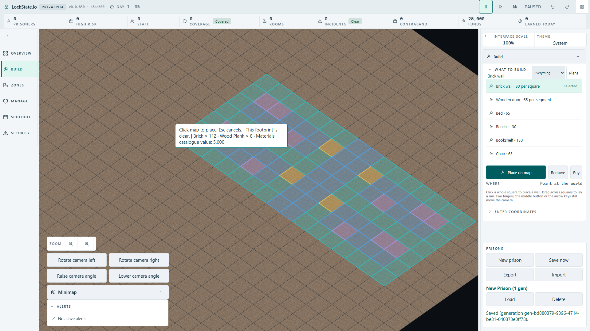
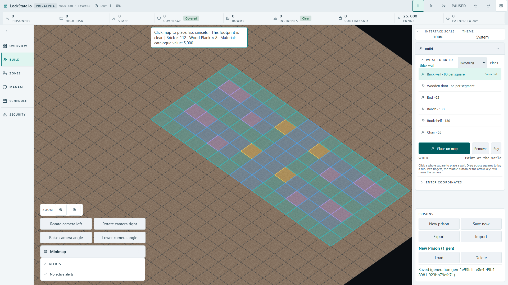
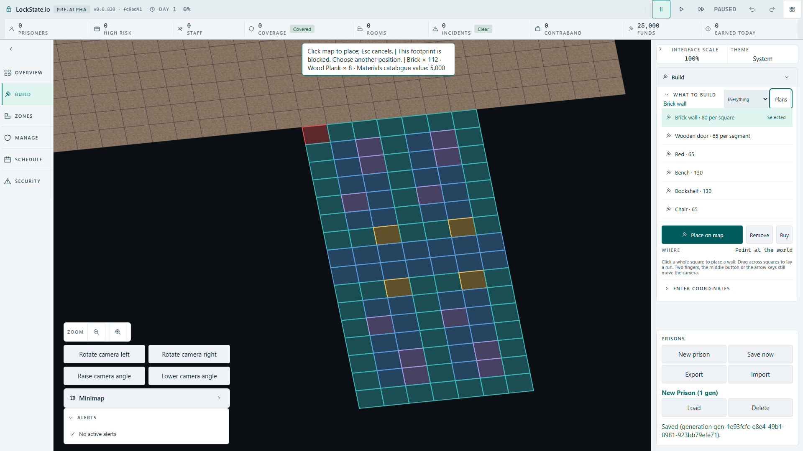

# Room-plan readout beside the projected floor

Issue: [#1925](https://github.com/woogitsu/lockstate/issues/1925). Source checkpoint: `fc9ed41fad`.

## Existing requirement and actual defect

The owner's square-building playtest brief in `docs/research/2026-09-27-square-building-and-room-templates.md`, Player flow step 3, requires cost, materials and conflicts beside the ghost. The current label used the plan's projected origin plus a fixed vertical offset. In the actual 1920×1080 angled game it covered 17 of the mirrored four-cell row's 112 ground squares after fitting.

The browser regression independently intersects the actual label rectangle with each SVG floor polygon, using the polygon's screen transform and separating axes. It fails on the production baseline with 17 intersections (6.4 s).

## Repair and limits

The presentation measures the current label dimensions and uses the exact convex projection of the entire room floor. Candidate positions stay inside the existing map area measured from the real navigation/corner, inspector and status strip. The nearest available position outside the projected floor is chosen, including a four-pixel gap. Canvas-to-CSS scale is applied to the label dimensions and output coordinates. Existing localized text, camera fitting, picking, collision checks and worker ownership remain intact.

If the viewport has no candidate large enough for this measured readout outside the floor, the bounded preferred position remains the fallback. This change proves the actual Full HD cases below; it does not assert impossible small-viewport geometry has a zero-overlap solution.

## Evidence

- Restored bridge and label-position tests: 11 passed; TypeScript passed.
- Mutation replacing geometric avoidance with the preferred origin-based position: one added unit regression failed (x1059 instead of x1208); restore returned 11 green.
- Design-token and input/rendering boundary gates: 86 passed.
- Actual normal `/?renderer=oblique` production artifact, one browser worker: center plus edge/mirror/yaw case passed in 7.7 s (10.7 s suite). All 112 real polygons were tested for label intersection, and both views had zero. The edge preview remained genuinely worker-blocked outside the map; the UI did not bypass that refusal.
- No timeout, retry, camera-policy, save-format or player-copy change.

The screenshots were opened for visual inspection. This branch is a pushed integration checkpoint and is not evidence of publication to main.