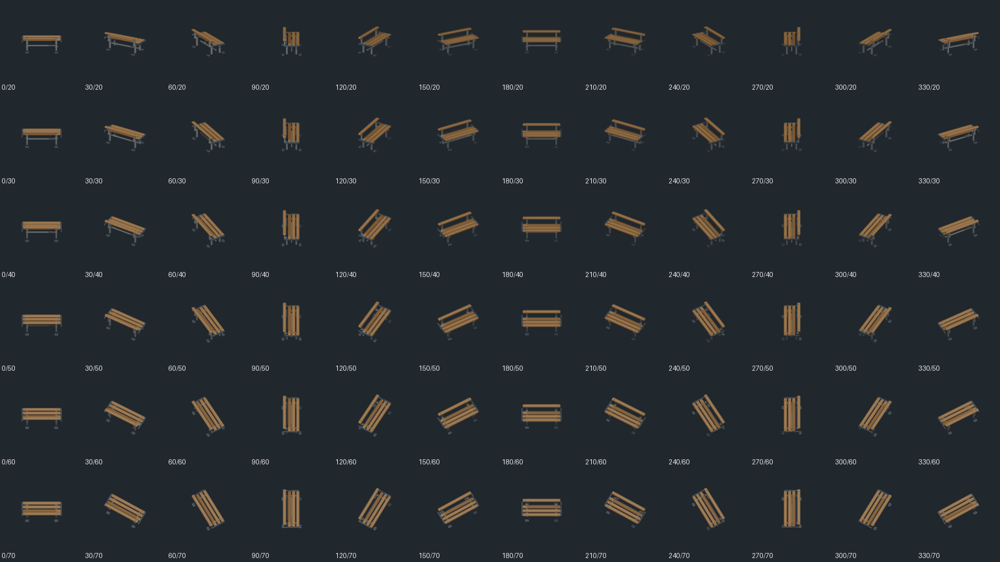
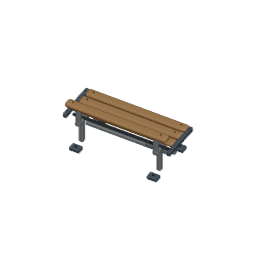

# Retained wooden bench: shared square export — 2026-10-02

## Current checkpoint

This isolated source/export checkpoint starts at integrated `25b0cdb79d`. It reuses the existing authored wooden bench from the catalog, retaining its 40 meshes, materials and modifiers. Its original centered export is aligned through the existing shared square pipeline. Native bounds/camera/retained-mesh guards, two complete repeat exports, decoded frame borders and deliberate mutation/restoration are verified. Actual native worker-build, normal/90° placement and Save/Load acceptance remain queued for the next exclusive browser lease; no player or hosted completion is claimed yet.

The default mapping is already `object.bench` -> `furniture.corridor.bench.variants`, registered through `/game-content/oblique-canteen-bench.v1.json`. Those canonical identities and the existing manifest descriptor remain unchanged. The separately authored upholstered Common Room and steel Yard context overrides are not changed by this work. No core, input, HUD, workflow or shared exporter source is changed.

## Authorship and actual geometry

Fresh remote audit inspected `codex/oblique-corridor-bench-20260928`, `codex/oblique-canteen-bench-art-20260928`, `codex/corridor-bench-refinement-art-2026-09-24` and `art/oblique-bench-alias`. Existing authored Canteen export commit `e389a2427315ca8a2669c0d2651881d6aa928415` and mapping commit `f6a7ee5d3c381765355567ff19d7e8f2cd0f6c4c` establish prior work. This checkpoint extracts that existing model; it does not claim a newly invented bench.

The original registered 512px export targets [0,0,0], while the retained mesh coordinates are centered around their scene-grid parent. Rendering from a min-corner object anchor therefore places negative source extents outside the authored occupied rectangle. Correcting metadata alone would cancel during projection; the loaded geometry needs the corresponding min-corner translation.

- Authoritative object footprint: 2x1, as defined by `object.bench`; the existing `bench-wooden` buildable remains unchanged.
- Original catalog SHA256: `57db9afb7e48996cef9aaedda72b8e874e865eb56862ee4add8b177a9713887d`, byte-identical after extraction.
- Retained standalone source SHA256: `3c07ae8916f36090803b05e09addb26458a704a674431ba786ccddee5e78b867`, 5746167 bytes.
- Provenance: `assets/source/blender/furniture.corridor.bench.provenance.json` lists all 40 retained meshes, evaluated vertex counts and modifier types, including four worn timber slats, eight recessed bolts and two end brackets.
- Original evaluated bounds relative to its catalog origin: [-0.967999458,-0.474999845,0]..[0.967999458,0.474999845,0.886500001].
- A single loaded-scene translation (1,0.5,0), with no scaling, gives [0.032000534,0.025000155,0]..[1.967999458,0.974999845,0.886500001]. All actual evaluated vertices remain inside 2x1 or 1x2 through all four clockwise quarter turns.

`extract-wooden-bench.py` appends only the original bench collection, removes its scene-grid parent while preserving relative mesh transforms and packs existing materials. `render-wooden-bench-oblique.py` imports the shared kitchen exporter without modifying it. The existing optional callback verifies retained source identity and exact mesh names. The actual camera renders 256px with a four-tile span: exactly 64 pixels per tile, pivot [128,128], target [1,0.5,0.44325]. The target height is the evaluated geometry midpoint; all 72 actual camera offsets and aim vectors are checked independently against the square yaw basis.

## Repeat and negative controls

Two full exports matched every one of the 72 actual PNG byte hashes and the manifest bytes. Manifest SHA256: `c7de37337f4a1154f3a037102dfa803ff14e9ae1814879a94b504acdffda4400`. Each frame has its full hash in the manifest, a hash-derived filename, 256x256 geometry and transparent pixels along all four borders. Native normalization and an independent PNG-inflation integrity test verify those borders.

| Deliberate native mutation | Obtained result |
| --- | --- |
| Shift actual meshes outside 2x1 | evaluated bounds guard red |
| Halve actual camera span | actual 64 pixels-per-tile guard red |
| Shift actual camera origin | actual target/yaw basis guard red |
| Omit authored timber slat | retained mesh-set guard red |

Every native mutation exited 1 with `--python-exit-code 1`; exact restoration exited 0. [Native evidence](native-guard-mutations.json) pins restored wrapper SHA256 `b6debe3ae8808bd9742ebe0a62ad092a494e8583579566fdb31dc2d840bc4184`. Appending a byte to one referenced PNG made the integrity suite red, then exact restoration returned 2/2 green. [Repeat/frame evidence](repeat-and-frame-mutation.json) preserves both outcomes. Four source/descriptor/mapping/coverage suites passed 48/48; both TypeScript projects passed.

## Opened actual exports



The contact sheet contains only actual PNG exports resized to 128px each and was opened. SHA256: `30ed700d7a5bb4241b303fcf7cdb9d18df00c52312718d1d26503b9384e6a6ba`.



The full-size 256px frame was opened. SHA256: `f18d12b145eb2666af6b9eeaf742dcbdac3c078e38d43660636803aeadffc4d6`.

## Repeat and queued native route

```powershell
& 'C:\Program Files\Blender Foundation\Blender 5.2\blender.exe' -b --python-exit-code 1 --python tooling/blender/extract-wooden-bench.py
& 'C:\Program Files\Blender Foundation\Blender 5.2\blender.exe' -b --python-exit-code 1 --python tooling/blender/render-wooden-bench-oblique.py -- --verify
& 'C:\Program Files\Blender Foundation\Blender 5.2\blender.exe' -b --python-exit-code 1 --python tooling/blender/render-wooden-bench-oblique.py
node node_modules/vitest/vitest.mjs run tests/unit/oblique-wooden-bench-integrity.test.ts
```

The inspected host is Blender 5.2.1 LTS, upstream build identifier 9e2066aef7ef, executable SHA256 `284f4041f98e113f3dc10654a7193ffaaa9bfdfec8b87fa116620a48b5f6d4cb`. Export determinism was measured on this host with the committed source. Cross-host byte-identical `.blend` regeneration is not claimed.

The queued native route reuses worker-built Storage Room/Delivery Bay capacity, then places a Holding Cell at (20,5), which consumes the default wooden bench rather than a context override. Normal completed anchors should be (21,6)/(23,8), orientation0; clockwise90° should give (24,6)/(22,8), orientation1, with corresponding 2x1/1x2 rectangles. Separate actual screenshot palettes must be calibrated and proved by missing-consumer red/exact-restoration green plus real Save/Load. The HUD agent currently owns the browser lease, so this checkpoint has not run a browser.
