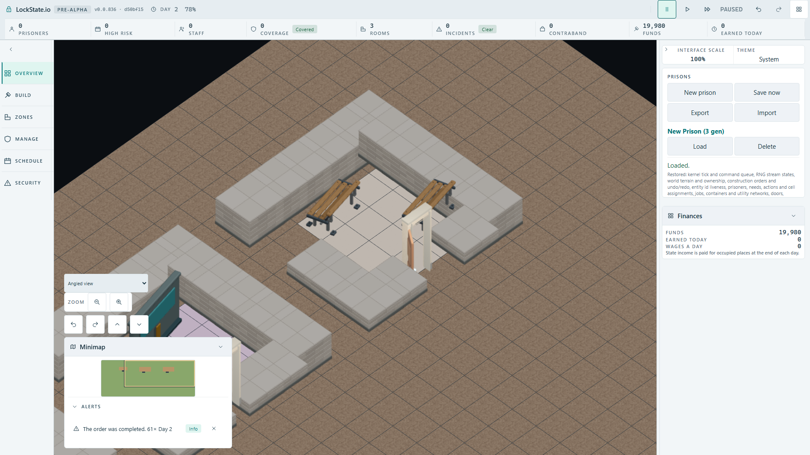
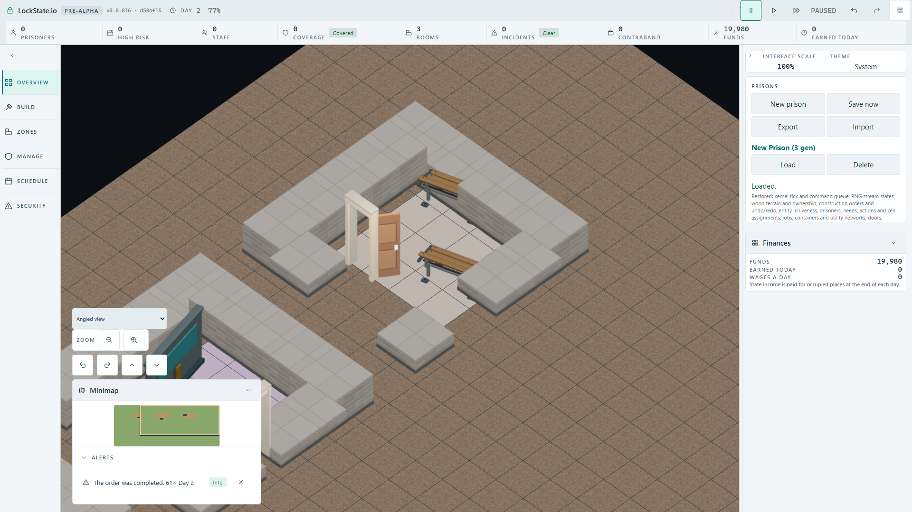

# Native wooden bench acceptance ? 2026-10-02

## Actual route

The tested production checkpoint is `d50bf157292ceb6b1babfb5006ce42124209b453`. The fixture uses the existing built-client gate settings through a temporary manual configuration outside `tests/`; no new tracked browser configuration or workflow is introduced.

Native New prison ? worker-built Storage Room (5,5) and Delivery Bay (12,5) ? actual IndexedDB Save. Each separate orientation case consumes that real save, places Holding Cell (20,5) through Room plans, allows actual workers to complete every order, inspects a read-only worker snapshot, then uses actual Save now/Load. No objects or completion are injected, and construction uses the normal path. The 60s case timeout and 10s construction-count progress guard are retained.

| Rotation | Actual completed anchors before and after Load | Native timber pixels before and after Load |
| --- | --- | --- |
| 0? | `object.bench@21,6:orientation=0`, `object.bench@23,8:orientation=0` | 917 / 730 |
| 90? clockwise | `object.bench@22,8:orientation=1`, `object.bench@24,6:orientation=1` | 401 / 583 |

[Normal raw worker/commands/pixels](accepted-q0-worker-and-pixels.json) and [rotated raw worker/commands/pixels](accepted-q1-worker-and-pixels.json) preserve actual sent template commands and snapshot anchors. RGB(150,115,75) was calibrated from the opened native FullHD pose. Each rectangle isolates one bench, with >300 pixels required separately. The rotated rear bench is partially occluded by its wall; the measurement establishes its visible timber portion. Source-preview colours were not substituted for actual runtime calibration; [the earlier calibration record](runtime-calibration.json) preserves that distinction.

## Consumer negative control and exact restoration

Only the default `object.bench` ? `furniture.corridor.bench.variants` row was temporarily removed. Common Room/Yard context overrides remained. The built client then ran each normal/90? route independently, because a serial failure would otherwise skip the second orientation. Capacity passed in 44.0/43.3s. Holding Cell completed and Save/Load retained its real anchors in 38.5/38.6s, but all four per-bench pixel assertions failed in each route: before [0,0], after [0,0]. Both negative loaded FullHD images were opened and show procedural blocks replacing the wooden meshes.

- [Normal negative snapshot/pixels](mutation-q0-worker-and-pixels.json), [opened image](mutation-q0-loaded-fullhd.png).
- [Rotated negative snapshot/pixels](mutation-q1-worker-and-pixels.json), [opened image](mutation-q1-loaded-fullhd.png).
- [Exact source restoration](consumer-mutation-and-source-restoration.json): original/restored SHA256 `a9eada806ff523bc9933da9b7a2e8a731c5a896286e33b0551119d8e389dd2d4`; the mapping diff is empty.
- [Actual built worker comparison](consumer-mutation-worker-bytes.json): mutation and restoration binaries are directly byte-equal (425954 bytes), SHA256 `cfd7bb59b26eb2bdb55b1a3a727564dd149ab60433a648b12b0fee3b70a1d2f9`. Both builds used the same tested checkpoint. No worker/core source was changed.

After exact restoration and a fresh production build, the full unified native fixture passed 3/3: capacity 43.0s, normal 38.0s, rotated 37.5s. Both per-bench palette counts match calibration and remain exact after Load. Four focused source/descriptor/mapping/room-template coverage suites pass 48/48, and both application/tools TypeScript projects pass.

## Opened final loaded images

Both 1920?1080 loaded images were opened after the final green run. [Acceptance metadata](player-acceptance.json) pins every completed/loaded frame SHA256, durations and the eight expected pixel failures. The browser process is terminal and its exclusive lease was released to HUD. Temporary manual configurations/calibration scratch files were removed. Root owns integration, routing the accepted spec into the existing artifact gate and any hosted verification; this evidence makes no hosted or integrated exact-head completion claim.
