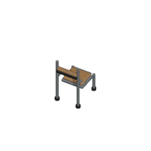

# Retained wooden chair: shared square export ? 2026-10-02

## Current checkpoint

This isolated work starts at published integrated `74ab00891a0a38d9a471f2a7856a0afbfdebe420`. The existing authored default wooden chair is retained, recentered and exported through the shared square pipeline. Actual evaluated geometry, material assignments/diffuse RGBA and modifiers match the original assembly after the declared translation. Native bounds/camera/mesh guards, two complete repeat exports and decoded transparent borders are verified. Actual worker-built normal/90? placement, native palette calibration and Save/Load remain queued for a browser lease. No player or hosted completion is claimed.

## Authorship and existing counterpart

Canonical object `object.chair` has the authoritative 1?1 footprint and existing `chair-wooden` buildable. Default mapping already selects `furniture.chair.wooden`, registered at `/game-content/oblique-cell-chair.v1.json`. The default manifest had only nine legacy poses at 512px with cameraTarget[0,0,0], while its source coordinates were centered around a catalog scene-grid origin. These descriptors and IDs are reused; registry/mapping rows and all gameplay semantics remain unchanged. The accepted Classroom steel/molded-seat context override is separate and untouched.

Fresh remote audit inspected `codex/chair-refinement-art-2026-09-24` (authored refinement `0bb7ad70f1d41e934d906e59ae9388050017d032`), `codex/chair-plank-clarity-2026-09-27` and `codex/oblique-cell-chair-dense-20260929` (legacy densification `0dac27c446f9fa7aaefe85faf54753c2e0eb1a9f`). The earlier densification adapted a legacy fixture exporter; the current registry still consumed nine default poses. This work extracts the existing model from the current catalog. It does not claim a newly invented chair.

## Actual source geometry and preservation

- Original source `assets/source/blender/environment.mvp.catalog.blend` stays byte-identical: SHA256 `57db9afb7e48996cef9aaedda72b8e874e865eb56862ee4add8b177a9713887d`.
- Native original audit found 16 meshes around catalog origin (21,28,0). Original local evaluated bounds: [-0.3859996795654297,-0.5024994611740112,0]..[0.3859996795654297,0.4680006802082062,1.3200000524520874]. [Original records](original-source-audit.json) list every mesh, evaluated vertex count, material assignment and bounds.
- Actual depth 0.970500141 fits one tile, but its Y midpoint is -0.017249390482902527. A min-corner translation alone would leave the rear highlight slightly outside 1?1. The extracted assembly therefore shifts by (0,+0.017249390482902527,0), with no scaling or mesh deformation. Relative spacing remains unchanged.
- Retained standalone source: `assets/source/blender/furniture.chair.wooden.blend`, 5730180 bytes, SHA256 `dab33079c7a42b2967950bab72048953270520383adbf3873a65aeb8e1b6687d`.
- [Actual original/new retention comparison](actual-retention-comparison.json) reads both Blender scenes and compares all 16 evaluated mesh vertex positions after the declared translation, material assignments/diffuse RGBA and modifier lists. Every point matches within 1e-5; all materials/modifiers are equal. The existing brown timber seat/back, steel frame and dark feet retain their palette.
- Standalone centered bounds: [-0.3859996795654297,-0.485249400138855,0]..[0.3859996795654297,0.4852507412433624,1.3200000524520874]. Shared loaded-scene translation (.5,.5,0) gives [0.11400030553340912,0.014750592410564423,0]..[0.8859996795654297,0.9852507710456848,1.3200000524520874]. Actual evaluated vertices remain within 1?1 and grounded through all four clockwise orientations.

The provenance file `assets/source/blender/furniture.chair.wooden.provenance.json` pins original/source hashes, collection, 16 retained names/counts/modifiers, alignment translation and actual diffuse RGBA. Both extractor and wrapper explicitly invoke the pinned Blender version guard. The wrapper reuses the shared kitchen exporter unchanged and its existing optional source preparation callback.

## Camera, repeat and deliberate negative controls

The actual camera renders 256?256 at a four-tile orthographic span: exactly 64px/tile. Pivot [128,128], target [.5,.5,.6600000262260437] uses the actual evaluated source height midpoint. The wrapper independently verifies all 72 actual camera offsets and aim vectors against the shared world projection yaw basis. The existing descriptor now references 12 yaws?6 elevations with 72 individually hashed PNGs; historical frames remain.

Two complete exports directly compared every actual PNG byte and manifest byte: all 72 equal; manifest SHA256 `a0ab4467bcd1daf12b321d67f842becb2973861250c783b912ee68b8b3714532`. [Repeat evidence](repeat.json).

[Native mutation evidence](native-guard-mutations.json) records actual loaded meshes moved X -.25, actual camera span halved, actual camera origin moved X -.5, and actual retained wooden seat omitted. Each native `--verify` exits 1 with `--python-exit-code 1`; exact wrapper byte restoration exits 0, SHA256 `0d86230ae25a9622eb2444c6621f7dad7d5d9fe129e223d62dc312e5ced47e6c`. The mutations change actual source preparation/camera behavior, not only manifest fields.

Appending one null byte to an actual referenced PNG makes its byte-integrity assertion red; restoring exact bytes returns 2/2 green. [Frame mutation/restoration](frame-mutation.json). All 72 frames pass full SHA256, PNG signature/dimensions and independent decompression checks of all four transparent borders. Four focused source/descriptor/mapping/room-template coverage suites pass 48/48; application and tools TypeScript both pass.

## Opened exports and queued native acceptance

Contact sheet of every actual exported pose, opened; SHA256 `fef4a8c894fa2e403d9ce09fbb7499157a36095bd46452bf3717f2bcf89446f5`.

Full-size actual frame, opened; SHA256 `ae37b81ed25184a15734640b97b4c45a59bc6c48dd0f4158d853b2fa9510ae7b`.

The inspected host is Blender 5.2.1 LTS, upstream build identifier 9e2066aef7ef, executable SHA256 `284f4041f98e113f3dc10654a7193ffaaa9bfdfec8b87fa116620a48b5f6d4cb`. Deterministic export was measured on this host using the retained source; cross-host byte-identical source regeneration is not claimed.

Next native route will use an existing completed room plan that consumes the default wooden chair, plus actual worker completion, normal/90? anchors/orientation, independently calibrated per-chair runtime palette and IndexedDB Save/Load. The older synthetic renderer harness expects the old 45?/45? frame; preparation will update only that chair pose expectation to an exact new grid pose. A native worker-built proof is required separately and will wait for root's browser lease. Core, HUD/input, shared exporter and workflows are untouched.

Weakest claim: source/export inspection establishes the authored geometry and correct shared pose, but cannot establish its actual player consumer or runtime palette. A worker-built native run and missing-consumer red/exact restoration green can confirm or falsify that remaining claim.

## Native route preparation checkpoint

The source/export checkpoint is `98a867fc4190effd063853391351273ec81dcc60`. The separately prepared `tests/browser/wooden-chair-player-build.spec.ts` reuses real worker-built Storage Room/Delivery Bay capacity and actual IndexedDB save across its three serial cases. It then places Staff Room at (20,5), which consumes the default wooden chair while the desk uses its already registered Staff Room variant. Normal expected chair anchors are (21,7)/(23,8), orientation 0; clockwise 90? expected anchors are (23,6)/(22,8), orientation 1. The full 6?6 rectangle remains clear of capacity rooms.

The fixture preserves native controls, real workers, normal 60s case/10s construction-count progress guards, exact sent template commands, read-only snapshots and actual Save/Load. Its failure hook captures worker state and FullHD. At this preparation stage it asserts completion/persisted anchors and captures completed/loaded FullHDs; per-chair palette assertions will be added only after actual runtime calibration from those images. Source-frame colours are not used as substitutes for a native pose. The existing synthetic chair renderer harness is adjusted only to exact shared-grid pose 60?/50? and corresponding texture key; no synthetic object is used in the new native fixture.

The browser fixture and harness changes typecheck. No browser was run for this checkpoint: root owns the PR1898 repair lease. Before actual consumer acceptance, the native route must run, both loaded images must be opened, independent per-chair runtime crops must be calibrated, removing only the default wooden chair binding must produce red, and exact restoration must return a full bounded run green. Existing artifact gate routing remains parent-owned; no tracked config or workflow is added.

## Consumer assertion preparation and next candidate audit

While waiting for the native browser lease, the chair fixture now separately counts timber pixels in two estimated per-chair rectangles and asserts both before construction screenshot and after actual Load. These candidate regions and the >20 provisional threshold are preparation only; runtime calibration remains pending. Source provenance reads the actual retained timber diffuse RGBA (.48,.27,.11,1), shared by seat/back materials. Candidate source-frame RGB(150,115,75) occurs 31 times in the actual yaw30/elevation40 export. That source pixel is not a substitute for the native camera palette. Native calibration must tighten isolated chair regions, exclude desk/door pixels, choose the actual pose's colour/count floor and then prove both independent gates red after removing only the default chair binding. Objects, orientations and Save/Load assertions must remain unchanged. The initial provisional counts will be recorded honestly if the native run is red; they will not be labelled an exporter regression or missing-consumer proof.

The next concrete sparse counterpart is the **default generic wooden storage rack**, rather than the already aligned Kitchen/Laundry models. Existing `object.storage-rack`/`storage-rack-wooden` uses the default `furniture.storage.rack.wooden` catalog outside the Storage Room context. Its current default manifest still has 9 poses at 512px, target [0,0,0], from the original catalog. Native audit finds 48 retained meshes with local bounds [-.495000303,-.454999387,0]..[.495000303,.454999387,1.407999992], inside centered 1?1. Shared (.5,.5,0) translation could align it without scaling. [Candidate audit](next-generic-rack-candidate.json) pins every mesh and actual bounds, canonical object/buildable/manifest and fresh historical dense export commit `b7f6e98ad13ab3e199c700d71ab651ae79afbda8`.

The accepted Storage Room `furniture.storage-room.timber-rack` context override has 72 shared 64px/tile poses and real worker/SaveLoad proof; it is not this missing default counterpart and remains untouched. Current kitchen stove/prep-counter/fridge and laundry washing-machine descriptors already have 72 shared 256px/64px-tile poses, so duplicating them would not address the sparse default rack. No rack source/export/registry/mapping is changed by this audit. Its later native acceptance would need the real individual Storage Rack build outside the published Storage Room context to reach the generic consumer.
