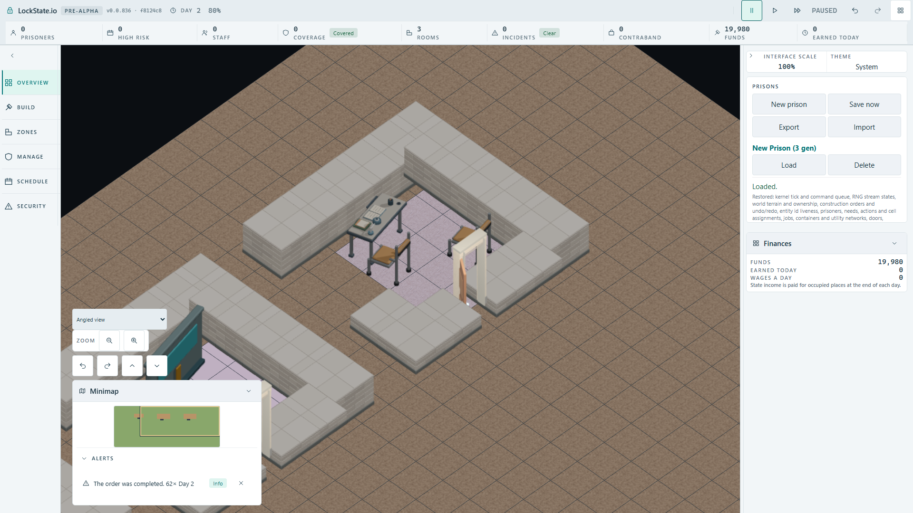
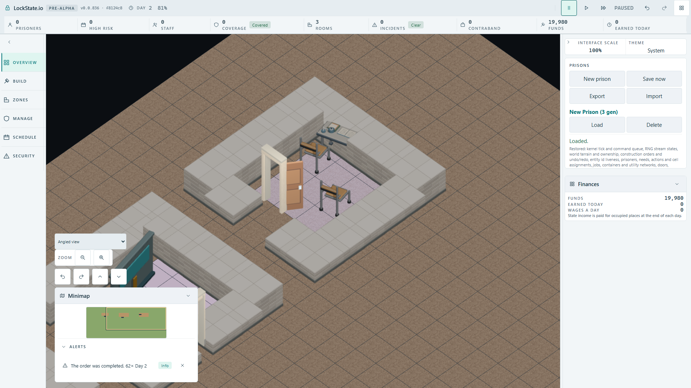

# Native wooden chair consumer acceptance ? 2026-10-02

Status: actual built-client worker construction, normal/clockwise90-degree orientation, independent chair palette and IndexedDB Save/Load accepted locally. Hosted deployment and integrated artifact gate are not claimed.

## Route and calibration

The existing Staff Room plan at(20,5) consumes canonical `object.chair` through `furniture.chair.wooden`. The three serial cases first build Storage Room(5,5) and Delivery Bay(12,5) using native controls and real workers, save actual IndexedDB state, then reuse that capacity save in fresh contexts for normal/rotated Staff Room. No world objects/completion state are injected. Exact template commands and read-only worker snapshots establish both chairs before/after actual Save/Load. Native budgets remain60s percase and10s per construction-count advance.

Normal anchors: `(21,7)`/`(23,8)`, orientation0. Rotated anchors: `(22,8)`/`(23,6)`, orientation1. Existing Classroom chair and Staff Room desk context variants remain unchanged.

Calibration at e3eff8678cb8f7b66b8835067d1071e89a8d5417 passed3cases42.9/37.8/37.4s. Both loaded FullHDs were opened. Actual native timber RGB(150,115,75) gives108/106 pixels normal and54/49 rotated, equal before/after Load. The actual retained source seat/back diffuseRGBA(.48,.27,.11,1) informs timber choice, but does not substitute for native pixel measurement. The normal rear chair is partly behind the door; the visible seat is included. Each crop excludes the desk. Calibration record pins all rectangles; every independent gate requires>40pixels.

## Missing consumer and exact restoration

At calibration checkpoint f8124c8c5a983ddd48f379dfc263368aedb40775, remove only the default mapping `'object.chair': 'furniture.chair.wooden'`, build production and run two bounded native routes separately so normal failure cannot skip the rotated case. Normal capacity43.2s/room38.5s; rotated capacity42.6s/room38.9s. Both commands, real construction, anchor/orientation and actual Load assertions remain valid. Each route exits1 with four expected independent palette failures: both chairs after completion and after Load all have0timberpixels. Both negative loaded FullHDs were opened, showing fallback geometry while the real placed chairs still exist. This also falsifies contamination from the desk/door.

Restore the exact original mapping bytes: SHA256 `a9eada806ff523bc9933da9b7a2e8a731c5a896286e33b0551119d8e389dd2d4`, empty source diff. Both production builds exit0. Directly compare the entire actual emitted worker files:426813bytes equal, SHA256 `484f4cf4563a026c2b214850d8e6a1ca88bc9a923d21a2846383d2458919b86f`. No worker/core change explains the negative result.

Final exact-restored actual run passes3/3 at44.0/39.9/38.8s with original budgets, anchors and pixel counts restored. Four focused source/descriptor/mapping/coverage suites pass48/48; application TypeScript exits0. [Consumer mutation/restoration record](consumer-mutation-and-restoration.json) and [accepted raw run](accepted-player-run.json) preserve evidence and exact image hashes. All browser processes are terminal; exclusive lease released to root/HUD before evidence publication. Temporary local/manual configs removed; canonical artifact routing stays parent-owned.

## Opened accepted FullHDs

Normal loaded SHA256 `3706b491a14743d138c938ba3982336e49f3e0732860deb1dbdc84e13076368e`, opened after final green.

Rotated loaded SHA256 `b60da5edbdcdb79dfe358684df8cfac6faae220f36ad3d8394013f93f43eafe2`, opened after final green.

## Limits and next source checkpoint

This proves both default wooden chair consumers at the observed native camera pose and retained palette. The synthetic renderer harness remains a separate pose check. It does not establish hosted deployment or all camera views; all72exported poses were separately inspected and verified for byte repeat/borders/source-camera alignment.

The separately retained generic wooden rack source/export checkpoint is `0c1cfa7c5cfbc49bf046c0dae515646bf00fdaa7`; accepted Storage Room context override remains unchanged. Generic rack native individual build/SaveLoad is still pending; this chair proof does not cover it.
