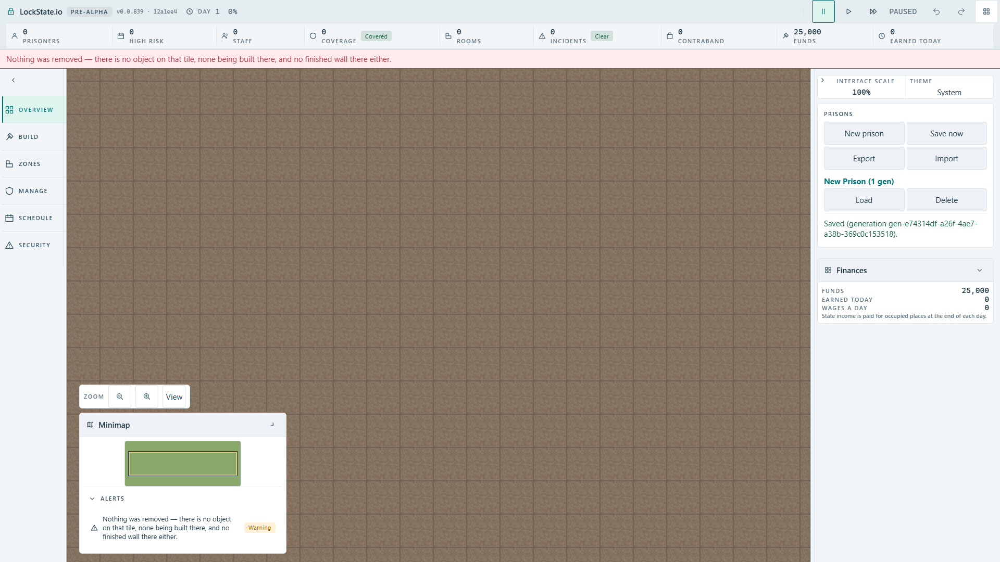
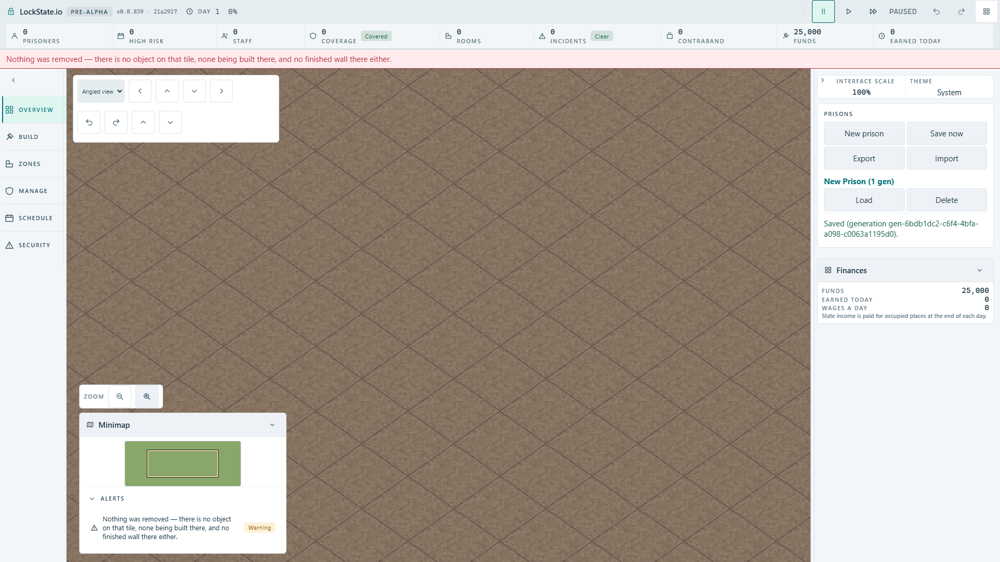

# Kamera — dwie niezaakceptowane propozycje

**[A: View / Widok otwiera panel](https://github.com/woogitsu/lockstate/commit/12a1ee465df672b57d5dfd547e8f678d4f494bdc).** Przycisk przy istniejącym powiększeniu otwiera wybór widoku oraz te same działania przesuwania, obrotu i pochylenia. Escape zamyka panel. Koszt: dodatkowe naciśnięcie; zamknięty panel oddaje miejsce mapie.

[A po otwarciu panelu](./native/a-original/actual-ui100-active-status-all-camera.png).

**[B: ten sam panel zawsze widoczny](https://github.com/woogitsu/lockstate/commit/21a2917a4d9f414c7d97d66495ac073ccf92674f).** Funkcje są dostępne od razu. Koszt: panel stale zasłania część górnego obszaru mapy; w zmierzonym widoku pod kątem zajmuje396×130px.

Zachowujemy istniejące napisy **View/Widok**, **Top-down/Z góry**, **Angled view/Pod kątem**, Zoom i nazwy wszystkich działań kamery. Nie dodajemy nowego tekstu. Funkcje i źródłowe minima44/88px pozostają. Żaden wariant nie zabiera wysokości liście powiadomień ani minimapie. To decyzja o rozmieszczeniu kamery #1292, niezależna od przycisku obrotu wyposażenia #2019 i szerszej alokacji Build/Save200.

**Oba warianty przeszły rzeczywisty test angielskiego interfejsu100% przy1920×1080.** Wszystkie cele mają co najmniej44px, pełny wiersz alertu67px mieści się w liście, a działania kamery nie zmieniają całego wstrzymanego stanu gry. [Dokładny wynik i ograniczenia](./NATIVE_RESULTS.md). Skala200% i polski interfejs pozostają do sprawdzenia przed wydaniem wybranego wariantu. Ta propozycja i jej zrzuty nie oznaczają zatwierdzenia lub wdrożenia.
