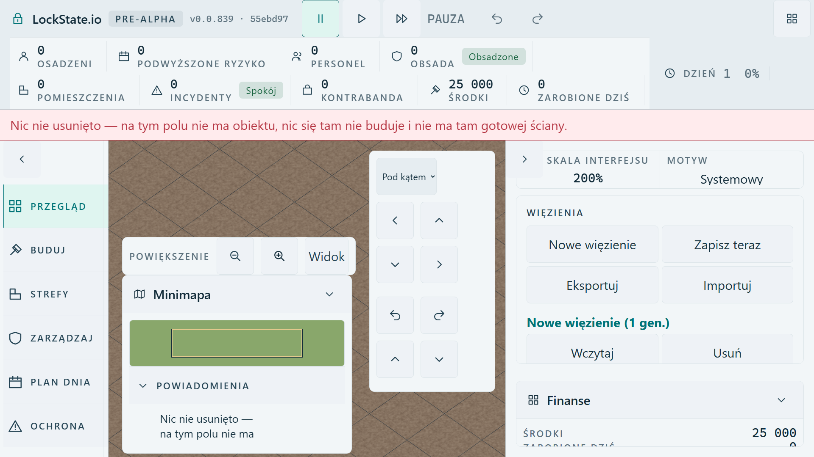
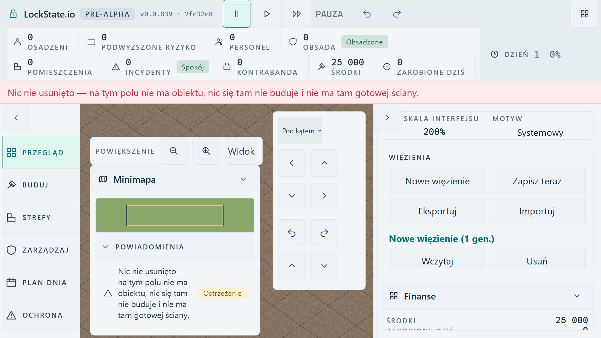

# REVIEW DRAFT: complete UI200 corner alert

**Owner decision required. Do not integrate this allocation change as part of the already approved Camera A fit.**

## Concrete choice

Recommended review option: retain the same bottom-docked corner, width, minimap, Zoom/View controls, twelve camera targets, top nine readings and side rail; let UI200 use the actual vertical budget below visible notices instead of the fixed `6 × 88 = 528px` cap. The bound is `viewport height − actual maximum strip/notice bottom − 12 × UI scale`. This case has `1080 − 332 − 24 = 724px` available. The natural corner needs651px to display its complete207px refusal row, so it uses651px, not the whole724px.

This moves the existing Zoom row upward123px and gives the corner123px more map area at UI200. That is the proposed allocation tradeoff. UI100 clears the inline override and retains the previous CSS allocation; the approved source at UI100 already passed its complete native recipe, while this draft was executed only at UI200. This is not a new layout exemption, player text, color palette, Build/Save allocation, game state or persistence rule.

Alternative: retain the existing528px cap and scrollable84px alert viewport. This preserves the current allocation but does **not** meet the unchanged native full-alert-row guard. Both screenshots are supplied so the decision concerns an actual visible result.

## Frozen subjects and source patch

- Approved camera fit: `55ebd97ee2b04cf152e181fbb2405b2d6cec2515`, [separate original/fixed receipt](../2026-10-03-camera-a-scale-fit/README.md).
- Review draft source: `7fc32c85f13c88d4756fa433639d7ef3c7391752`, branch `codex/corner-ui200-height-review-20261003`.
- Narrow [patch](./corner-height-review.patch.txt): only the existing presentation's corner max-height override and one measured producer test. The budget follows resize and actual notice publications through existing observers. No global layout relocation or new persisted field.

The underlying CSS cap remains the default for other scales. Only root `data-ui-scale-step=200` gets the ephemeral actual-height override; every other scale clears it. The resulting maximum can still require scrolling for many alert rows or insufficient available height. This one-row FullHD proof is not a claim that every dense UI200 state fits without scrolling.

## Actual before / after

| Measurement | Approved camera fit, existing cap | Review draft |
| --- | ---: | ---: |
| Corner top / height |552 /528|429 /651|
| Effective corner maximum |528|724|
| Alert list client / scroll height |84 /207|207 /207|
| Full alert row bottom |1162, outside viewport|1039, inside viewport|
| Expanded camera left / top / width / bottom |871.34375 /356 /296.65625 /926|unchanged|
| Visible refusal bottom / camera gap |332 /24|unchanged|
| Camera controls and minimum targets |12 /88px|12 /88px|

The exact strip, tabs, right rail, refusal band and expanded camera bounds are unchanged in [DOM measurements](./evidence/geometry-before-after.json). Existing minimap sizing/source is unchanged; its actual screenshot moves with the corner. Zoom retains the same width, height, target floors and callbacks but moves upward123px. Entire paused worker state before/after all interactions is equal, and camera interactions post zero new simulation commands.

Before: retained **UI200 RED** at the original full-row assertion, after camera reachability is repaired.

Review draft: same real public recipe **UI200 GREEN**, terminal26.515s.

## Execution and limits

Default installed Playwright Chromium; genuine compiled own production output, public New prison, actual worker RemoveWall refusal, Pause, native View/renderer and camera presses. Existing60s / expect10 / retries0 / worker1, FullHD1920×1080 / Polish / UI200. No private state injection, supplied geometry, synthetic CSS or altered assertions. The spatial check permits actual horizontal or vertical separation; full alert row guard remains unchanged. The old failure is preserved, not renamed as a fixture error.

Source96GREEN and both strict type checks/build succeed. Actual draft budget-producer omission gives **1RED /95GREEN**; finally exact-byte restoration gives **96GREEN**. Inert executed recipe and SHA proof are retained. Raw compiled hashes, runner JSON, screenshots, whole snapshots and counter measurements are in `evidence/`, indexed by `evidence-manifest.json`. Source mutation was on detached exact7fc32c85, then restored with production diff0. No native producer mutation run or hosted latency claim is made.

Own native PID16508 and preview tree ended, own port5373 was free, exclusive browser/build lease released to root before this evidence publication. No further browser or build runs belong to this record.
