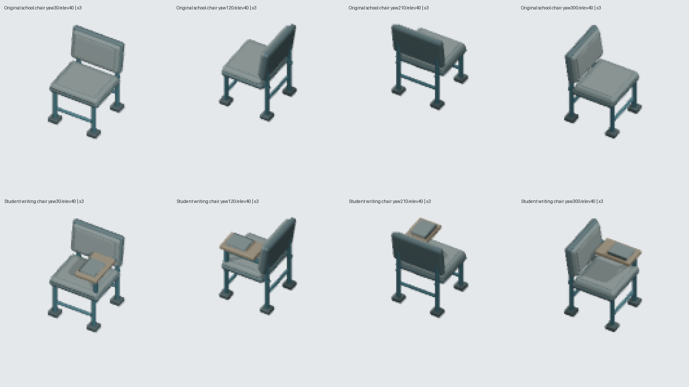

# Classroom student writing chair: genuine retained source

## Corrected existing context

Base1da862861057d3b4a3780be90d9a25d4c83961c9 already maps object.chair in room.classroom to the genuinely authored furniture.classroom.school-chair. This work is a functional student writing-tablet variant of THAT retained model, not a claim that Classroom lacked dedicated chair art. The existing school-chair source,72exports, producer, registry/context and all other room contents remain unchanged.

## First actual source checkpoint

Blender5.2.1LTS, one process/one thread, opened the real existing source SHA256d28bc849cc54701a8efa26504905dcfb8887847b540a6e1253e216c2b6bd16d1. It retained ALL25 original meshes, raw vertices/topology/modifiers/material assignments and world geometry (maximum vertex error0). All EIGHT complete stored material graphs are retained, including the unused original default Material in addition to the seven purpose-authored palette graphs. No new material or color was invented.

Eight substantial new parts form a right-side sealed timber writing tablet, connected petrol steel bearer/upright/cross brace, and bound exercise notebook with lower/upper covers, page block and spine. Real evaluated triangle-interior witnesses confirm13 physical contact pairs, including the original front leg and rear upright interfaces. Every new part has outward/nondegenerate evaluated geometric normals.

Original physical extrema remain EXACT: min[0.15000000596046448,0.14399999380111694,0], max[0.8500000238418579,0.8459999561309814,1.0440210103988647]. Footprint1x1/fourturns and camera target[.5,.5,.58] remain original. Retained parts were not translated, rescaled or removed. No additional gameplay desk/workstation function or capability is implied by presentation.

Actual source assets/source/blender/furniture.classroom.student-chair.blend SHA2560c3d7dc54a594659c810f8e1d76bd4980bf1293f7a5b22c367805760de1a9b1b. Its complete provenance records original/raw/material/evaluated/normal/bounds/contact data and source hash. actual-original-inventory.json is from the real Blender source, not a generated concept.

## Genuine source/export and obtained controls

Own asset furniture.classroom.student-chair; descriptor /game-content/oblique-furniture-classroom-student-chair.v1.json, own build-classroom-student-chair.py and render-classroom-student-chair-oblique.py. The new producer directly asserts pipeline_common.require_blender_version() before loading its source builder and ORIGINAL classroom exporter. It preserves the original minimum-corner source coordinates and shared camera rather than translating this already square-aligned chair through another exporter.

Canonical pipeline remains256x256,64pixels/tile, ortho4, pivot[128,128], original target[.5,.5,.58], yaw0..330step30/elevation20..70step10. Exactly ONE genuine new72-pose matrix ran, serial Blender1thread; no existing matrix or repeat benchmarking was rendered. The preview and all72 actual PNGs were normalized through the existing Classroom PNG exporter and independently hash/decode/border checked.

| Actual artifact | SHA256 |
| --- | --- |
| Source .blend | 0c3d7dc54a594659c810f8e1d76bd4980bf1293f7a5b22c367805760de1a9b1b |
| Complete provenance | ee83fc4d8838be9e48a7ce28a2aa56b5833e714f6500b667d56c5d0ea6f9ba75 |
| Descriptor | 13332d4efde722a47b2805143e04cba68bdc9739866e840436cd4a1e0aaf071e |
| Actual45/e45 preview | 2c79d33a7adc66f6c7e2bf1845b3d2eedb6d77f3eb6bfea58cc00b60e74c19f4 |
| Canonical60/e40 frame | eb690a4392146a594fa1b692a2dc0b28b881820e541a7125f7f112c474c50260 |

Frame60/e40: /assets/environment/oblique/furniture.classroom.student-chair-yaw+60-elev40.eb690a439214.png. Every72 path/hash is retained in final-source-render-integrity.json and the comparison receipt.

The actual preview and all four original/new yaw30/120/210/300,elev40 views were opened and inspected. The timber tablet and notebook read in every view; rear views naturally hide part of the frame behind the retained back shell. RGBA changes at identical actual cameras are698/655/426/1036pixels. These are source/render findings, not native on-screen calibration or a claim that every part is visible from every angle. The comparison contains only real rendered PNG crops and labels, no generated concept.

## Genuine negative controls -> exact restoration

The repeatable tooling/research/prove-classroom-student-chair-controls.py ran three actual controls:

1. Actual Blender opened the OWN .blend, moved sealed timber writing tablet z+0.22, saved it and matched the provenance sourceSHA to those bad bytes. The real producer --preview failed on tablet/bearer triangle-interior contact BEFORE raw/evaluated/hash rejection and before rendering.
2. Removed the actual OWN producer MODELS dispatch tuple. The real producer --preview failed on dedicated dispatch before rendering.
3. Produced a VALID RGBA PNG with opaque top-left border alpha, updated both descriptor SHA and hash-bearing filename, then ran the actual dedicated unit test. File/hash loading passed; decoded transparent-border guard failed.

All three reached exit1 at the intended reason. Source/provenance/producer/descriptor and all72OWN exports restored BYTE-EXACT; original school-chair source/descriptor72, original shared classroom exporter, registry and mapping remained unchanged. A fresh real producer --verify checked source/13contacts/all72camera bases/four footprint rotations; two dedicated tests GREEN. Existing school-chair art/context plus own tests9GREEN; TypeScript project/tools check GREEN. Actual RED/GREEN logs and complete restoration receipt are committed here.

## Existing base gate and scope boundaries

This published base1da8628610 still has the two inherited missing direct Blender guards in render-classroom-teacher-desk-oblique.py and render-garbage-room-bin-oblique.py. The existing determinism gate was actually run and records RED naming ONLY those two. The new builder/exporter have proper direct canonical guards and introduce no additional offender. Those forbidden surfaces are not edited here; the already published separate fix b648e7eed2b6d116cc6e455c931a840caa091373 belongs to root's integration. Full deterministic gate/release success is therefore NOT claimed on this isolated old base.

Root owns full gates/native Teacher/Reception; HUD stationary Build camera audit; delivery actual browser5365. No browser/server was started. None of the existing room templates, costs/collision/footprints/capabilities/save/schema/palette or current runtime registry/context was modified. Original chair parts are25 (not a guessed26); seven purpose-authored palette graphs plus unused default Material make eight retained stored graphs.

## Exact optional integration handoff, pending root

Root can register furniture.classroom.student-chair -> /game-content/oblique-furniture-classroom-student-chair.v1.json and replace ONLY the value for EXISTING room.classroom/object.chair with furniture.classroom.student-chair. Do not add a duplicate Classroom context row or change global object.chair, Reception or Teacher desk. Existing school-chair source/exports remain available as authored history. This branch makes no registry removal/canonical alias decision.

The existing public classroom-basic template still contains bookshelf+four existing chair owners. Native acceptance must establish those same owners and their orientation through whole paused Save/Load, real descriptor/PNG decoder evidence and visual calibration of the actual completed scene. No new playable desk/workstation or runtime capability is implied by this side writing tablet. Native wiring, UI recipe and gameplay visual calibration remain pending root; no native pass is claimed.
