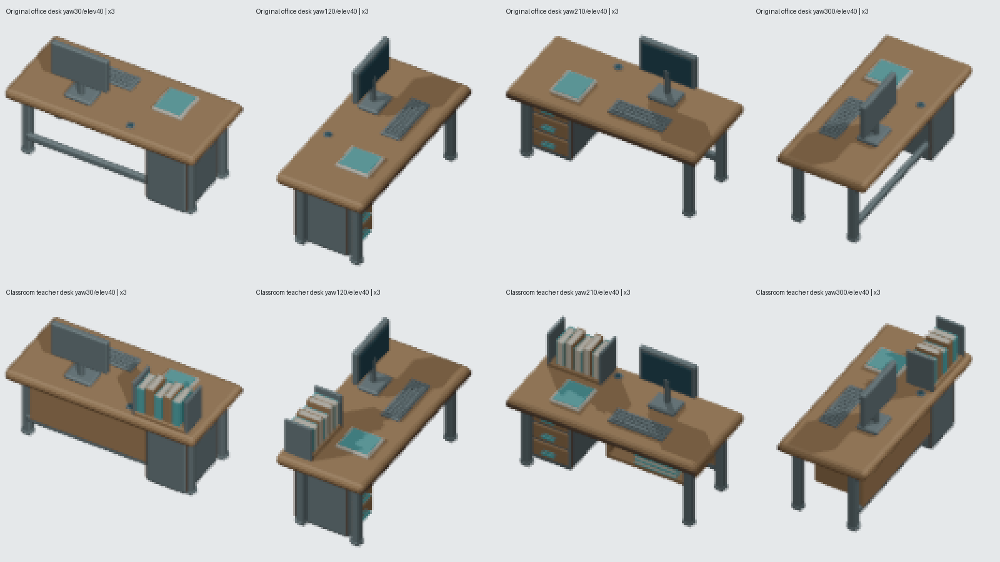

# Classroom teacher desk — retained Blender model

## Verified scope

The current object mapping sends `object.desk` to `furniture.office.desk.generic` in Classroom. Classroom currently has a dedicated school-chair variant only. Its public `classroom-basic` template places a bookshelf and four chairs, **not a desk**. This model is therefore a room presentation for an optional existing playable desk placed by the player; it does not change room requirements, template contents or workstation capability.

The genuine source retains every one of the original 94 authored mesh parts, all original raw vertices/topology/modifiers/material assignments, exact evaluated positions, and all six complete stored material graphs. Computer, documents, drawers and original structural details remain. The retained source SHA256 is `486b83b5079698faeb1cd58e989d1a1dfe524996813474b04550dd4c82a2fd46`.

39 new parts form a pupil-facing oak modesty panel, an open coursebook shelf with three bound volumes, and a desktop rack holding five bound textbooks. These reuse warm oak, paper, powder-coated steel and teal from the original palette. They change a substantial visible silhouette while preserving the original 2×1 footprint and exact overall bounds: `[-0.9100000262260437,-0.41999998688697815,0]` to `[0.9100000262260437,0.42250001430511475,1.2699999809265137]`. All four occupied rotations fit. All new evaluated geometric normals are outward and nondegenerate; inherited original bevel records are preserved.

## Genuine source and exports

- Asset: `furniture.classroom.teacher-desk`.
- Source: `assets/source/blender/furniture.classroom.teacher-desk.blend`; SHA256 `c1dd80d253667f8e1bca5b17371b183ec18b5a292bebdf9fd2062e85b01d55ff`.
- Full provenance: `assets/source/blender/furniture.classroom.teacher-desk.provenance.json`; SHA256 `ceac8ef8efd9f2f5154575fe8c1d77e78fd54a4d4002ec8347f18e3067021670`.
- Descriptor: `public/game-content/oblique-furniture-classroom-teacher-desk.v1.json`; SHA256 `21081cbe54947671e3eadbc0cd4b08be3c23d16e6d54cc8549fc85dcb722ccb7`.
- Camera: orthographic 4 tiles, 256×256, 64 pixels/tile, pivot `[128,128]`, original target `[1,0.5,0.6349999904632568]`, yaw `0..330` by 30°, elevation `20..70` by 10°. Exactly 72 new published PNGs; every actual PNG body SHA is in the descriptor and accompanying comparison receipt.

Blender 5.2.1 LTS was used with **one thread**. One full new canonical export ran; the original 72 files were read, not rerendered. Four bounded new production replays at yaw 30/120/210/300°, elevation40° are byte-exact with their published PNGs. The producer verifies 55 evaluated triangle-interior physical contacts before byte/raw/position guards and independently checks all 72 camera bases.



The four actual original/new views were opened and visually inspected. The image uses real PNG crops with nearest-neighbor enlargement and labels. Full-canvas RGBA changes at identical cameras are respectively **2383 / 1519 / 2076 / 2048 pixels**. The rack reads from all four sides; the pupil-facing panel and open shelf complement the retained drawer pedestal. These counts prove visible changed art, not gameplay acceptance or per-part visibility from every angle.

## Actual controls and exact restoration

`tooling/research/prove-classroom-teacher-desk-controls.py` ran these actual producer controls:

1. Opened the new `.blend` in Blender, moved the textbook-rack base `z+0.45`, saved it, and matched the provenance source hash to those bad bytes. Real production preview failed on the actual rack/worktop triangle contact **before** geometry/hash rejection.
2. Removed the actual standalone producer's model dispatch tuple. Real production preview failed on dedicated dispatch before rendering.
3. Re-encoded a valid RGBA PNG with an opaque top-left border pixel; updated both descriptor hash and hash-bearing filename. The actual dedicated test passed file/hash loading and failed on the decoded transparent border.

Each control reached exit1. Source, provenance, producer, descriptor and all 72 own exports were restored exactly; original office source/descriptor/72 exports, shared exporter, registry and mapping remained byte-identical. Fresh actual producer verification, two dedicated unit tests and full TypeScript typecheck passed. Receipt and RED/GREEN logs are saved beside this report. No shared code change is part of this branch.

## Exact integration handoff — pending root/native

Root can add this optional registry entry:

```json
{"assetId":"furniture.classroom.teacher-desk","manifest":"/game-content/oblique-furniture-classroom-teacher-desk.v1.json"}
```

In the existing `room.classroom` variant entry, retain the current chair and add:

```ts
'object.desk': 'furniture.classroom.teacher-desk'
```

Use the existing fully-contained rotated-footprint selection. Preserve default office/Reception and Staff Room routes. No alias, catalogue, palette, save, copy, capability, template or rendering behavior change is requested.

**Pending:** actual root mapping/registry integration and genuine built-client public placement of a 2×1 desk inside Classroom in q0/q1, network source/descriptor/frame evidence, calibrated visual checks and whole paused Save/Load. No browser/server was started and no native pass is claimed here.

## Reproduction

Use the installed Blender with `--background --factory-startup --threads 1 --python-exit-code 1`:

- `--python tooling/blender/build-classroom-teacher-desk.py` authors the retained genuine source.
- `--python tooling/blender/render-classroom-teacher-desk-oblique.py -- --verify` verifies source, contacts, four footprints and 72 cameras without renders.
- The same exporter without flags exports the 72 poses; `--repeat-four` makes only four independent repeats.
- Python `tooling/research/prove-classroom-teacher-desk-controls.py` repeats real mutations and restoration; focused test is `tests/unit/oblique-classroom-teacher-desk-art.test.ts`.

Reauthoring can change Blender source file serialization metadata; the committed source identity is the explicit hash above. Any intentional reauthor must refresh its own provenance/descriptor/hash pin through the genuine pipeline.

Final integrity and one ready-to-observe yaw60/elevation40 frame are pinned in `final-source-render-integrity.json`. Descriptor and provenance text-body hashes describe the recorded local UTF-8 files; Git line-ending normalization may change their byte digests on another checkout. Source and normalized PNG hashes are binary identities.
