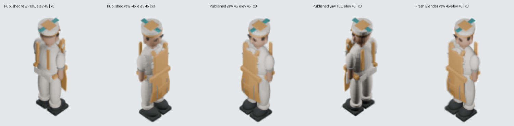

# Existing Cook apron and cap: no material geometry finding

2026-10-03. Isolated branch `codex/cook-apron-cap-audit-20261003`, base
`5008b18920edce057bd4d21446ddfcac1ac8586e`. Decision: retain the released model.
The apron and chef cap have actual supporting contacts and read as continuous
garments in the four inspected canonical directions. No parts were added.

## Real source and bounded replay

The existing `assets/source/blender/actor.cook.base.blend` was opened by pinned
Blender 5.2.1 LTS (`9e2066aef7ef`). Source SHA256 remains
`8ddb0c30fd183ec11574c386b7acfb0e8901307a21ebec357f1a51dcd6fa6a98`.
All **68 original meshes, 10 complete stored material graphs, modifiers,
parents, animation actions, eight original poses and bounds** were retained.
[Source receipt](./proof/one-original-producer-preview-receipt.json) records their
digests and 16 actual post-modifier triangle-interior contact witnesses at frame
1: apron bib/torso, waistband/hips/cloth, shoulder/back straps, side ties and cap
band/hair/crown/head/decorations. AABB intersections restrict the search; they
are not accepted as contact proof.

One new render used the **unchanged original role producer's preview path**,
retaining source lights, source scale 1, ortho 15.5, 512px image, nominal 64px
tile, pivot (256,256), target (0,0,0). The yaw 45/elevation 45 replay is byte
exact to the released PNG, SHA256
`dc2f8b253bdeee8aa8f81c26423336366c04b6d51131437c7d789964caa0535e`, zero changed
RGBA pixels. Existing yaw -135/-45/45/135 at elevation 45 were opened together:
the apron silhouette and seated cap are coherent; no material gap was visible.
Their alpha bounds are 37px wide and 98–104px tall.

[Exact view comparison](./proof/bounded-canonical-view-comparison.json).
This is four existing PNGs and **one** newly rendered preview, not a new
72-pose matrix. The preceding
[role actor record](../2026-10-02-oblique-role-actors/README.md) already documents
the orientation correction and full catalog; its Cook preview was also opened.

## Actual mutation → RED → exact restoration → GREEN

Blender temporarily saved the real source with
`Compact chef cap crown.location.z += 0.6`. The source guard exited 1 on
`Cook actual role contact disconnected: Chef cap folded band / Compact chef cap crown`
**before** the source hash check. Original `.blend` bytes were restored in
`finally`; a fresh Blender guard passed all 16 contacts. Source and descriptor
bytes and all 72 published PNG hashes remain exact. The existing Cook catalog
test passed (1 passed, 2 other roles skipped). No published exports changed.

[Control/restoration receipt](./proof/actual-cap-control-and-exact-restore.json),
[actual Blender mutation](./proof/actual-detached-cap-mutation.log),
[semantic RED](./proof/actual-detached-cap-RED.log),
[restored GREEN](./proof/exact-restored-source-GREEN.log).

Reproduce using `tooling/research/audit-cook-apron-cap.py -- --preview` with
pinned Blender `--background --factory-startup --threads 1 --python-exit-code 1`,
then host Python `tooling/research/inspect-cook-canonical-views.py` and
`tooling/research/prove-cook-apron-cap-control.py`. Cook catalog check:
`pnpm --config.verify-deps-before-run=false test tests/unit/oblique-role-actor-catalog.test.ts -t cook`.
Four serial Blender invocations terminated; no Blender process remained.

## Limits and next existing asset

This proves the inspected source contacts and bounded canonical readability.
It does not prove every animation-frame contact or active Cook gameplay/native
acceptance. No browser/server, new concept, hires, save, copy, renderer,
producer, mapping, palette or runtime changes were made. The temporary mutation
was not retained. Native and release integration remain with the root agent.

Next bounded candidate: the existing **Medic**, source
`assets/source/blender/actor.medic.base.blend`, released descriptor
`public/game-content/oblique-actor-medic.v1.json`, source SHA256
`e4e2c4335b6a9ddad08bb3fab6ef643cea53132a8b22db8f432702fe78e83864`.
Inspect its cap and medical-kit attachment through the same original role
producer; no defect is asserted here.
