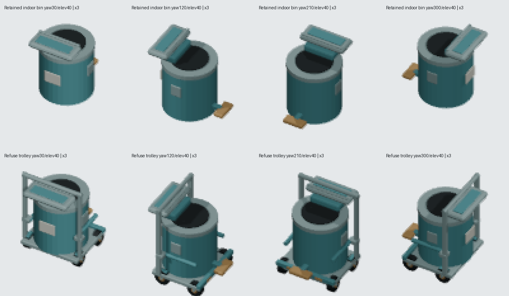

# Dedicated Garbage Room refuse trolley

2026-10-03, own branch `codex/missing-room-fixture-oblique-20261003`, base
`04bb28215a`. The playable catalogue already maps all 21 object IDs to angled
models. The missing presentation is contextual: `room.garbage-room` requires two
1x1 `object.waste-bin` instances but uses the Cell pedal-bin model. This record
does not claim that the global object mapping was missing.

## Genuine source and retained assembly

Pinned Blender 5.2.1 LTS (Blender build ID: 9e2066aef7ef, not a repository commit) saved
`assets/source/blender/fixture.garbage-room.waste-bin.blend`, SHA256
`5d9cafee94af08098b045e389b642ec655536fe0cc8aae8b5e026822f7d984cc`.
All twelve original bin parts, raw vertices/topology, modifiers and **all five
original stored material graphs** are retained. One rigid +0.16 Z translation
seats the complete bin assembly on a pressed steel carrier deck; no scaling or
original-source edits. Thirty real parts add four caster/axle/fork/hub
assemblies, two rear brakes, push uprights/handle, attached retention rails,
front bumper and amber reflectors. These serve refuse handling and reuse the
original palette. The source guard checks 33 real evaluated triangle-interior
contacts, geometric normals, source/provenance hashes and every occupied turn.

Grounded centered bounds are X ±0.4225000143, Y ±0.4875000, Z approximately
0..1.189999938. Every part stays inside the existing 1x1 footprint. The original
aligned source SHA256 remains
`ff8f91f62e67ad69293c0560849664524a5e7cd34824137171f5cb3d740376c3`.

## Actual canonical exports and integration handoff

The unchanged shared square export camera/pixel pipeline produced all 72 poses:
256px, 64px/tile, ortho 4, pivot (128,128), target
(0.5,0.5,0.5949999681859961), yaw 0..330 step30, elevation20..70 step10.
Descriptor: `/game-content/oblique-fixture.garbage-room-waste-bin.v1.json`.
Asset ID: `fixture.garbage-room.waste-bin`. Existing source and descriptor formats
are reused. No shared registry or object mapping edits are made here.

Root's exact optional integration:

1. Add `{ "assetId": "fixture.garbage-room.waste-bin", "manifest": "/game-content/oblique-fixture.garbage-room-waste-bin.v1.json" }` to the existing registry.
2. Add a `ROOM_VISUAL_VARIANTS` row for `room.garbage-room` mapping only
   `object.waste-bin` to `fixture.garbage-room.waste-bin`, through the existing
   wholly-contained footprint logic. Preserve default Cell and Yard routes.

Descriptor SHA256:
`0041d15d3dd5fe1ccf25ed2f358ee7a7f3c86d81e79e4923bc3f87ecd07dc8aa`.
[Source, descriptor and all 72 frame hashes](./proof/source-descriptor72-and-four-yaw-comparison.json).

The four actual canonical views at yaw30/120/210/300, elevation40 were opened
alongside the retained indoor bin. The push frame, carrier rails and caster
silhouette are visible from all four directions. Full-canvas changed RGBA pixel
counts are 2771/3095/3071/2949; these comparisons include the explicit deck lift
and new height-centered camera target. The labels and nearest-neighbor x3
crops below contain only genuine exported PNG pixels.

Only four canonical frames were rerendered through the actual producer, into
ignored proof files, and all four were **byte exact** to their published frames.
[Repeat hashes](./proof/four-real-producer-repeats.json),
[actual producer log](./proof/four-real-producer-repeats-GREEN.log).
There was one canonical 72-pose render, one initial single-pose preview and
four bounded repeats; no second complete matrix. All Blender calls used one
thread and ended; zero Blender processes remained at handoff.

## Three genuine negative controls and exact restoration

1. Blender saved the actual new `.blend` with the rear caster wheel moved
   +0.18 X, leaving the rest of the model untouched. Its provenance source hash
   was updated to the bad source. The actual producer's preview invocation
   exited 1 on **wheel/axle triangle-interior contact** before byte or placement
   checks. This is an actual assembly failure, not an artificial hash mismatch.
2. The actual standalone producer's `exporter.MODELS` tuple was emptied. Its
   preview invocation exited 1 on dedicated dispatch omission, before renders.
3. A valid actual exported RGBA PNG gained an opaque top-left corner. Both the
   descriptor hash and hash-bearing filename were updated to match it. The
   production catalogue test reached the decoded transparent-border assertion
   and failed; hash identity had passed.

Each mutation was restored in `finally`. A fresh actual producer `--verify`
passed all 33 physical contacts, original complete materials, grounded four
orientations and 72 actual camera poses. Dedicated art tests then passed
**2/2**, and `pnpm typecheck` passed. Source, provenance, producer and descriptor
bytes and all 72 new PNG bytes were exactly restored. The original Cell bin,
its 72 exports, shared exporter, registry and object mapping hashes were also
unchanged.

[Three controls and exact restoration receipt](./proof/three-actual-controls-and-exact-restoration.json),
[actual Blender wheel mutation](./proof/actual-detached-wheel-mutation.log),
[wheel/axle semantic RED with matched source hash](./proof/actual-detached-wheel-matching-source-hash-RED.log),
[actual dispatch RED](./proof/actual-producer-omitted-dispatch-RED.log),
[hash-valid PNG border RED](./proof/actual-hash-valid-PNG-border-RED.log),
[restored real producer GREEN](./proof/exact-restored-producer-GREEN.log),
[restored catalogue tests GREEN](./proof/exact-restored-catalog-unit-GREEN.log).

Reproduce pinned Blender source authoring with
`tooling/blender/build-garbage-room-bin.py`; export with
`tooling/blender/render-garbage-room-bin-oblique.py`. Use
`--background --factory-startup --threads 1 --python-exit-code 1`.
Host Python `tooling/research/prove-garbage-room-bin-controls.py` runs the
bounded repeats and actual controls, and
`tooling/research/compare-garbage-room-bin.py` creates the actual-pixel comparison.

## Limits

No browser/server, runtime, save, player-copy, catalogue/palette or canonical
alias changes. Root owns integration and native verification. The dedicated
descriptor is ready, but **is not registered or mapped yet**. No native pass,
completed Garbage Room gameplay, or automatic trolley motion is asserted.
The casters and handles are presentation geometry for the existing placed bin;
this changes no simulation capability.
