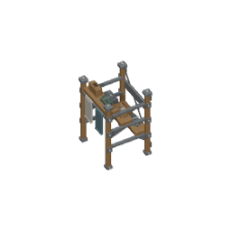
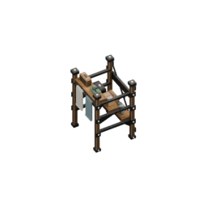
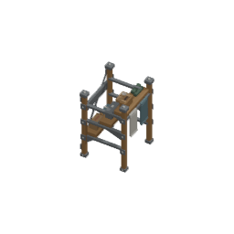
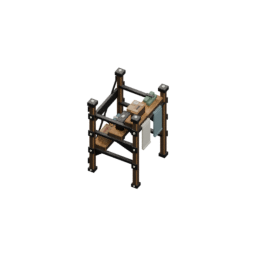

# Genuine modern material/light draft: original Laundry linen rack

This is a bounded source/render draft for the owner's direction that the game should look modern and warmer rather than like a1990s RTS. It is not final visual acceptance or a production art replacement. The generated modern-warm-concept is now available and was opened by the art agent; root/owner review of these actual samples remains pending; no full72 rerender, runtime dispatch change, browser/server/build or synthetic image has occurred.

## Actual cause and proposed change

The current published renderer sets `BLENDER_WORKBENCH`, `STUDIO`, `paint.sl`, `color_type=MATERIAL`. The actual retained Laundry source contains111authored mesh parts and12complete materials, including the2172?724 packed authored wood image and Principled steel/cloth shading. Workbench uses material display colour, so those node textures and roughness/metallic responses do not participate in the visible result. Source parts and full material graphs are already correct; the bounded proposal is to render their actual existing shader materials under broad soft area lights.

Draft uses genuine Blender5.2.1Cycles CPU/thread1,64fixed samples/seed0/no adaptive sampling/no denoising, restrained warm key450W/4unit diameter, neutral fill180W/5diameter, broad rear300W/3diameter; neutral world indirect strength.25, AgX/None/exposure0/gamma1. Palette RGBs/material node values and texture bytes are not changed. Original accepted18room palettes, gameplay, scale, footprint and maps/save/picking are untouched. Soft shadows are actual self-shadows inside the assembly; no floor plane/contact-ground shadow is added or claimed.

Both renders use exact original256?RGBA/canonical4tile orthographic span/64pixels-per-tile, pivot128/128, target(.5,.5,.7039999961853027), yaw60and300/elevation40. Both actual new Workbench before renders reproduce published PNG bytes exactly. The after images are real path-traced renders of the same model, not AI concepts or pasted texture replacements.

## Opened actual before/after samples

| Published Workbench reproduced | Original material nodes + soft area lighting |
| --- | --- |
|  |  |
|  |  |

All four genuine256px PNGs were opened. After rendering, texture/grain and physical metal highlights become visible; panels/rail cast actual self-shadow. The steel appears darker than Workbench's display colour. This is an honest material/light difference to judge against the now available reference, not a claim that unchanged intrinsic RGBs make perceived palette identical. Object silhouette, proportions and111part/12graph/eightcontact assembly remain exactly the same. At64px per tile this rack is still a small sprite; lighting alone is not a complete modern art direction for the whole prison.

## Genuine source, invariants and hashes

Original released source SHA256: `779d11f79c28b8049ccd3371d840c75b52cd153439f3882e28c593d05dd964ec`. Saved actual draft `.blend`: `assets/source/blender/draft.laundry.linen-rack.soft-light.blend`. The saved draft is the existing min-corner export scene with the same111meshes/12material graphs and three actual area lights, canonical camera and render profile; it is intentionally not a new runtime fixture/source descriptor.

`actual-before-after.json` pins the draft .blend hash, all four PNG body hashes, exact before/after raw/evaluated geometry, complete stored material/texture graphs, normals, eight actual BVH triangle contact witnesses and canonical source bounds. All79protected original source/provenance/descriptor/72PNG/registry/context/room-palette files are byte-identical. Actual producer is `tooling/blender/render-modern-retained-material-draft.py`; it first invokes the existing strict Laundry source guard and canonical camera/PNG decoder. No authored component is filtered out.

## Actual saved-source semantic controls and final source checks

Actual saved draft .blend was reopened and independently verified against its complete physical record. Three genuine saved .blend mutants were produced: linen panel lifted1tile breaks the real panel/return-fold contact; actual key area light omitted breaks the physical emitter assembly; actual camera ortho span halved breaks64pixels-per-tile. Each actual saved source has a different SHA and production verification exits1 for its semantic failure; exact original .blend byte restoration then exits0. No mutation of released source or palette. All86protected source/render/palette/registry/context/draft files restored byte-exact.

One genuine bounded source60/e40Cy?cles repeat has the same PNG bytes/SHA as the first after sample (`65f80634dc026fa83c95fcf81ee40e539f0f947ab8dc0b03f0c0eb377b883716`); no full72 duplicate. Final3focused suites9PASS/1generic Blender-on-PATH SKIP. Explicit pinned Blender5.2.1 actual source/light/camera controls all run GREEN after restore. Both application and tooling strict TypeScript exit0.

The first new unit draft incorrectly compared source-centered normal signed distances bit-for-bit to the existing min-corner translated export. Its counts/directions/raw parts were exact but floating distances differed below1e-7; corrected contract keeps exact raw topology/direction counts and positive outward distances within the established1e-6geometry precision. Before-versus-after lighting records and saved draft replay remain bit-exact. This harness correction is not counted as a geometry repair or one of the three meaningful producer negatives.

No production build/browser/server, full72, catalogue/alias/gameplay/copy/palette or native visual acceptance. Review this precise actual comparison against root's now available modern visualreference before broadening the rendering profile. Lighting exposes existing material authorship; it does not by itself modernize whole-scene floors/walls/HUD/actors or enlarge sprites.

## Reference comparison after source checkpoint

The actual root reference `docs/design/2026-10-03-modern-game-style/modern-warm-concept.png` and its README were opened after the genuine source/render checkpoint. `actual-reference-read.json` pins the precise generated reference and original prompt hashes; it is explicitly an AI concept, not runtime source art.

Its warmer timber/steel/ceramic and softer depth support evaluating the original node materials under broad light. This actual draft exposes those retained wood/steel responses; the source60and300pairs are the concrete comparison. The draft steel is darker than the baseline and has no surrounding floor/contact-shadow stage, so owner/root review of actual samples is still necessary. Original source proportions and all occupied tiles remain intact. The reference's illustrative lights/plants/world arrangement/HUD omissions are not copied or claimed as gameplay. No concept pixels, full72 adoption, new material colours or runtime source switch are introduced by viewing the reference.
