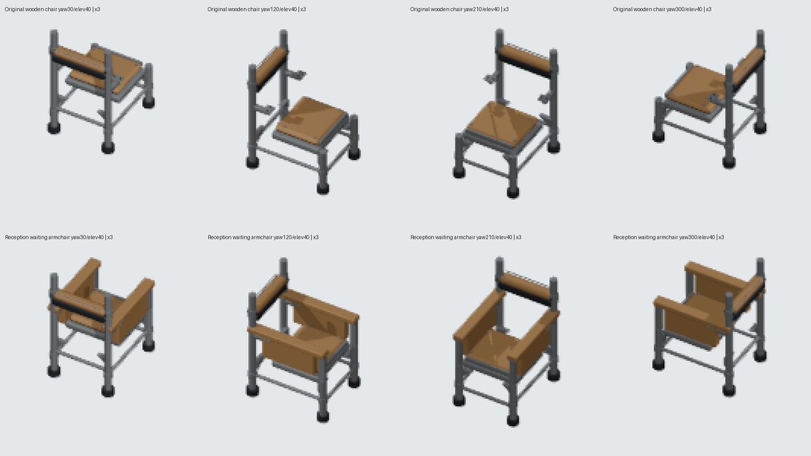

# Reception waiting armchair — retained genuine Blender model

## Verified choice and existing gameplay context

Visitation is not an existing room-catalog ID or public Room plan at the branch base `2059cfbe01959ff3f6bba5510b75207afcbfc672`. A Visitation dining-table variant would therefore require inventing a new gameplay context. The bounded alternative is **Reception**, whose existing 6×6 public template places one desk and two ordinary `object.chair` owners. Reception requires those chairs, but currently has no chair visual variant; they use the generic `furniture.chair.wooden`. Classroom's existing school chair is a different context and remains untouched.

The new model preserves every one of the actual wooden chair's **52** authored mesh parts and **four** complete stored material graphs. All original raw vertices, topology, material assignments and modifier parameters are retained; the maximum evaluated original-vertex movement is **0**. Original seat, back, frame, fixings and structural refinements remain authored parts of this model.

Eight substantial new parts form two broad timber armcaps, two continuous steel arm bearers, two front steel uprights and two timber side panels. Each has real physical attachment to the retained seat/legs/back posts. These create a visible waiting-armchair silhouette without a new cloth/paint graph or generic replacement.

## Exact source/render identities

- Asset: `furniture.reception.waiting-armchair`.
- Source: `assets/source/blender/furniture.reception.waiting-armchair.blend`.
- Source SHA256: `12cd91c54feb1d35603752eb7efe5c6245be190d77aa31d6e6b81121ea18457d`.
- Complete source provenance: `assets/source/blender/furniture.reception.waiting-armchair.provenance.json`; SHA256 `e6c1f46f592a1fbcf0da23c09347405bb086aed50dfca55cd4174fdce8870d2f`.
- Descriptor: `public/game-content/oblique-furniture-reception-waiting-armchair.v1.json`; local UTF-8 body SHA256 `55fa838b7d646a308ce9d97ff2167a2ffbb914aa35d9db3b7544578dab942aea`.

The original **1×1** footprint and exact overall evaluated bounds remain:

```text
min [-0.3859996795654297, -0.485249400138855, 0]
max [ 0.3859996795654297,  0.4852507412433624, 1.3200000524520874]
```

All four occupied rotations fit; all eight added parts have outward nondegenerate actual geometric normals. Materials remain `Canteen worn steel`, `Corridor bench worn wood plank 0`, `Corridor bench worn wood plank 1`, and `shade`, including their full stored node graphs and values.

The existing genuine square export pipeline is reused: Blender5.2.1 LTS, **one thread**, orthographic4 tiles, 256×256, 64 pixels/tile, pivot128/128, original target `[0.5,0.5,0.6600000262260437]`, yaws0..330 by30°, elevations20..70 by10°. One full new **72-PNG** canonical matrix was rendered. Four bounded independent production replays at yaw30/120/210/300°, elevation40° are byte-exact with the new published PNGs. No full original or duplicate new matrix was rerendered.

## Actual visible views



All four actual original/new exported views were opened and inspected. This image uses actual PNG crops enlarged by nearest-neighbor3× and labels only. Armcaps and timber panels clearly distinguish the waiting chair from every direction while the original open steel frame remains visible. Full-canvas RGBA changes at identical camera targets are **1422 /2133 /2020 /2093 pixels**. Counts prove changed visible exports, not native gameplay acceptance or independent visibility of every retained part.

## Actual source/export controls

The standalone producer verifies **16 evaluated triangle-interior contact witnesses** before raw/hash/position guards, plus every actual canonical camera basis and occupied turn. Its dedicated tests parse the actual descriptor and decode/hash all72 PNGs, including normalized scanline structure, nonempty pixels and transparent borders.

`tooling/research/prove-reception-waiting-armchair-controls.py` executed:

1. Actual new `.blend` front arm upright `x+0.18`, saved by Blender; provenance source hash matched the bad source. Real producer preview reached RED on the disconnected continuous bearer/front upright triangle contact before a hash/geometry rejection.
2. Actual standalone producer dispatch tuple removed; real preview reached dedicated dispatch RED before image rendering.
3. Actual valid RGBA PNG re-encoded with an opaque corner; descriptor SHA and hash-bearing filename matched the bad PNG. The real test passed byte/hash loading and reached decoded transparent-border RED.

All three controls exited1. Exact original bytes were restored for source, provenance, producer and descriptor, and all72 own PNGs remained unchanged. The original generic chair source/descriptor/72 PNGs, shared exporter, registry and object mapping remained hash-identical. Fresh actual source/contact/camera verification, two dedicated unit tests and full TypeScript typecheck are GREEN. RED/GREEN logs and restoration receipt are retained beside this report.

## Root integration handoff — actual native pending

Root may add this optional registry entry:

```json
{"assetId":"furniture.reception.waiting-armchair","manifest":"/game-content/oblique-furniture-reception-waiting-armchair.v1.json"}
```

Add a Reception room visual variant through the existing fully-contained rotated-footprint selection:

```ts
{ roomCatalogId: 'room.reception', objectAssets: Object.freeze({
  'object.chair': 'furniture.reception.waiting-armchair',
}) }
```

Keep the existing desk, default chair and Classroom school-chair routes. No registry/mapping edit is part of this model branch. No template, save, palette, price, capability, copy, workflow or renderer behavior change is proposed.

The existing public Reception plan already produces the two genuine chair owners and can be rotated by its current public control. Root still needs its built-client placement/network evidence, calibrated visual proof for each actual chair, consumer negative controls and whole paused Save/Load. **No browser/server was started and no native pass is claimed.**

All72 binary PNG identities and source provenance are recorded in `final-source-render-integrity.json`. A ready-to-observe actual yaw60/elevation40 frame is `/assets/environment/oblique/furniture.reception.waiting-armchair-yaw+60-elev40.4e6ee8fdb156.png`, full SHA256 `4e6ee8fdb156be06a9d023f8806d90aede0b12552d048dcdba383c5f68b4cb0d`. The retained original source SHA256 is `acd0e9decb3bb451b44e8354e797fb5656825f4748bbed832bab61659f06cd88`.

## Reproduction

Use the installed Blender with `--background --factory-startup --threads 1 --python-exit-code 1`:

- `--python tooling/blender/build-reception-waiting-armchair.py` authors the retained actual source.
- `--python tooling/blender/render-reception-waiting-armchair-oblique.py -- --verify` checks source/16 contacts/four footprints/72 camera bases without renders.
- The same producer without flags exports72 poses; `--repeat-four` renders only four bounded repeats.
- Python `tooling/research/prove-reception-waiting-armchair-controls.py` repeats actual producer mutations/restoration.
- Focused unit test: `tests/unit/oblique-reception-waiting-armchair-art.test.ts`.

Source and normalized PNG hashes are binary identities. Descriptor/provenance text-body hashes describe the recorded local files; Git checkout line-ending normalization may change those text-byte digests. Reauthoring the Blender file can change serialization metadata, so intentional reauthoring must refresh the own genuine provenance/export/hash pin.
