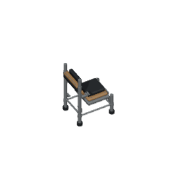
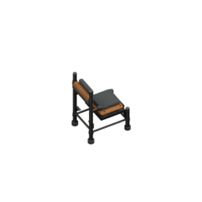
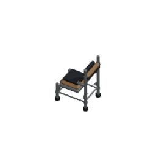
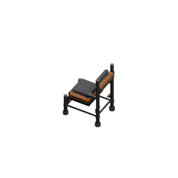

# Staff chair retained-material modern presentation

Actual playable RoomStaffRoom/ObjectChair uses furniture.staff-room.padded-chair, not a guessed generic model. Retain full52 authored chair parts plus its two existing connected charcoal pads, allfour original material graphs, three actual triangle-interior pad contacts, exact1x1 footprint and existing64px/tile camera. Root requested modern shader/light presentation after independently inspecting genuine Laundry comparison. This source uses the identical bounded profile function already inspected for Laundry; no materialRGB or texture graph modification, no mesh additions and no floorplane.

## Genuine source samples

| Pose | Original Workbench | Actual Cycles |
| --- | --- | --- |
| 60/e40 |  |  |
| 300/e40 |  |  |

Allfour PNGs opened. Actual before frames byte exact to old published bodies. After reveals authored warmer timber grain, subtle charcoal pad edge shading and steel response; frame/rail appears darker than flat display-grey under Workbench. Geometry remains identical, pads retain their existing shape, and no brighter material palette is substituted. This visible change requires future root game captures for independent per-chair calibration; do not reuse or reduce old exactRGB thresholds.

Source-only checkpoint: actual saved54mesh/fourgraph/threecontact source, before/after samples and camera guard complete. No72 or native acceptance claimed yet. Old source and allold72 preserved; historical descriptor archived beside source. Current real producer is tooling/blender/render-staff-chair-cycles.py, Blender5.2.1 CPU/thread1/64samples/seed0/AgX/noadaptive/no denoising,256RGBA/ortho4/pivot128/target(.5,.5,.6600000262260437). No global renderer adoption, alias, gameplay, prices, copies or18-room palette changes.
